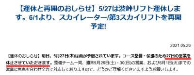
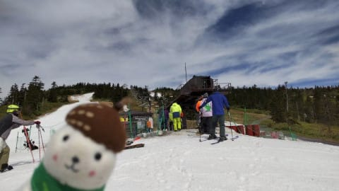
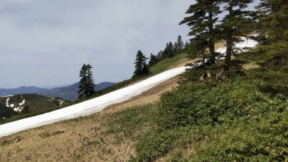
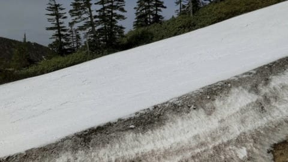
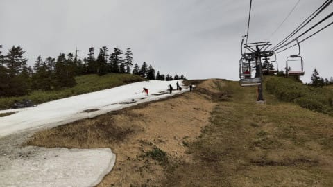
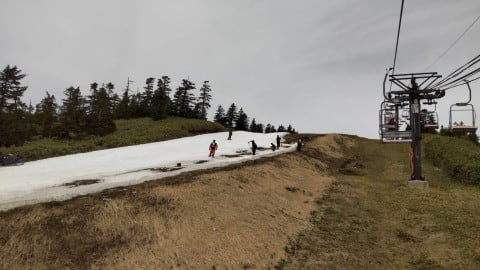
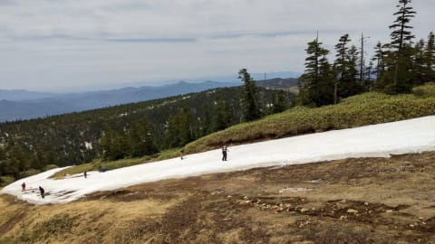
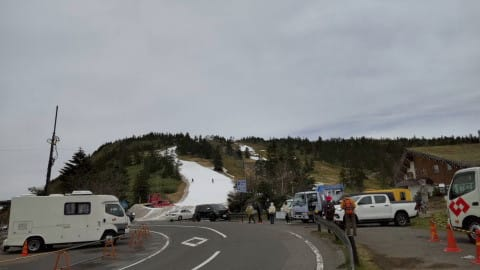

# 2021/5/26(水)の志賀高原・渋峠スキー場コース状況動画が特派員から送られてきたよ！

📅 投稿日時: 2021-05-27 03:14:46

どうやら．

5月27日の雨予報を受けて．

渋峠は，

コース保全のために27日(木)は運休

と決めたようですね…

（[横手山スキー場ホームページ](https://yokoteyama2307.com/news/14585/)より）

普通なら，成り行きに任せて

「27日の雨でコースが切れたら終わりね」

としてしまいそうなところ．

「何とか週末まで営業してやる…！！」

という気合を感じる判断ですね．

いや．

今年の横手山，気合の入り方が違う！

ってなことで．

こちらは

「渋峠のリフトが動いている限り，滑る！」

という気合を感じる特派員から，

今日も写真が届いたので．

26日(水)の渋峠レポートです！

…あ，今日は写真だけじゃなくコースを

映した動画も届いたので，最後に動画も

ありますよ～！！

…本日は朝から晴れだったみたいですが…

硫安がガンガン効いているバーンは，

「カチカチ＆ザクザクのハーモニー」by特派員

とのことでしたが…

(なんだか滑って楽しそうではなく，どちらかというとおいしそうに感じる表現だな)

硫安が効いていた分，カチカチ＆ザクザク

ではあるものの．

晴れの日差しで雪が解けて，全面滑りが

悪くなってしまうようなことは

なかったようです～！

そして．

朝のうちはバーンのところどころに

穴が開いていたところもあったよう

ですが…

なんと．スタッフの人海戦術により，

雪が薄くなった部分の穴埋めを

していたようです！

すごい…

すごいぞ，渋峠！

営業中も，人力でコース整備を

続けるとは…！

今日の人出は昨日より多く，午前中の

ピークで40人ほどいたみたいですが．

ゲレンデ上の人ではこんな感じなので．

ストレスなく滑れそうな感じですね…！

…ということで．

送電線故障による停電にくじけず

電源車を繰り出してまでリフトを動かし．

さらに激しい人力で，必死にコース維持を

続けている渋峠．

この努力が報われて．

このまま雪が消えず，

7月くらいまで雪がもってほしい…

と願わずにいられません！！

いや…8月くらいまでもってくれてもいいんだけど…

なんならば，9月まで…←無理だから，それは

ってなことで．

本日は，特派員から，渋峠のリフトを

降りてからコース最後までの，

コース状況の動画も送られてきました！

あさイチじゃなく，昼ごろの状況です．

コース幅や雪の厚みがよく分かりますね…！

スタッフが必死に雪を入れ続けてくれた

おかげで，あさイチよりも状況がいいかも？

ということらしいですが．

よくぞここまでもたせたものよ…！！

## 💬 コメント一覧

### 💬 コメント by (いちと)
**タイトル**: Unknown
**投稿日**: 2021-05-28 15:42:01

ひさびさにのぞきました

ここまでしてスベル、スベラセル

両方とも変態（スゴい）ですね(笑)

### 💬 コメント by (Skier_S)
**タイトル**: ＞いちとさま
**投稿日**: 2021-05-29 04:13:58

これまでは，意地でもシーズンラストまで整備を続ける根性は，かぐらが一番だと思ってましたが．

いや…渋峠，昨シーズンからすごいです．

根性入ってます．

