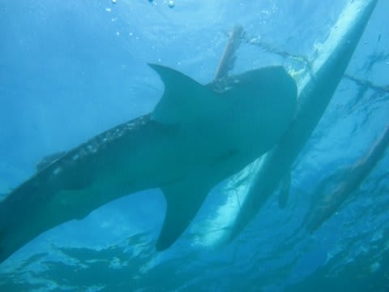

# 2013年11月　フィリピン・オスロブ　子連れでジンベエを見るぞっ！　その11

📅 投稿日時: 2014-07-19 03:31:19

という感じで．

ジンベエシュノーケリングを終えてボートに

戻ってきたわけですが．

(向こう側の人がごっちゃり乗ったボートがあるあたりが

ジンベエエリア)

同時に，ダイビング組もダイビングを終えて，

ボートに戻ってきました…

私「いやー．すごかった．たらふくジンベエ見れたね～っ」

　(これで，「突発性ジンベエを見たくて

　我慢できない病」が治る…よかった…)

妻「でも．…あんまり近づけなかった…」

私（…な，なんてゼイタクなんだっ！！！

　ジンベエを見れただけでも，普通は十分だと思うのに…）

妻「ジンベエ，ずっと水面にいて，ダイバーは着底だし．

　　逆光だから，あんまりよく見えないのよね．

　　シュノーケラーはジンベエに近づいてたね～」

私（私もダイビングやりたいと最初は思ってたけど…

　やってみると，シュノーケリングが正解だったわ）

妻「でも，ジンベエ見れて満足」

私（まぁ，45分間ずっとジンベエ見続けられて，これで

　不満と言われては…）

妻「今度来た時は，みんなでシュノーケリングかな」

私（こ，今度またって…今回の旅行のジンベエダイブは

　これ一回で終わりだし…まさか，またもう一回フィリピンに

　来ようってことかっ！？？）

って感じで．

ジンベエを見れて，妻の「突発性ジンベエを見たくて

我慢できない病」は治ったみたいだけど．

…どうやら，今回のジンベエダイブ．

妻にとって，なんだか宿題が残っちゃったみたいです．

でも．

妻が撮った写真を見返してみると．

これだけの写真が残っていたのに．

これで満足しきれないってのは…

オスロブ．

恐るべき海だということですな．
