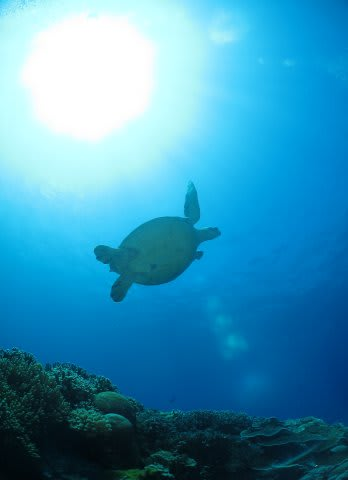

# 2014年8月　オスロブagain…再び，子連れでジンベエザメと泳ぐぞ！　その26

📅 投稿日時: 2014-10-11 03:32:32

🏷️ カテゴリ: [ダイビング日記](ce3a7a8d424d112fce83ee85c81a0e344.md)

えーー．

今日，仕事を終えて，パラオのホテルに

到着ですが．

…会社に拉致されることもなく，

無事，旅立てました…

ってことで．

パラオにいるというのに．

書きためていたフィリピン日記に行くのだ．

----

アポ島…

それは，フィリピン・セブ近辺のエリアで，

もっともサンゴが元気と言われるエリア．

…私もダイビングを始めたばかり，

経験本数40本くらいの，かつて昔に

潜った場所なんですけど…

…全く覚えてないや（笑）．

とりあえず．

1日目のダイビングは妻が2本，私が1本だったので．

今日は，私が2本，妻が1本潜る番ですね…

今日の1本目を潜る権利は，私にあるんだよな…

…ということで，

超久しぶりのアポ島の海へ！

潜ってみると…

透明度は20mちょいくらいかな．

スミロンよりはちょっと落ちるけど，

バリカサグよりはいい透明度！

いや，確かに．

サンゴは元気だな．ここ．

…おーっと．

タイマイかな？

ウミガメさんが目の前を横切っていきます…

そして，しばらく，立派なサンゴの

上を泳いでいきます…

あー．

これだけ立派なテーブルサンゴを見たのは，

コモド以来かな～．

いや，サンゴは結構元気でうれしい．

うれしいんだけど…

ちょっと魚が少な目かな～．

ってことで．

久しぶりの，元気いっぱいのサンゴを堪能して，エグジット．

サンゴは元気だった．

サンゴは元気だったけど．

…あとは，魚影が濃ければ満点なんだけどな～…

やっぱり，サンゴと魚の両方がそろっているコモドは

すごかったなぁ…

と，ゼイタクにも思ってしまったSkier_Sなのだった．
