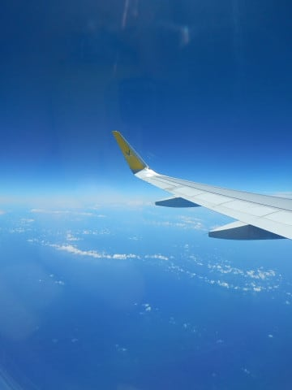

# 早くも夏休みスタート！…いま，モアルボアルに来ています

📅 投稿日時: 2018-08-03 00:16:53

🏷️ カテゴリ: [日記](cc4b5682fb7b8b144980957a978653fb0.md)

ということで．

普通の人より早めに，3日間の夏休みを取った我が家．

昨日．

成田から飛行機に乗って…

4時間半ほどひとっ飛び．

昨日夕方，セブ島空港へ到着っ！

今年の7月に新ターミナルがオープン

したらしく．

むっちゃきれいになってましたね…

空港から，さらに車で4時間．

マクタン島の無茶苦茶渋滞を抜けて…

夜7時過ぎ，真っ暗になってから．

ホテルに到着しました…

で．

明けて本日．

当然のように，

ダイビングに出かけたわけですが．

まぁ，いつもながらのフィリピンの

きれいな海だったわけですよ．

そして．

本日の2本目は．

そう．

モアルボアルといえば．

イワシポイントですね…

…と．

いつも通り，イワシを見ていたら．

イワシポイントに，いきなり現れたのは…

え？？？

えええええええ！！！？？

こんなの出るって，聞いてませんけど～っ！！！？？？

…てなわけで．

フィリピン到着2本目にして．

もう日本に帰っても悔いはない…

というダイビングでした…（感動）

まさか，こんなところでジンベエに出会えるとは…っ！！

…そうそう．

本日から，ジュニアオープンウォーターの講習を

受けている，わが娘．

午前中はプール実習．

午後は海洋実習だったのですが．

おまえ…

なんていう景色を見ながら，実習を受けてるんじゃ…っ！！

半分冗談だろう…と思っていた，

イワシの群れを見ながらの海洋実習でした．

残念ながら，娘はジンベエを見られませんでしたが…

海洋実習でジンベエを見たら，歴史に残りそうですね(笑)

ってなわけで．

明日，明後日と．

フィリピンで潜ってます～！

## 💬 コメント一覧

### 💬 コメント by (yumi)
**タイトル**: すっごぉ～い✨✨✨
**投稿日**: 2018-08-03 14:59:40

Ｓさぁ～ん🌴🏝️🏖️

ジンベイくんに逢えたのですね。🎵🎵🎵

何やら、｢ダイバーのあこがれ｣って聞いた事があります🎉

Rちゃんも、ついにデビュー戦ですね🎵

皆さま御安全に、存分に楽しんで下さいませ。

それと、イエティの情報、ありがとうございました。

今年は、毎年行ってる沖縄の代わりに、山中湖の別荘を予約しちゃいました🎵

### 💬 コメント by (mae)
**タイトル**: Unknown
**投稿日**: 2018-08-03 21:18:49

オスロブで餌付けされたジンベイを見た時は感動も何も無かったですが,それとはまったく違うんでしょうね～

私も夏休みで西表島から昨日戻りましたが、なんと12年振りに潜りましたよ。

バラス周辺で3日で8本ほど。やっぱ海外の海とは違い魚の群れが違いますね.

あと、セブまでバニラで機内は窮屈ではなかったですか？

実は私も復路は石垣島からバニラを利用しましたが、成田での着陸後の移動がやたらと長いなど不便な面も多く、次回は無いなと思いました。(^^;

### 💬 コメント by (Skier_S)
**タイトル**: モアルボアル滞在中
**投稿日**: 2018-08-03 23:08:20

＞yumiさま

全く想定外に，ジンベエ様に会えました～！

もう，ダイバーのあこがれです．

私もシュノーケリングでは見たことがありますが，

ダイビングで見たのは初めてです．

そして．

わが娘もダイバーデビューです～！

今年は沖縄行かれないのですね．

山中湖，楽しんできてください～！

＞maeさま

オスロブではシュノーケリングでしたが，

今回はダイビングでしたから…

それもかなり近づけたので，かなり感動でした．

我々のチームしか周りにおらず，他に誰も

いなかったので独占でした…

バニラは席が狭かったですが，まぁ5時間程度なら

耐えられます．

成田第3ターミナルもかなり遠かったですね…

でも，航空機代が結構違ったので，そのくらいは

我慢できます…

### 💬 コメント by (いか)
**タイトル**: Unknown
**投稿日**: 2018-08-03 23:50:48

今年は相模湾にジンベイが入っているみたいです〜。私は遭遇しておりませんが、、、

今年は私はマンタやウミガメには何度か遭遇しました、海のいきものはいいですね(*^^)

### 💬 コメント by (しんちゃん)
**タイトル**: 生ジンベエ凄い!!
**投稿日**: 2018-08-04 00:12:41

生でジンベエザメ見れたなんてすごいですね。

ジンベエさんは

大阪と沖縄の水族館でしか見たことがありません(^^ゞ

### 💬 コメント by (マルハバ)
**タイトル**: イワシとダイバーとジンベエと・・
**投稿日**: 2018-08-04 07:14:50

すごいワンショットですね！

こんな画像がダイビング雑誌にでも載ったら

モアルボアルに行く人が急増しちゃいますよ！

### 💬 コメント by (Goku)
**タイトル**: 羨ましい～
**投稿日**: 2018-08-04 07:26:53

私はダイビングをしたことがありません、素晴らし世界ですね‼

因みにサクラちゃんはＮＺで滑っているようです。

私は酷暑の中、今日もお仕事です(T_T)

### 💬 コメント by (Skier_S)
**タイトル**: これからダイビングへ出発！
**投稿日**: 2018-08-04 09:10:09

＞いかさま

え？相模湾にジンベエ？

そしてマンタにカメって…

釣りで見たのですか？？

マンタが見れるんですね…

＞しんちゃんさま

私どころか，ガイドも全くの予想外の

ジンベエでした…

いきなりの遭遇で，びっくり…

娘は幼稚園児の時にフィリピンでジンベエ

シュノーケリングをして，ジンベエをたっぷり

見ているというぜいたくをしています…

＞マルハバさま

かなりびっくりのジンベェさまでした！

モアルボアル，いいところだと思います…

＞Gokuさま

あ，SAKURAちゃんはNZでスキーですか…

我が家は今の時期は完全に海の時期です．

お仕事頑張ってください～

