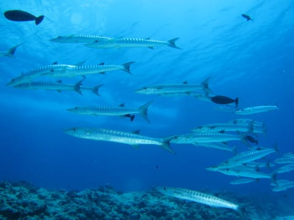

# 2014年10月，小学生の子連れでパラオへダイビングに行ってみた，その7…素晴らしきブルーコーナー

📅 投稿日時: 2015-07-25 01:36:31

ということで．

やってきました，ひさしぶりのブルーコーナー！

また，ここに潜りたい…と思うこと，

かれこれ10年．

子供が生まれて当分無理，とあきらめていた

ブルーコーナーに．

ついに．

ついに，帰ってきたよ～！！！

潮は下げ潮．

そこそこ強めの流れだったので，

コーナーの西側，かなり沖側にエントリー．

ダイバーが全員そろったところで，ガイドが一気に潜行！

周りに何も見えない完全なブルーウォーターの中，

コーナーに向かって流されていくと…

ウメイロモドキやクマザサハナムロの群れが！

＃この写真では，アカモンガラばっかり写ってるけど…

そして，ドロップオフに近づいていくと，

定番の，ナポレオンフィッシュが出迎えてくれて…

そして，見上げると．

グレイリーフシャークがぐるぐるしてますね～．

で．

ドロップオフを左に眺めつつ，コーナー先端へ向かい…

特等席，コーナー先端に掴まるわけですが．

あらら．

ちょいと流れが強めで，みんなカレントフックにぶら下がっての

吹き流し状態…

…泡の流れっぷりが，カレントの強さを物語ってます．

その横を，悠々と通過していくナポレオンフィッシュ(笑）．

カレントフックで吹き流し状態のまま，沖側を見ると…

来ましたよ～っ！！！！

ブルーコーナーのメインイベント．

目の前，大物ぐるぐる状態です！！

ここまでサメに近づけるとはっ！

さすが，ブルーコーナー！！

ちょいと流れが強めだったので．

コーナー先端ではそれほど長い時間粘らず，

5分ほどで流れの穏やかな棚の上に上がります…

棚の上に上がると，流れがなくなるので一安心．

棚の上では，定番のバラクーダの群れがお出迎え．

いや，下げ潮だけど，今日は透明度がいいなぁ～．

そして，ナポレオンとバラクーダの共演をしばし堪能したら…

今度はカメさんが登場したり…

ギンガメアジやら…

クロヒラアジの群れなんかを堪能しつつ…

いやー．

この魚影の濃さ，透明度の良さ…

ブルーコーナー，素晴らしいっ！！

そして，オオメカマスの群れを眺めながらの安全停止のあと…

エグジット．

いやーー．

パラオ．

1本目からブルーコーナー．

満足っ！！

素晴らしいっ！！

おなか一杯のダイビングでしたっ！！！

## 💬 コメント一覧

### 💬 コメント by (いか)
**タイトル**: Unknown
**投稿日**: 2015-07-26 13:07:03

うむー、釣れそうな魚がいっぱい…(違)

### 💬 コメント by (Skier_S)
**タイトル**: いかさま
**投稿日**: 2015-07-27 03:05:47

グレイリーフシャークも釣れますか（笑）

### 💬 コメント by (いか)
**タイトル**: Unknown
**投稿日**: 2015-07-27 11:42:15

先日、10キロくらいのサメ釣りました…笑

### 💬 コメント by (Skier_S)
**タイトル**: いかさま
**投稿日**: 2015-07-28 00:05:41

まさか，ホントに釣れるとは…（汗）

