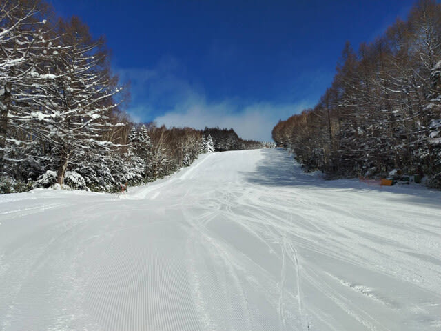
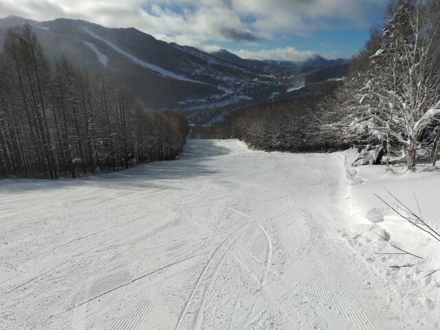
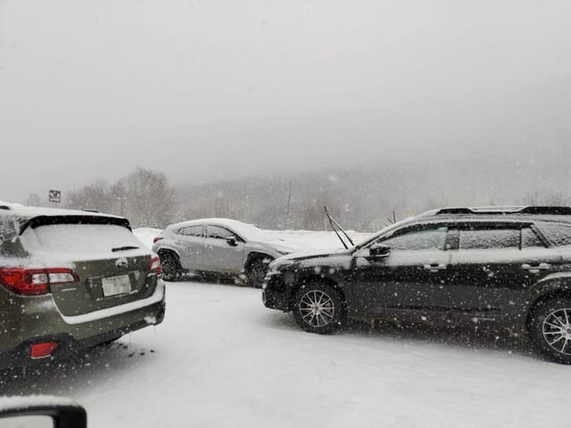
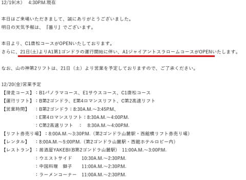

# 12月19日（木）の志賀高原は晴れのち雪，昼過ぎから夜まで40cmくらい積もったか？…そして21日（土）から焼額山スキー場第1ゴンドラ運転！

📅 投稿日時: 2024-12-20 09:39:23

🏷️ カテゴリ: [日記](cc4b5682fb7b8b144980957a978653fb0.md)

ちょっと最近いろいろクリティカルで，

Blogを書いている時間がない…（泣）

とりあえず，今日も手短に朝更新！

まず，昨日19日，焼額山スキー場の

第2高速リフトが動き始め，唐松コースが

オープンしました～！！

特派員によると，コースは雪は硬めなものの

幅いっぱい滑れて，そこそこよかったようです！！

ただ，まだコースにうねりが残っていて，

これから圧雪が進んでフラットになっていく

だろう…

とのことでした～！！

ちなみに，この日は朝は晴天で最高

だったようですが．

昼頃から雪が降りはじめ…

夕方はかなりの勢いで降り，ライブカメラを見ると

夜までに40cmくらい積もったみたいです．

今日も特派員からレポートがありましたが，

雪が降った後の晴れなので，

かなりいいコンディションみたいです～！

そして．

焼額山スキー場は，明日から第1ゴンドラが動き出し，

GSコースがオープンです！

順調にコースがオープンしていってますね…

（[焼額山スキー場ホームページ](https://www.princehotels.co.jp/ski/shiga/winter/)より）

土曜も天気が良くて楽しめそうな予感…

そして日曜は太板を持っていこうかというくらい

積もりそうな天気図です…！

とりあえず，年末年始もかなり冷えそうだし，

いい感じのシーズンスタートです！

## 💬 コメント一覧

### 💬 コメント by (レインボー77)
**タイトル**: Unknown
**投稿日**: 2024-12-20 14:21:45

金曜日の志賀高原情報

昨日は湯田中で降雪20だったのに、志賀では15位しか降ってない感じ。それでも綺麗に圧雪されたバーンは、ふかふか絨毯みたい。みーんなが幸せを満喫すること２時間。

贅沢に慣れたこの身には、その後のやや荒れバーンは重荷に。

私は3時間で終了しましたが、まあ楽しめた一日でした。

### 💬 コメント by (アリス)
**タイトル**: Unknown
**投稿日**: 2024-12-20 16:39:51

skier_S様

ズル休み3日目。

晴天に誘われ朝一に横手山へ。

第一リフトPPで山頂から、北アルプスの稜線くっきり。

下山コースはともかく第二ゲレンデぐるぐるとその後は熊の湯の馬の背へ。

明日は一ゴンにGSコースが一番の目玉ですね😀

### 💬 コメント by (Skier_S)
**タイトル**: 明日は志賀高原！
**投稿日**: 2024-12-21 00:10:14

＞レインボー77さま

あれ～！湯田中より山の上の方が降ってない感じでしたか…

ライブカメラでは20cm以上積もっていたので期待していたんですが．

明日の土曜は朝から晴れて最高だと思います…！

平日よりは混みますけど．

＞アリスさま

今日は横手・熊だったんですね．

山頂から滑るのに雪は十分もう積もっている感じでしょうか？

明日は1ゴンとGSコース動くから，焼額行くしかないです！！

