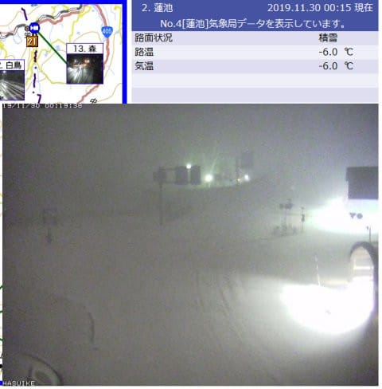
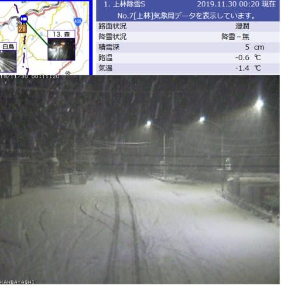
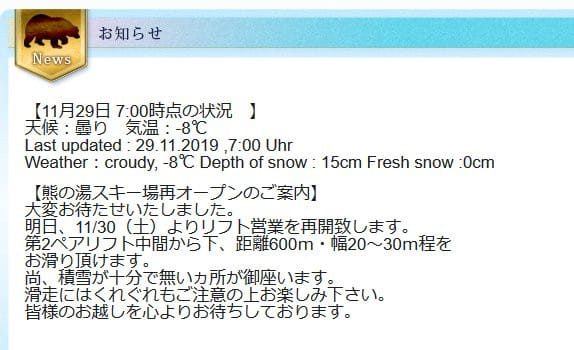
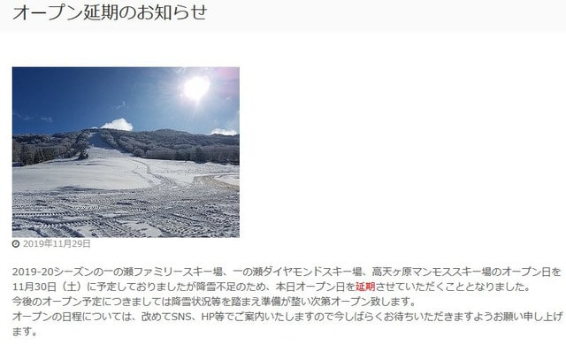
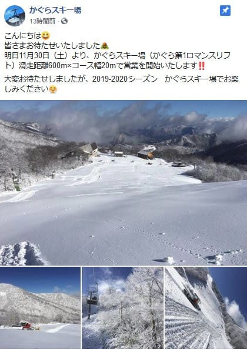
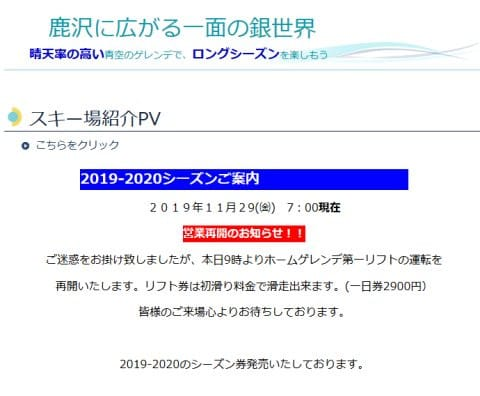
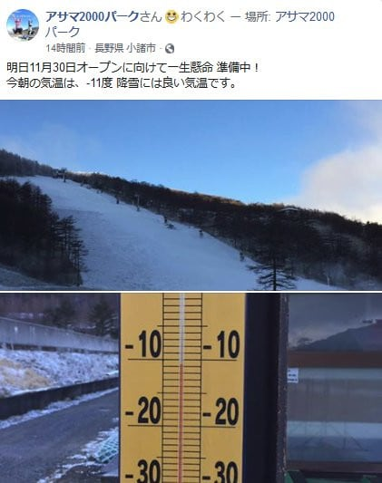
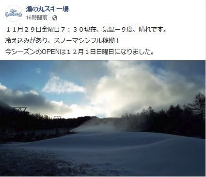

# 11/30(土)から熊の湯，かぐら，アサマ2000オープン！…鹿沢も11/29から再オープン．湯の丸は12/1から，志賀一の瀬＆高天ヶ原，丸沼，白馬方面はまだ未定

📅 投稿日時: 2019-11-30 01:53:05

🏷️ カテゴリ: [日記](cc4b5682fb7b8b144980957a978653fb0.md)

えー．

今，志賀高原は雪が降っているようです！

…29日は冷えるものの，雪が降っても

積もるほどではなさそうだなぁ…

と思っていましたが．

10cm程度は積もっているように見えますね…

（[北信建設事務所道路気象状況](http://hokushin-camera.org/)ページより）

それも，麓の上林まで積もってます！

（[北信建設事務所道路気象状況](http://hokushin-camera.org/)ページより）

この雪は，それほどドサドサ積もるほどでは

無いとはいえ．

強まったり弱まったりしながら，明日の

朝までは降ってくれそうなので．

あと10cmでも積もってくれれば，

ゲレンデにとっては，かなり恵みの

雪になってくれそう…！！！

とりあえず，この雪のおかげか．

無事，熊の湯も土曜から

再オープンのようですね！

（[熊の湯スキー場HP](https://www.kumanoyu.co.jp/lift/)より）

明日土曜日の熊の湯，午前中は曇り～小雪，

午後は曇り～日が射し．

気温は真冬並みの冷え冷え

…って感じでしょうか．

雪質的には恵まれた感じだと思いますよ！！

…でも．

滑れるのはペアリフト下半分だけですか…

で，熊の湯はオープンしますが．

志賀高原の一の瀬＆高天ヶ原エリアは，

30日オープン予定の延期を決めたようです…

オープン日は未定とのこと．

（[志賀高原中央エリア公式HP](http://shigakogen.co.jp/archives/5026)より）

そして．

オープンするか心配していたかぐらも，

30日に無事オープン！！

（[かぐらスキー場FB](https://www.facebook.com/snowkagura/posts/2410834739043832?__xts__[0]=68.ARBR61RhKDsHvjGzksaT9q77mYrZewaTd7jg6C4JkrybfjN7qMjYMOYWcH3sL0oHrU8jcyXsCVzPtcmlXD5A_TXHocGCv1jGeew98YFBwkbDwYGUlpd8O-JKeBLjApjMEB5Lheph28tEoZgHfuUPVMqrkpiRxZFS5YHU-Rjz46_DgYHH_mcIBwWqAcC3lp2x4JG_NERIuvlrrKPdm0lE9Di0lt6W0JktK1l2PWL0FefvZ2xLVOwbqroM1ik1SBcIVzZnlcuUIYxcTTFn5u9OD3XSErBsJ_1aPkhKn3sVY4WevJbhjDvAPICL0kYpF-UlGX6m3-6X9xbcOpc47kvAtAhDrw&__tn__=-R)より）

とはいえ，ペアリフト1本．

幅20mだけですが…

鹿沢も，29日に再オープンしてます！

（[鹿沢スノーエリア公式HP](http://www.kazawa.com/snow/)より）

で．

アサマ2000は一応30日土曜のオープンを

狙っているようですが．

まだ，人工雪の幅はかなり狭そうなので．

オープンできたとしても，かなりタイトな

バーンかな…

（[アサマ2000FB](https://www.facebook.com/asama2000park/posts/3816691428356270?__xts__[0]=68.ARBzQzsqKRO0KeyaG6c3_0Y14gMeDavxr4tSSiT1Q3QctuvdFD36ffkZDCZytLs02QH2HkYr299KnIs8P_P_CKKKnK4znwPt7Q9h65alwjCIvu0ummrDdUYQfCb2Nw-L5sm74csChNoXI2GjbfQKXc4XoO0KGMvjlQlgQdyrOtpHjFf0kDjjw1ek5tWnVxlgs2fm8I97c9xmpVMHf4HvitRQS2pRuOaFuKm4G6ICmID75buCR9luusYz9Lym6dZn_pY5u3nv9K1p1VfYc5rE8lNExhL08KIy-xUvx7kGcL5x5mFVEpajFscqV_rSdShduLa_cuaHo1TBdGNP8NUanW98BdeZfAHXYIGZFeW7qXpEJSPRW8NLM3KdEBK8VtSMjVR6vKPefx8P_UQ5gc8n14lyLk9DOFi8ggZT1zIlduAW--Q&__tn__=-R)より）

そして．

湯の丸は30日にはオープンできないようですが．

12月1日，日曜にはオープンです…！！！

（[湯の丸スキー場Facebook](https://www.facebook.com/yunomaruski/photos/a.580219268659369/3045877278760210/?type=3&theater)より）

ってなあたりが，今週末にオープンする予定の

スキー場ですが…

白馬山麓は，まだどこもオープンできないようで．

丸沼，八千穂などもオープン延期のアナウンスが

出ています…

とりあえず．

今週末，関東圏からのアクセスで滑れる

スキー場は，

・Yeti

・軽井沢

・熊の湯ペアリフト下半分

・鹿沢ペアリフト

・かぐらペアリフト

・アサマ2000（？）

・湯の丸(日曜から）

…という感じになりそうです．

…ってなことで．

今週末，土日ともに滑りに行こうかと

思っていたのですが．

とても1泊2日で滑りに行くような

ゲレンデ状況ではなさそうだし．

この11月，

先週まで3週連続の，週末を狙った長距離フライト

という「嫌がらせか？」という出張日程で

死にそうなので．

さすがに土曜は休んで，日曜日帰りで

滑りに行く予定です…

…いや．

私も，サイボーグでない生身の人間なので．

…大事な所なので繰り返しておきますが．

私も生身の人間なので，

長距離フライトでの帰国後，時差ボケの

ままスキーして，そのまま平日の仕事を

こなしていると，さすがに死にそうに

なりました…←でも，ゲレンデコンディションが良かったら，絶対この土日も

1泊2日で滑りに行っていたはず…！！

ってなことで．

日曜日帰りで滑りに行く予定なわけですが．

アサマか熊の湯か，どこに行くかは

土曜の状況を見て決める予定．

…とりあえず．

明日は死んだように寝よう…

PS.来週，3～6日はそこそこ冷えてくれそうなので，

　来週末はかなりのスキー場がオープンするかも？？

## 💬 コメント一覧

### 💬 コメント by (五輪の書)
**タイトル**: Unknown
**投稿日**: 2019-11-30 18:49:39

skier_Sさま

情報整理ありがとうございます

行けないですが見るだけでテンションあがりイメージトレーニングになります

冷え冷え踊りもハイパーバージョン化加速しそうです

アサマと熊の湯ハシゴですかあ(そんな事言ってないから)、いくら日帰りだからって、いくらサイボーグだからって(ちがうから)、凄すぎます

気を付けてくださいませ

https://ameblo.jp/athlete-0718/

### 💬 コメント by (Skier_S)
**タイトル**: ＞五輪の書さま
**投稿日**: 2019-11-30 21:52:59

いやー．

今シーズンスタートは，コンディションが悪すぎます（涙）

でも，ここ数シーズン，これが標準になりそう…

明日はどこに行こうか，まだ悩み中です．

おそらく熊の湯かなぁ…

かぐらがクワッドが動いているので，そちらも引かれているのですが．

さすがに2スキー場のはしごはやりません（笑）

