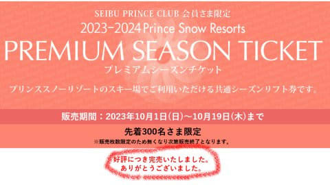
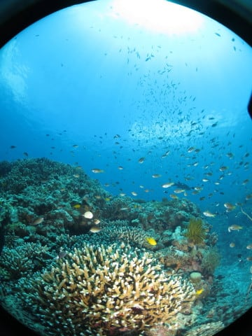
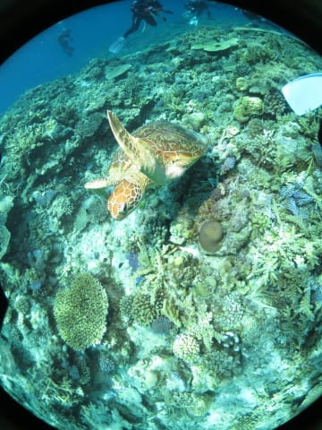
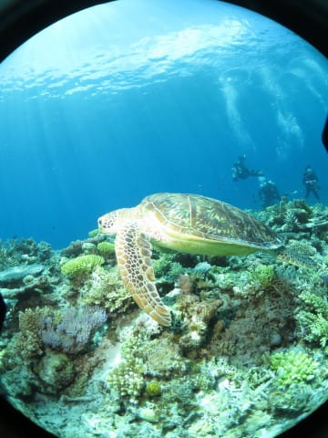

# 2023年8月，座間味で親子3世代ダイビング！その16…ダイビングラストデーの2本目も，慶良間らしいGood dive!

📅 投稿日時: 2023-10-03 03:52:50

🏷️ カテゴリ: [ダイビング日記](ce3a7a8d424d112fce83ee85c81a0e344.md)

なんだか．

[値上がりが続く今の時期としては格安](ec19063b3b4953b46be22cf2bb4c1b0f1.md)だと

書いた，プリンス系列の9スキー場で使える

プレミアムシーズンチケットですが…

10月1日の発売日の午前中に，あっという間に

300枚売り切れたようです…

（[プリンススノーリゾートプレミアムシーズンチケット案内ページ](https://www.princehotels.co.jp/ski/premium_season_ticket/)より）

やっぱりな～…

どう考えても割安だったもんな～…

しかし，割安とは言え…10万円のチケットが

初日の午前中で売り切れるとは…！！

ってなことで，本題へ．

今日も[前回の続き](e731d8a5846d3b6f05f3db152dfa9f275.md)，ダイビング日記です～！

ーーー

ということで．

ダイビングラストデーの1本目が終了して．

ボートに上がります…

ボートに上がったら，タンクの付け替えを

して，2本目の準備！

2本目に向けた器材セットが終わったら，

船は2本目のポイントに向かいますが…

今日も，1本目と2本目の間にいったん港へ

寄って，2本だけ潜るゲストをピックアップ．

3本組は朝8:15集合ですが，

2本組やシュノーケリングツアーの

人たちは，のんびり目の朝10時に港集合の

ようです…

ってなことで．

10時ごろに，追加ゲストをピックアップしたら．

2本目のポイントへ移動しますが…

いつもお昼によるガヒ島の横を通過して．

やってきたのはガヒ島の裏側のポイント，

「ブツブツサンゴ」

です！

ってなことで．

ポイントへ到着したら，10時に乗船した

シュノーケリングゲストたちは早速泳ぎ

始めてます…

ダイビング組は，シュノーケリング組が

海に入った後にブリーフィングを受けて…

そして，今日の2本目へエントリー！

ここも，リュウキュウイソバナの赤と

海の青のコントラストがきれいな

ポイントです…！

そして，魚の密度が高い！

いやー．

ここもいかにも慶良間っぽい，

癒しポイント…！

サンゴの上を漂っていきますが…

いや．

このポイントの，魚の密度の高さよ！！

もう，見渡す限り，魚，魚，魚！

それも，ハナゴイやケラマハナダイ等の

かなり鮮やかな魚が多くて，

南国の海っぽい，癒しの海です…

いや．

サンゴがきれいなだけじゃなく．

こういう，スズメダイやハナダイ系が

キラキラしてるのが，座間味だよね！

周りをキラキラと魚が行きかって…

これを見ているだけでも，

数時間は過ごせそう…

泳いでいる周りを，360度魚に囲まれる

この幸せ…

やっぱりダイビングをやっていてよかった…！！

もう，気づいたらこのダイビング1本だけで，

200枚ほど写真を撮ってました

でも，いっぱい写真を撮りたくなるのも，

この写真を見てもらえばわかって

もらえるんじゃないかな…

見てたら，ダイビングしたくなりません？？

ってな感じで．

魚いっぱいの海を漂い，

最後のほうは浅瀬のサンゴの上に

やってきますが…

ん？？

なんか，いる！！

…と，まっすぐそいつに向かわず，

チームのメンバーの反対側に回り込み…

周りを囲むような形で，じりじりと

近づいていきます．

まっすぐカメさんに向かっていくと，

反対側に逃げられちゃうので．

一旦カメさんの向こう側に回って，

チームメンバーと向かい合う形に

なるように回り込んでから，

接近していきますが…

今回もアオウミガメさんだな…

と見ていたら．

向こう側の大勢のチームメンバーに

恐れをなしたのか．

一人しかいないこちら側に，

カメさん突進！！

ぶつかりそうになったところ，

ちょっとかわして…

しばらく，カメさんと並走！

…しかし，さすが生まれたときから

泳ぎ続けているカメさんに，泳力で

勝てるわけがなく．

振り切られて，去っていきました…

カメさんを見送ると，

そろそろダイブタイムも40分．

ボートの下に戻ってきて，安全停止

がてら，ボートの周りフリータイム．

そして，2本目もエグジットタイム…

今日の2本目のダイビング，終了です！

（[続く](ea96c4e7827cdd16184016fe0772a3860.md)）

## 💬 コメント一覧

### 💬 コメント by (1kamakura)
**タイトル**: Unknown
**投稿日**: 2023-10-03 07:51:14

江戸の秋

20年以上やっていないダイビング

こちらで綺麗な海の中を見せていただくと、やりたくなりますねー。

亀さんが可愛い❤️

カメラに向かって泳いできてくれたー！

嬉しいですね♪

### 💬 コメント by (mae)
**タイトル**: Unknown
**投稿日**: 2023-10-03 22:20:04

ケラマの写真は何度見ても心が癒されますね。

20〜30歳代にダイビングにハマってた頃が懐かしくなります。

### 💬 コメント by (Skier_S)
**タイトル**: Unknown
**投稿日**: 2023-10-05 07:10:43

＞江戸の秋さま

この20年で，石垣の海のサンゴがかなり広い範囲で壊滅したり，

いろいろ残念なこともありましたが…

座間味は白化やオニヒトデの害もなく，20年以上変わらない海でいてくれてます！

もし，ダイビングを再開するなら座間味の海がいいかもです…

＞maeさま

慶良間の海は，大物ガンガンとかいうわけではないですが，

癒しの海としては最高です…

そして，焼額の新コースの予想，当てましたね（笑）

