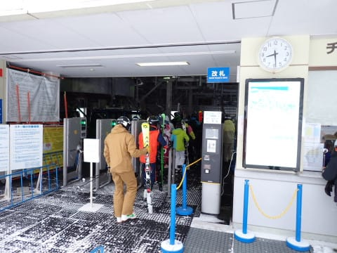
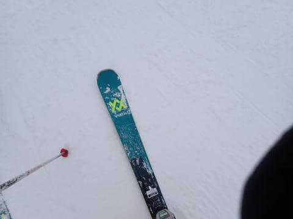
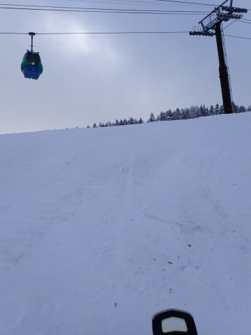

# 2024/1/1，2024年元日の志賀高原，焼額山スキー場は…積雪40cmでコンディション回復！GSコースオープン！でも混んだよ（涙）

📅 投稿日時: 2024-01-01 23:23:30

あけましておめでとうございます～！！

…と，書いておきながら．

おそらくほとんどの人がこの記事を

1月2日に読むであろうから，

一日遅れ感を多少感じつつ…

一応，2024年初めて書く記事なので，

ここで挨拶しておきます．

えー．

私の今年の抱負は．

ご無体な仕事で死なないこと

ですかね…←これのどこが抱負だ

とりあえず，なぜ年が明けるとめでたいのか

よくわかっていないのですが…

今年もよろしくお願いします．

ってなことで．

飽きもせず，元日の本日も志賀高原で滑り

倒しているわけですが．

まず，本日の焼額山．

朝は，重めのしっかり積もる雪が40cmほど

積もってくれました～！！

このおかげで，今日の10時からGSコースが

やっとオープン！！

…でも．

今日新たにオープンしたのはGSコースのみ．

この積雪では，オリンピックコースもSGSコースも，

イーストもミドルも白樺もブナも，

まだオープンできず…（涙）

第3高速リフトも営業できず．

ってなことで．

いつも通り，朝イチは第1ゴンドラで

スタートしますが…

8:30の定時より3-4分早めにゲートオープン！

山頂の気温は-9℃と，朝から0度近い

高温だった昨日から比べると，いい感じの

冷え込み！！

そして，朝のコースは…

うほーーーーっ！！

しっかり重めの雪が踏まれた圧雪の上に

2-3cmの新雪が乗った，かなり滑りいい

快楽バーン！！

あさイチの1本は…

間違いなく今シーズンでピカイチ（死語）の

激烈快楽バーンでした…！！

…が．

快楽バーンだったのはわずか1本だけで．

2本目からは，早くも人口密度が…（泣）

せっかく雪が良くなったのに，気持ちよく

飛ばせたのは1本目だけでした（涙）

でも．

今日の10時には，待ちに待ったGSコースが

オープンです！！

いやーー．

この景色，久しぶり…！！

帰ってきたよ～！

GSコースへ！！！

オープン直後の，まだ滑っている人が少ない

この時間なら，柔らか快楽シマシマバーンを

楽しめるかと思っていたところ…

あり？？

なんだか，氷のコロコロは出てくるし，

下地に結構硬い氷の塊が…（涙）

どうやらGSコース，オープンに向けて

人工降雪を打っていたらしく．

人工降雪の硬い雪…というか，氷の

コロコロが混ざったバーンでした（涙）

そしてさらに．

1ゴン乗り場へ到着すると…

ゴンドラ，かなりの列（泣）

…でも．

ぴったり8人乗車になるように，

相乗りレーンの人をスタッフが巧みに

誘導していたので，最大5分待ち

ちょいで済みました…

さらにこの後，GSコースの非圧雪部分に

突っ込んでみましたが…

新雪を蹴散らしてパフパフしている人が

いるので，気持ちいいかと思ったところ．

いや…

昨日から降った雪，結構重いんですが…（泣）

重い雪なので，板はそんなに沈まないし．

また，軽快にターンするのはかなり難しく，

結構まっすぐ突っ走る雪で，ちょい手ごわい

感じ…

1ゴンの待ち行列も短くならないので，

次は第2高速の唐松コースへ行って

みたところ．

…これはすごい人口密度だ…（涙）

新雪が積もった本日．

新雪が削れて，コースがコブコブになって

来たので…

コースで多くの人が立ち止まり，すごい

人口密度になってるようで，コースの

人は多かったけど，リフト自体は

そこまで混んでませんでした．

ちなみに，パノラマコースは終日こんな感じの

混雑でした（涙）

昼前のピーク時は，第2高速もゲートの外まで

並んだし，2ゴンは10分待ちくらいまで

行ったらしいけど…

1ゴンも，昼休み前にはガラガラになるの法則で，

11時半ごろには待ちがほぼ解消！

第2ゴンドラも，午後はそれほど待ち時間が

なかったようです…

ってなことで．

昼からはひたすら1ゴンでGSコースを

メインにグルグルしてましたが…

新雪が積もった本日．

第2高速沿いの唐松コースは，

午後は新雪が削られて，全面かなりの

コブ斜面になっちゃってたし…

パノラマコースも，急斜面部分は

かなりのコブ＆人口密度だったので．

…今日はやっぱり，GSコースが一番

良かったかな～…

…でも．人工雪打ちたてのGSコースは

ゲレンデにこんな氷が埋まってる感じだったので，

午後になっても全面カリカリコロコロした

感じがあったうえに…

さらに残念なことに，ごく一部だけど，

雪がはがれてブッシュが出てきたところも…（涙）

うーん．

やっぱりもうひと降りほしいな…

でも．

昨晩から積もった雪のおかげで．

スタッフが必死に雪出ししなきゃコースに

穴があいちゃうような，致命的な雪不足は

とりあえず解消したし．

GSコースもオープンしたし…

そして今日は，午前中は雪がぱらつく

天気だったけど．

午後は時折日も差す，穏やかな天気で．

ちょうど夜中に大雪が降ってくれる

という，いい感じの降り方だったし．

かなりコンディションは回復したな…（注：昨日比）

と．

昨日までの悲しい状況がずっと続く

最悪シナリオから逃れられたことに

安心して．

今日も日が暮れかける16時の

リフト営業終了まで滑り倒したのでした…

…で，本日．

16時営業終了だったので．

16時過ぎの地震の影響は直接

受けなかったのですが…

志賀高原でも結構揺れて，そのせいで

本日のナイターがなくなったり，

明日から営業開始予定だったファースト

トラックが明後日からに変更されたり，

いろいろありました…

皆さん，地震は大丈夫でしたでしょうか？？

とりあえず．

いろいろあったものの．

焼額は昨晩からの雪のおかげでコンディションは

そこそこ回復し．

明日からは白樺コースもオープンする

みたいです～！！

ってなことで．

また明日も志賀高原滑ってます～！！

## 💬 コメント一覧

### 💬 コメント by (新米パパ)
**タイトル**: Unknown
**投稿日**: 2024-01-02 06:51:41

元旦の、スタート2時間は、サイコーでした。

２高を回して昼前にあがり、2時過ぎにゲレンデ戻るも、コブだらけで下手くそには歯も立たず、ナイターに備えるも、、。

不安な日を過ごす北陸の方を思えば、スキーできるだけでありがたいです。

感謝です。

### 💬 コメント by (Skier_S)
**タイトル**: ＞新米パパさま
**投稿日**: 2024-01-03 00:21:46

元日の朝は良かったですね～…

午後のコブコブは厳しかったですが（涙）

とりあえず，滑れるだけでもありがたいと感謝するのでしょうか…

