# 2015年10月　子連れで西表へダイビング旅行その17…最後のダイブを終えて

📅 投稿日時: 2016-09-17 02:28:45

ということで．

車の試乗レポートを挟みましたが．

まだ夏モードのダイビング旅行記，続きます…

ということで．

本日も，西表島旅行記へ，Go!

--

って感じで．

きれいなサンゴをたっぷり堪能できた本日の

3本目が終わって．

ラストダイビングを終えたボートは，

港へ戻ります…

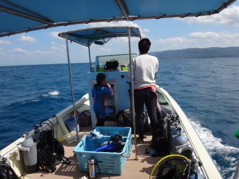

いやー．

昨日はどうなることかと思ったけど．

今日は天気に恵まれて，良かった～！

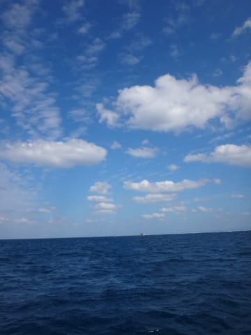

…ってことで．

30分ほどで，ボートは港に帰ってきました…

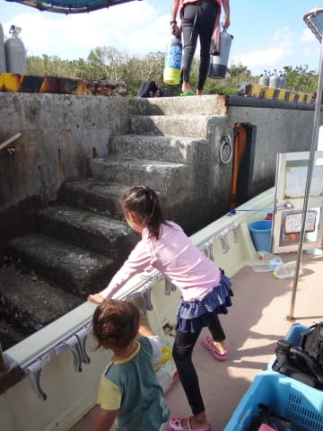

ダイブショップの車で，船浦港から宿へ送って

もらって…

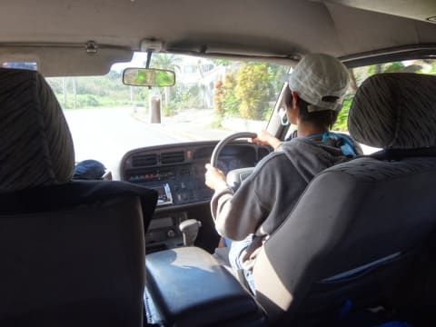

今回泊まった宿には，ダイビング器材を洗える

場所があるので．

宿で器材を洗って，部屋の前に干します．

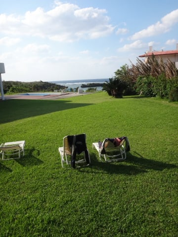

器材を洗っていると．

あぁ…ダイビングも終わってしまった…

という悲しさが迫ってきます（涙）．

＃この心境．ダイバーなら分かりますよね…？？

ってことで．

器材を干した後は…

またダイビングショップの迎えの車に乗って，

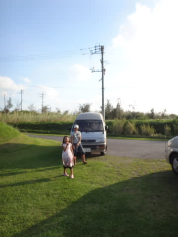

宿から車で2-3分のダイビングショップへやってきて，

ログづけタイム！

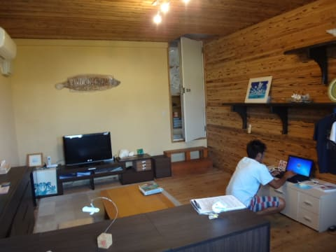

ここで，本日撮った水中写真を眺めつつ，

ログづけ…

というより．

オーナーのお子さん3人（船に乗っていた子以外に，

小学生のお子さん二人）と娘が仲良く遊んでいるのを

眺めての，雑談タイムを過ごしました（笑）．

のんびり雑談タイムを過ごしたあと．

まだまだ遊びたそうな娘を連れて，

ショップの皆さんとお別れして…

本日一緒に潜ったゲストの方と一緒に，

ダイビングショップにほど近いレストラン，

「Roco」へやってきました．

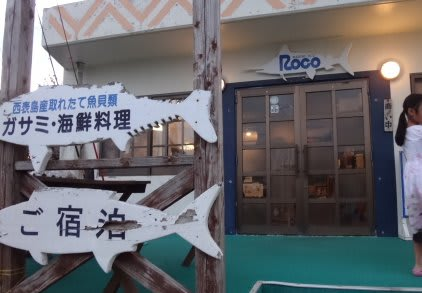

ここは，地元の魚を使った海鮮料理が楽しめるお店です…

まずは，地魚の刺身サラダですが…

お，結構イケる！

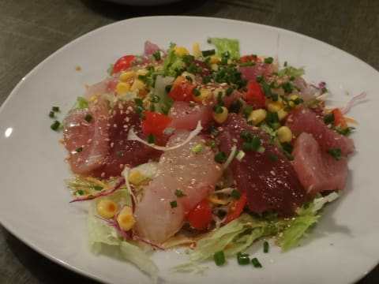

そして，海ぶどうと並ぶ娘の好物．

モズクの天婦羅．

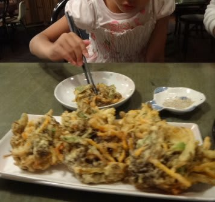

＃相変わらず謎な嗜好を持った娘だ…

島魚の野菜あんかけ．

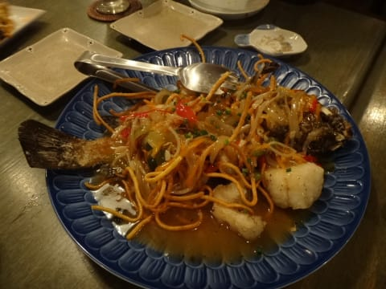

なかなか豪快！

そして，最後は締めの…

焼うどんだったかな？

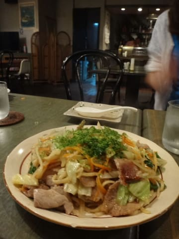

メニューはそんなに種類が豊富ではなく，

昨日の「初枝」さんのような，かなりレベルの

高い料理，ってわけではなかったけど

地物の魚と沖縄料理が楽しめて．

リーズナブルで良かったかな！

…このあと．

宿に帰って，

ビールの酔いと疲れで，すぐに気持ちよく寝てしまったのでした…
