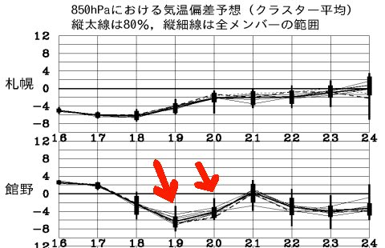
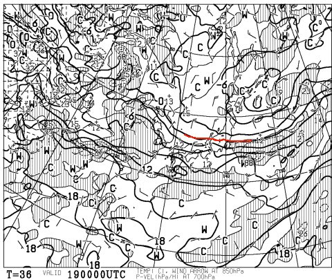
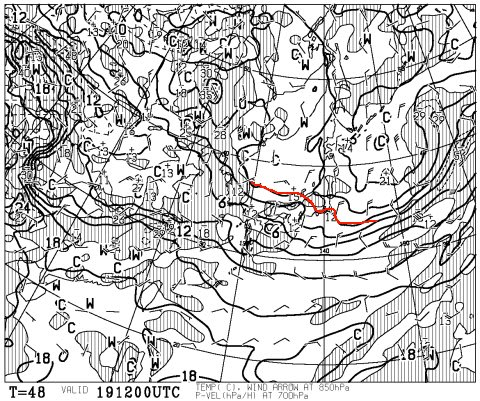
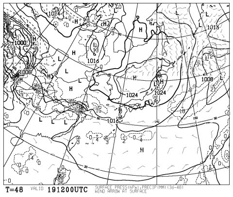
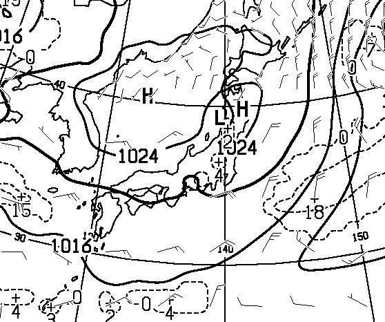
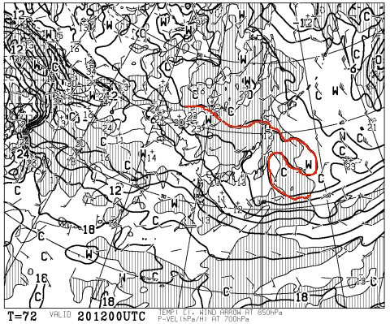
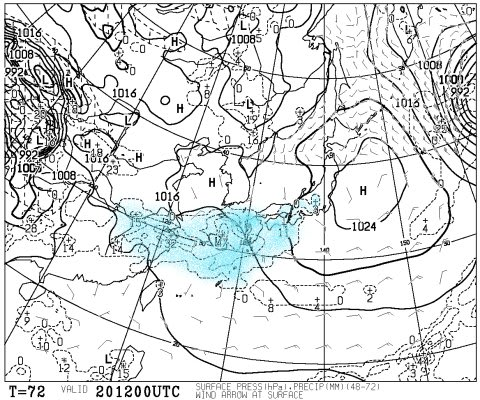

# 恒例！この週末の志賀高原は…土曜は晴れ時々曇り．日曜は曇りがち…でも，雨は降らなさそう

📅 投稿日時: 2014-04-18 03:13:40

🏷️ カテゴリ: [スキー天気予想](c6554f5c3c106093b511a8daae23757e8.md)

えー．

4月ももう下旬ですが．

志賀高原天気予想．

まだまだGWまで続きますよ～！

で．

この週末の志賀高原の天気は，と言いますと…

…

ふむ．

こんな感じで．

土日とも，平年より冷え気味のいい感じ！

ここ3週間，平年より冷える日がぴったり週末と

一致するのは．

おそらく．

私の日ごろの行いの良さのおかげでしょう←またそれか！

とりあえず．

土曜日の朝9時の，850hpa気温図はこんな感じで．

志賀高原にちょうど0度線がかかってます．

うむ．

この時期としては上出来．

土曜朝はマイナス気温でのスタートですね～．

で．午後9時になっても．

こんな感じで，0度線は志賀高原近辺にとどまってくれます．

…これは．

ほぼ[先週の日曜](eb3c0712a14485274da81b095c2a7bf0b.md)に近い感じなので．

昼間になっても気温がそれほど上がらない，

いい感じの一日になりそう！

土曜の地上天気図は，こんな感じで…

一見，高気圧に覆われてそうですが．

日本付近を拡大すると．

こんな風に，プチ低気圧がいくつか発生しているので．

雲が時折流れて太陽を隠してしまいそう．

まー，この時期は，

すっきり晴れよりも時折曇る方が，

雪が溶けなくていいかも…

で．

日曜ですが．

うーむ．

0度線は東に行ってしまい．

志賀高原は3度線がかかってます．

…土曜よりは気温が上がりそう．

んでも，平年よりは低い気温ですが．

んで．

地上天気図は．

こんな感じで，水色に塗った雨が降るエリア．

志賀高原近くまで伸びてます…

しかし．志賀高原はぎりぎり雨の領域から

はずれてそうで．

また，低気圧の接近も当初予想より遅くなったので．

降ったとしても，夕方以降，夜くらいかな～

って感じなので．

まとめると．

土曜：雲は多めなれど，晴れ．雲が時折太陽を隠すかな．

　　気温は朝はマイナス．昼間も山頂は2-3℃程度まで

　　しか上がらず，気温は低め．

　　早朝は，金曜に降る雨でしっかり硬くなったアイスバーン．

　　午前中には，表面が緩んでちょうどエッジが効く

　　いい感じのバーンになるでしょう．

　　雪は終日ザブザブにはならず，昼間もザラメ．

　　夕方は冷えて固くなっていく．

　　…この時期としては，比較的いいコンディションかな．

日曜：朝から曇り気味．時折日も射すタイミングもあるかも．

　　午後に向かって，雲が多くなる．

　　気温は朝は0℃前後．

　　早朝は固めにしまった雪．

　　朝のうちから緩みはじめ，午前中は適度にエッジが効く

　　滑りよいバーン．

　　昼から午後に向かって結構緩み，雪は荒れ始めるけど，

　　ちょっと緩めのザラメ程度で，水が浮いたりストップ

　　スノーになったりはしなさそう．

　　夕方遅くから，もしかするとぽつぽつと雨が落ちてくるかも…

…って感じで．

この週末．

[去年みたいに新雪が積もる](e60cb60277ae6b17ecf46070ee8ae9617.md)ような奇跡はなさそうだけど．

まーまー冷え気味のいい感じかな！
