# 4月24日(月)の志賀高原スキー場，特派員情報…そして，焼額は4月30日で営業終了(涙)．一の瀬ファミリーもすでにクワッド営業終了

📅 投稿日時: 2023-04-25 04:10:24

🏷️ カテゴリ: [日記](cc4b5682fb7b8b144980957a978653fb0.md)

一旦昨日でGSコースが終わるとの情報が

あった焼額ですが…

なんと，

25日まではGSコースが滑れるようです！！！

いやー．

スタッフの皆さんが雪付け頑張ってましたし，

25日までは気温が冷える予定だから，

何とかオープンするみたいですね…！

ただ．第1ゴンドラの営業終了が4月30日と

公式にアナウンスされてしまいました…（泣）

この案内の下の方に，GSコースが25日までと

書かれてます

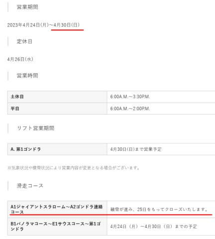

（[焼額山スキー場ホームページ](https://www.princehotels.co.jp/ski/shiga/informations/spring_skiing2023/)より）

うーん．

焼額は30日で終了か…！！

でも．

26日は気温が上がってかなりの雨に

なりそうだし（夜中はうっすら雪になるかも）

さらに，28日からは下の図の矢印部分

を見て分かるように，気温が平年より

4℃くらい高くなりそう（泣）

これは…30日どころか，29日までもつか

ギリギリと言ったところ…

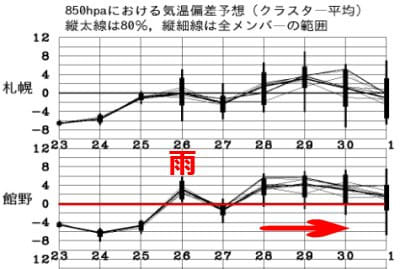

ただ．

本日の特派員情報によれば…

今日…というか，もう昨日ですね．

4/24(月)の焼額は，朝は-5℃と冷え冷え！！

そして，あさイチのバーンはかなりガチガチ！！

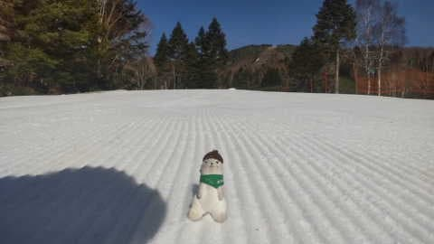

なので，晴天にもかかわらず．

午前8時を過ぎても，かなり硬めの

バーンをキープしてくれたようですが…

気温もそんなに高くないので，

コースの雪もほとんど解けず，土日から

雪はほとんど減ってない感じですね…！！！

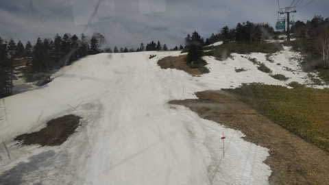

確かに，GSコースは火曜まではもちそうな

感じ…！！

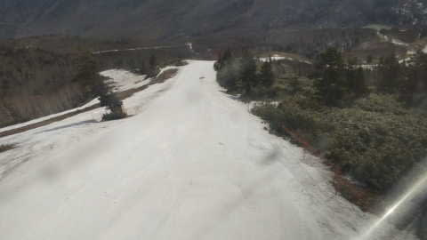

そして．

きのうは[かなり土だらけ](https://blogimg.goo.ne.jp/user_image/54/ef/441e221a7cec566ca91d58c3587a503c.jpg)だったパノラマコースの

壁の部分．

…しっかり雪が入れられて，バーン状況は

見事に復活してます！！！

おそらく，結構離れたパノラマインコースに

残ってた雪をかき集めて，運んで復旧したん

だろうなぁ…すごい…

さすが焼額！

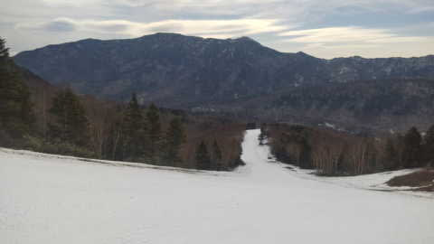

で．

この日は昼近くになってもまだ0℃を

わずかに上回る程度の，低めの気温で

天気もうす曇りだったので，雪は

それほど融けず…

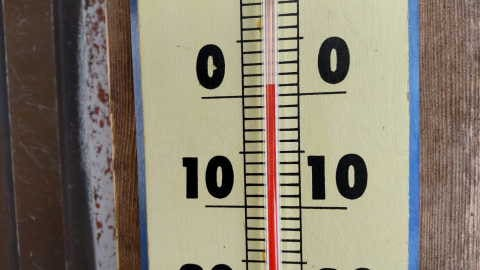

板の滑りも良かったし，さらに

コース幅が狭くなる，2ゴンから1ゴン側への

連絡路部分も，ほとんど雪が減らなかった

ようです…！

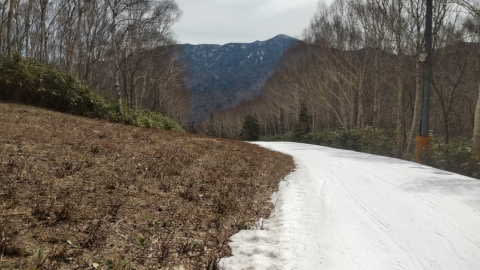

ただ．

一の瀬ファミリーは，ついに正面バーンの

融雪により，クワッドの営業が終わってしまい

ました…

今後動くのはペアリフトのみです(泣)

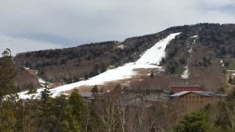

後は高天ヶ原がいつまでもつのか…

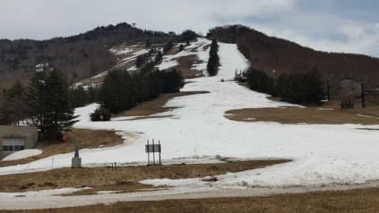

ってなことで．

現在，志賀高原で動いているのは，

奥志賀第2，第3，第4リフト

焼額第1ゴンドラ（GS,パノラマ2コース）

一の瀬ファミリーペア

高天ヶ原（土日のみ，おそらく29，30は動いたとしてもトリプルだけだろうな…）

熊の湯第2ペア（まだギリギリ山頂からOK)

横手山第1，第2，第3，第4

渋峠ペア

となります…

高速リフト・ゴンドラが滑れるのは，

奥志賀第2，第3と焼額，そして横手第2の

4本だけですね…

その中で，ゴンドラが滑れるよう維持している

焼額はやっぱりすごい…！！

しかし．果たして．

水曜日，26日の高温の雨にゲレンデが耐えるのか？？

そして，28日からの高温に負けず，29，30日のGW

まで生き残るゲレンデがあるのか？？

焼額も，かつて[こんな状態になっても営業していた](m201804.md)

年もあったので…

今週末も，それに近い状態になりそうな

予感…

2018/4/28のGSコース（この日で営業終了）

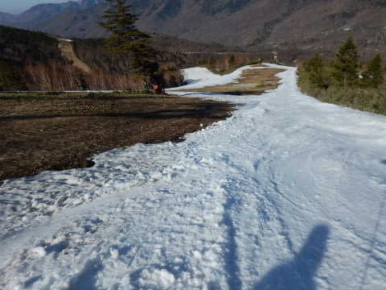

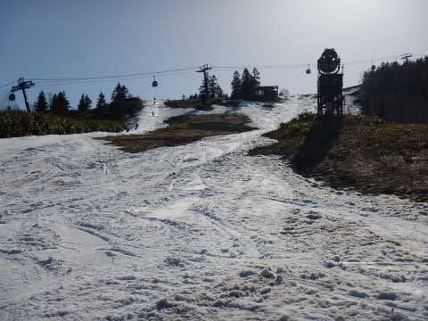

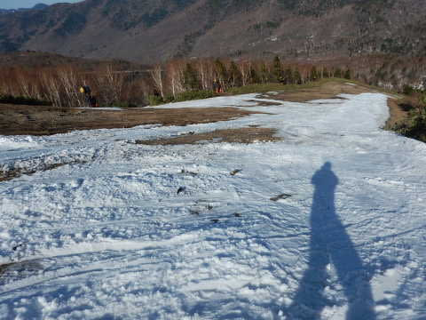

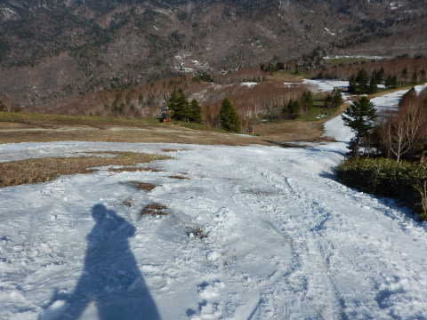

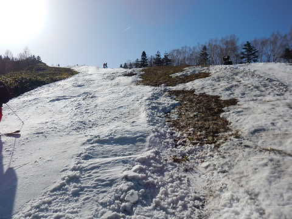

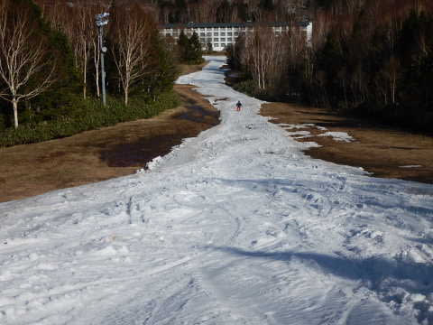

2018/4/29のパノラマコース（この日で営業終了）

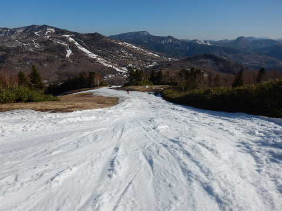

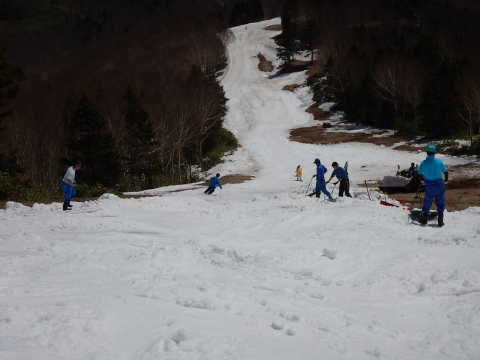

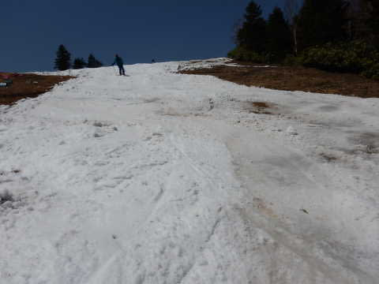

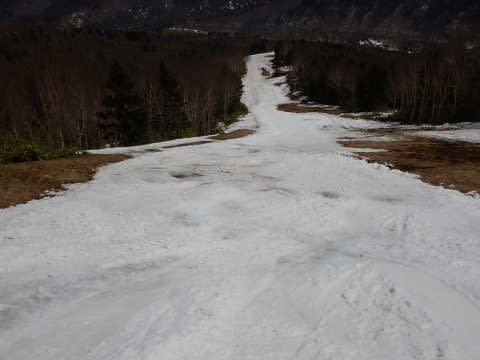

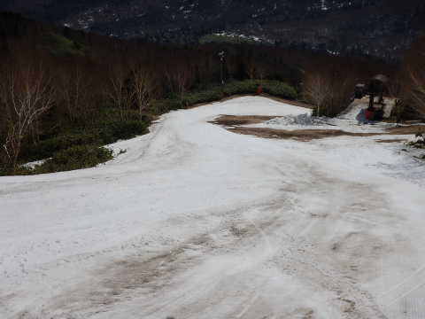

いや．

しかし，これで営業してたってすごいな…

この年も，4月28，29日でGSコース，パノラマコースが

終わっているので，だいたい今シーズンと

おんなじ感じだったんだなぁ…

…2016，2018，2023と，最近はGW連休まで

雪がもたないシーズンが続いているので．

やっぱり，+10℃で水が凍るように

ちょっと祈ってみないとダメかな…？
