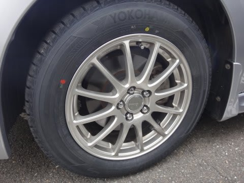

# YOKOHAMA iG5 PLUSで1万km走ってみた…ヨコハマのスタッドレスはどんなもんかな？

📅 投稿日時: 2016-02-24 01:35:57

えー．

なぜか，12月に[77777km走った報告](e9691982bfd538dd3f6f95ddb5bc29bdc.md)をした，わがBRレガシィ君．

…早くも8.5万kmを突破してしているわけで．

うーん．

順調に（？）過走行への道まっしぐらです．

ってことで．

今シーズン，[通販で買ったヨコハマのiceGuard 5PLUS](ed37f79b998c2bb8649b52639399bb425.md)．

こいつを履いて，もう1万km以上走ったので．

このタイヤのインプレッションでも書いてみますか…

とりあえず．

このタイヤを履いて，志賀高原の登り坂を，

すでに30回近く登っているわけですが．

…雪道での効き具合は，不満は無いレベル．

柔らかい雪，冷えた氷，ツルツルミラーバーン等

走ってみたけど．

昨シーズン履いていた，BRIDGESTONEのREVO GZとどっちが

効くかというと…

特に明確な差はわからないレベルです．

…直接比べたらわかるのかもしれないけど．

間に1シーズン挟んでいると，

うーん．

去年のBLIZZAKと比べ，明らかに「効いている」

「効いていない」という差はわからない感じ．

ってことで，

雪道では，6年前のモデルのBLIZZAKからの大きな進歩を感じる…

というほどの変化は分からないなぁ…というのが正直なところ．

まぁ，これだけの性能があれば，私が志賀高原を走る分には，

全く問題は無いですね～．

でも．

この，YOKOHAMAのiG5PLUS.．

ドライのアスファルト路面での性能は，

古いBLIZZAKよりは進歩している感じ．

横Gをかけた時，REVO GZより滑り出しが遅く，

粘る感じがあります．

また，タイヤの剛性も高めの感じで．

ドライグリップと操作性は多少進化した感が…

まぁ，日常ではそうそう使うことのない横Gをかけた

領域の話ですが．

このあたりはフィーリングの話ですが．

予想以上に大きな差が出たところが一つ．

…それは．

燃費なんですね～！！

このiG5PLUS．

広告でも，エコタイヤ並みの低燃費タイヤだって

言い張ってるけど…

確かに，燃費が良くなった！

REVO GZを履いていた時は，BRレガシィ君の

志賀高原往復の燃費は，大体13～13.5km/l

ところが．

iG5PLUSにしてから，大体13.5～14km/lになり．

燃費が大体0.5km/lくらい伸びまし

わずかな差に感じますが，

燃費改善率は，3～4％ってところでしょうか…

ということで．

雪道の効きに関しては，私がはっきりわかるほどの

進化を感じられなかったiG5PLUSですが．

スタッドレスにしては燃費がいいこのタイヤ．

スタッドレスタイヤで，シーズン2万km以上走る

私にとっては，ちょっと嬉しいかも…
