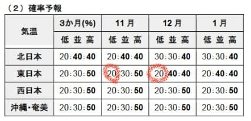
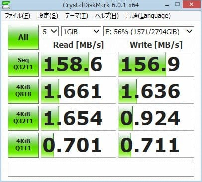
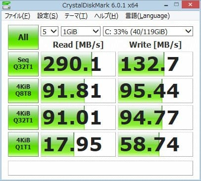
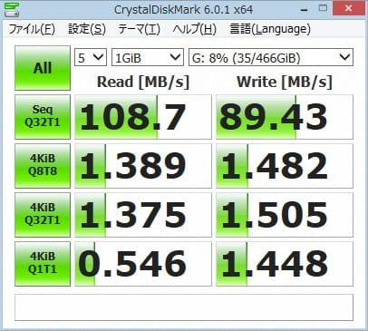
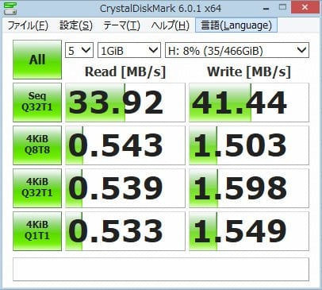
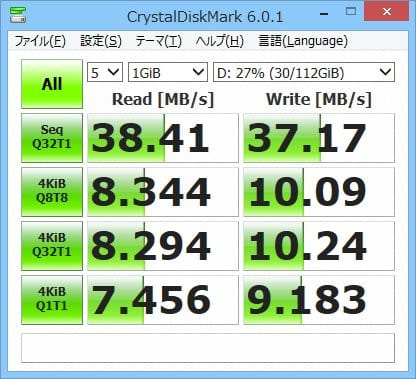
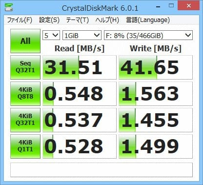
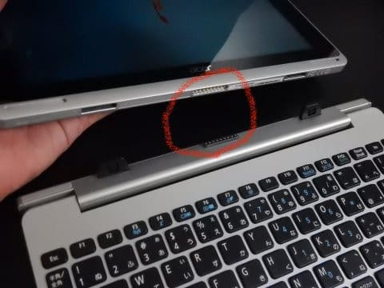
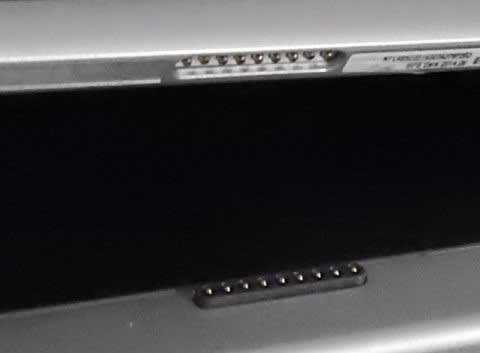
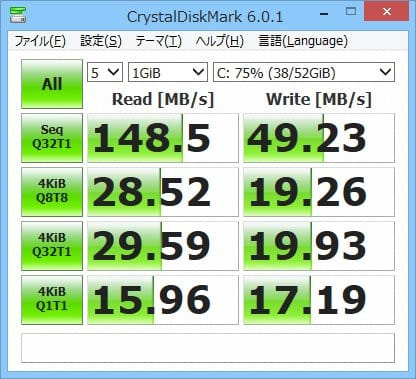

# ACERの2-in-1タブレット，Aspire switch 10を分解，SSD化してみる…その4，ベンチマーク編

📅 投稿日時: 2018-10-25 01:51:39

えー．

本日．

気象庁の[全般季節予報資料](https://www.sunny-spot.net/chart/FCXX94.pdf)と，

[3か月予想資料](https://www.sunny-spot.net/chart/FCXX93.pdf)が出ましたが．

うーーん……

この11月から12月にかけて．

日本付近で偏西風は北に蛇行する，

という予想のようで…

なんだか，この11月，12月．

雪があんまり積もらなさそうな気配ですね（涙）．

ヤバい…

昨シーズンは，11月からかなりの積雪があり．

熊の湯が11月中にほぼ全面滑れるようになるという，

かなり嬉しい感じのシーズンオープン時期でしたが．

…今シーズンは，そういう楽しい状況は

望み薄です…（泣）．

いや．

でも．

こんな感じで．

まだ今でも，20％の確率で，平年より冷える可能性が

残っているのだ！！

大丈夫！！

みんなで今から必死に冷え冷え踊りを踊れば，

まだ間に合うのだ…っ！！

ということで．

これから11月中にかけて．

久しぶりの冷え冷え踊りを踊って．

恵まれたシーズンインとなるよう，祈りましょう…！！

ってな感じで．

本題へ．

本日は，ノートパソコンのSSD化，[その1](e1dddcdb06b2065a23b9d053df0f1a158.md)，[その2](e2aa82f12f358b3de46a55194b2ef0b12.md)，[その3](e59c737cc2670a6274fe7b5bce86011b0.md)の続きです．

では，どうぞ～！

---

とりあえず．

Aspire switch 10をSSD化したものの…

なんだか，SSDにした割にはあんまり早くなって

無い気が…？？

いや，このPC．

システムディスクは本体内蔵のeMMCなので，

データディスクをSSD化しても

アプリケーションの動作速度は

早くなったりしないんですが．

写真データの読み書きなど，データの

読み書きにかかる時間が，なんだか

遅い気がする…

ってなことで．

ディスクのベンチマークを走らせてみました…

使ったソフトは，ディスクベンチとしては定番．

[Crystal Diskmark](https://ja.osdn.net/projects/crystaldiskmark/)．

まずは，比較の基準として，普通のSSDやHDDの

読み書き速度がどんなものなのか知るために．

私の自作デスクトップマシンのベンチマークから

とってみましょうか…

このベンチマーク結果．

左側が読みだし，右側が書き込みで．

一番上の列がシーケンシャル読み書き，

下3列がファイルサイズを変えたランダム読み書きの

速度です…

まぁ，下3列の違いを細かく言うと，

いろいろありますが．

一番上がマルチスレッドテスト，

2番目がNCQの性能を見るシングルスレッド＆32コマンドキューでのテスト，

3番目が純粋なリードライト1コマンドを完遂する実行速度をみるテストと

なりますが…

実際，今のデバイスはマルチスレッドで動作してませんし．

ほとんどのデバイスが32キューのNCQで動いているので，

下から2番目の行を見ておけば，ランダムアクセス性能の

目安が得られます…

ってなわけで．

改めて，ハードディスクの測定結果を見返してみます．

・デスクトップマシン

・ハードディスク

ふむ．

3.5インチ，5400rpmのハードディスクとして

平均的な値ですね．

シーケンシャルのリードライトが150MB/sちょい，

ランダムリードライトが平均1.6M～0.9MB/s．

シーケンシャルに比べ，ヘッドシークが走る

ランダムリードライトが激遅ですね．

それに対して，デスクトップマシンのSSDの

結果が，こちら．

・デスクトップマシン

・SSD

かなり古い激安モノなので．

SSDとしては遅めですね…

とはいえ．シーケンシャルリードは300MB/s近く出てますし．

まぁ，十分なスピード．

それよりも．

ランダムアクセスが，90MB/sと．

HDDの50倍以上の早さです！！

…ランダムアクセス性能が，システムディスクとして

使う時の性能に効くので．

ハードディスクをSSDにすると，システムがいかに

早くなるか想像がつこうというもの…

そして．

今回．AcerのPCから取り出したハードディスクで作った

ポータブルHDDを，デスクトップのUSB3.0ポートにつないだ

結果が，こちら．

・デスクトップマシン

・外付けHDD，USB3.0接続

シーケンシャルアクセスが100MB/s前後と，

内蔵ディスクよりは遅くなってますが．

ランダムアクセスは内蔵ハードディスクと

それほど変わらない値で．

USB3.0の伝送速度なら，ハードディスクの性能は

ほぼ余すところなく引き出せている感じですか…

で．

わがデスクトップマシン．

速度が遅いUSB2.0のポートがあるので．

次は．同じポータブルHDDを，このUSB2.0の

ポートにつないでみましょうか…

・デスクトップマシン

・外付けHDD，USB2.0接続

うううーーーん．

さっきと全く同じポータブルHDDなのに．

シーケンシャルアクセスが33～41MB/ｓと，

一気に1/3程に速度が落ちてます！

スピード7割減っ！！

そして，ランダムアクセス性能も，

リードが0.5MB/s前後と．

こちらも1/3近くに落ちてます…

…USB2.0，遅いね…

ってな感じで，

デスクトップマシンを使っての基礎数値を

知ったところで．

今回のACER Aspire 10のSSDのベンチマークを測ってみると…

・ノートPC

・SSD

なんだよ！！！

シーケンシャルアクセス，SSDと思えないほど

激遅じゃないかっ！！！！

このSSD，カタログ値500MB/sくらい出るはずなのに，

38MB/s前後って…

どういうこと？？？

このディスク，データディスクだから．

写真だとか動画だとか．デカいサイズのファイルの

読み書きメインなので．

シーケンシャルアクセスの性能がモロ響く

使い方なんですけど…（涙）

ついでに，このACER Aspire 10のUSBに

先ほどのポータブルHDDを繋いでみると…

・ノートPC

・外付けHDD

うむ．

デスクトップで測った，USB2.0のときとほぼ

同じ数値…

ってことは．

こいつのUSBポートは，USB2.0だな…

…

…で．この，シーケンシャルアクセスが37～38MB/sって．

もしかすると．

直前に測ったSSDとほぼ同じ数値じゃないか？？

…これって．

もしかすると．

このPCって，2-in-1で．

画面（本体）とキーボードドックが外れて．

このキーボード側に，SSDが載ってるわけだけど．

で．

この本体とキーボードは，このコネクタで

繋がってるわけだけど．

もしかしたら…

このコネクタの上の信号線…

USB2.0なんじゃないか？？？

いや．

ってか．

自分が設計者だったら．

本体と周辺機器とを簡単につなぐコネクタを

設計するなら．

安くチップが手に入って，いろんなデバイスが

簡単につなげるUSBの信号を利用するわな…

間違いない．

ってなわけで．今回の結果は．

2-in-1のノートパソコンをせっかくSSD化したものの．

SSDが乗るキーボードドックと本体が

USB2.0接続だったため，激遅だった

という，悲しい結末でした…（涙）

…でも．

ハードディスクに比べて電力が減ったので．

電池もちはちょっとだけ良くなった気がするので．

良しとしておこう…

うん．

交換した意味はあった．

決して，無駄骨じゃなかったんだっ！！！！

…と，自分に言い聞かせた，Skier_Sだったのでした…

PS.

ACER Aspire 10のシステムディスクである内蔵eMMCの

ベンチマーク結果は，こんな感じで．

シーケンシャルアクセスはHDD並みの

スピードなものの，

ランダムアクセスが

約30～20MB/sと，ハードディスクの20倍くらいの

速さなので．

ノートパソコンよりずっと快適に使えます…

## 💬 コメント一覧

### 💬 コメント by (ほっぽ)
**タイトル**: 10/25　イエティナイター
**投稿日**: 2018-10-26 00:01:57

ｓさん

週末イエティのご参考にと、今夜滑ってきました。

雪はやや緩んでいましたが、

コース幅も僅かながら広がり、

雪上スキー満喫出来ました。

リンク先に今夜の滑走レポートを貼り付けておきました。

http://www2.tokai.or.jp/nana_hoppo/

### 💬 コメント by (Skier_S)
**タイトル**: ほっぽさま
**投稿日**: 2018-10-27 01:10:22

ガラガラで，ゲレンデも広がったみたいで．

うらやましいです～．

私も平日スキーに行きたいなぁ…（涙）．

今の仕事の山場と引っ越しが落ち着かないと，

週末もスキーが厳しい状態です（泣）．

12月には落ち着くはず…！（楽観的見通し）

