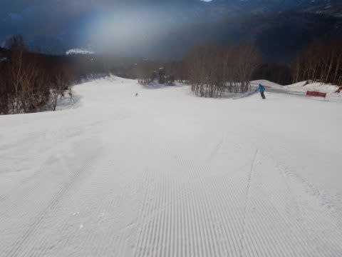
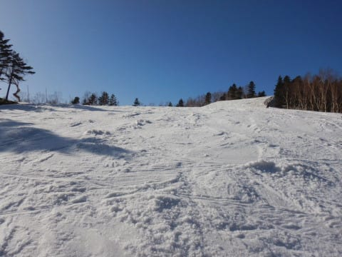

# 2021/4/11(日)の志賀高原スキー場レポート，速報モード！…天気は終日晴天！朝は最高！でも昼前から緩み，午後はちょっと疲れるバーン

📅 投稿日時: 2021-04-12 02:04:46

えー．

2月まで例年並みの積雪量だったのに．

異常に気温が高く，さらに全ての週末が

雨にたたられるというダメダメ3月の

おかげで，例年より雪が少なくなりつつある

今シーズン．

一の瀬正面バーンや高天ヶ原メインバーンに

早くもブッシュが出始め．

一の瀬のパーフェクターコースの

取りつきもすごい土が出てしまい，

来週は無理っぽい状況になって．

寺小屋もかなり土が出てきてますね…(泣）

例年より2週間以上，雪が消えるのが

早いよ…(激涙)

…と思っている今日この頃，皆様いかが

お過ごしでしょうか(時候の挨拶)

そのうえ，さらに14日の水曜は，

また，空から液体が降りそうで．

うーん．

14日の夜は雪になりそうなんだけど…

雨で雪が解けないよう，祈るばかり…

ってなことで，本題へ．

今日も志賀高原で滑ってきたわけですが．

帰宅後片づけや板の手入れをしていると，

またこんな時間…

だもんで．

日曜定例，速報モードにて！

えー．

本日も6:30オープンの，焼額早朝営業から

スタート！！

早朝の参加者は比較的多く，営業開始前に

駅舎からちょっとはみ出るくらいの

人数が待ってました…

早朝営業開始時の焼額山頂の

気温は-2℃と．

ちょいとだけ予想より高い

気温だったけど…

天気は朝からすっきり晴天！！！

ゲレンデはしっかり凍って硬いけど，

表面はザラザラしていて，いい感じで

エッジが効く，この時期としては

かなりのいい感じのシマシマバーン！！

早朝が終わって通常営業になっても，

しばらくは固く締まったいいバーンを

滑ることができました～！

ただ，今日はすっきり晴天で．

昨日よりは気温が上がっちゃったので，

昼前にかなり雪が緩み始め…

昼過ぎには，ザブザブした感じの

雪になっちゃいました(涙）

でも．

そのおかげか，昼からは無人に近いほどの

ガラガラで．

ゴンドラも飛び乗りだったし．

ザブザブ雪で多少疲れるバーン

状況だったものの．

人が少なかったから，ものすごい凸凹に

なることもなく，

焼額は，最後まで大回り板で

滑れるレベルでした～！！

ちなみに．

他の特派員から送られてきた奥志賀の

第2ペアリフト沿い，エキスパートコースの

状況を見ると．

焼額に比べて，かなり荒れた凸凹で…

小回りレーンも出来ちゃってたので．

うーん．

夕方は，奥志賀より焼額の方が

良かったのかも…？

とりあえず．

今日は営業終了まで，ずっと天気も

良かったし．

夕方は多少荒れたとはいえ，早朝から

午前10時頃までは，締まった感じの

バーンをキープしてくれて．

焼額は午後はガラガラで，そこまで

雪も荒れなかったので．

今日も結構楽しめる一日でした～！！

また，余力があれば，明日詳細レポート

やります…

(先週は詳細レポートできなかったけど…)

## 💬 コメント一覧

### 💬 コメント by (レインボー73)
**タイトル**: Unknown
**投稿日**: 2021-04-12 12:16:29

月曜日の志賀高原情報

今日で目標だった120日滑走達成です。今シーズンはこれで消えます。善良なエス様の、少しでも力になれればと、拙い文章で紙面？をお借りしてきましたが、これから、妻との逢瀬（妻は望んでくれてるのかは極めて不安）、山菜採りと渓流釣り（山ごもりして）、鮎釣り（山ごもりして）などで、生きていればレインボー74として来シーズンを迎えます。

朝の上林５℃　蓮池４℃　山頂２℃。さわやかに晴れわたつている。

一番籠で一本目、少し食い込む快樂バーン。これは早くゆるみそう。

４本滑って13.5分ペース。パノラマの茶色い所ではブレーキが。だけど他はまだまだ。とにかく人に会いません。

６本目はパノラマインコース（ビギナーズ）をクローチングで。気持ちいい。アウトコースの仲間は、成長した妖怪に悩まされたとか。

７本目にはアウトで妖怪が増殖。ここ以外は快適なんだけど、いいイメージで終えたいので、ここで終了。

滑るイメージ、めっちゃいいです。ありがとうございました。

### 💬 コメント by (ゆうこ)
**タイトル**: Unknown
**投稿日**: 2021-04-12 14:30:40

先週末は、志賀高原に行ってきました！土曜は2ゴンで、Sさんの板は見かけましたが、お会いできなくて残念でした。

今シーズンは、子供が体力がつきメキメキと上達して、いいシーズンになりました。Sさんの娘さんのように英才教育がんばります！

また来シーズン会えたら会いましょう！

### 💬 コメント by (ほっぽ)
**タイトル**: 4/11
**投稿日**: 2021-04-14 00:19:00

Ｓさん

遅くなりましたが、日曜日はニゴンで板と車を見かけました。

また、特派員に起用して頂きありがとうございました。

ラストのエキスパは難しいバーンでまともに滑れなかったです。

今週末、来週末は土日志賀高原に出動しますので、お会い出来たらよろしくお願いします。

今週末は、再び天気が心配です。

http://hoppo.officialblog.jp/

### 💬 コメント by (Skier_S)
**タイトル**: コメント回答遅れました…すみません
**投稿日**: 2021-04-14 00:59:06

＞レインボー73さま

今シーズン，120日に渡る志賀高原滞在＆レポート，

ありがとうございました！！

数多くの読者が，コメント欄のレポートを楽しみに待っていたと思います…

また来シーズン，志賀高原でお待ちしています！！

＞ゆうこさま

お久しぶりのコメント，ありがとうございます～！

お元気だったようで何よりです．

志賀にいらっしゃってるのに会えなかったとは残念…

お子さんも大きくなったのでしょうね．

ぜひ来シーズンは一緒に滑りましょう…！

＞ほっぽさま

板と車しかお見せできなくて残念(笑)．

また今週末お会いしましょう…！！

でも，ホントに週末狙ったように雨って…（涙）

