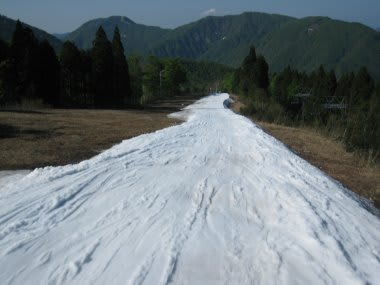

# 5月19日，土曜日のかぐらはいいコンディション！

📅 投稿日時: 2012-05-19 23:25:53

えーっと．

今日は日帰りで，かぐらへ行ってきたわけですが．

晴天でしたね～．

雪はいっぱいありましたね～．

…でも．

あれですね．

…混みましたね．

朝イチロープウェーは7時半からなんですが…

7時半に並んだら，乗車まで20分以上待ちました…

んで．

山頂の高速リフトは．

朝から夕方まで，平均5分ほど待ったよ～っ！

ピークは午前10時～11時ごろまで，15分近くのリフト待ちでした…

並行するペアリフトも動いてたけど．

それでもこれだけの列が…

…でも．

でも．

なんでこんなに待ち時間があったかというと．

今年の5月は，かなりコンディションがよいのだ．

この1-2月．新潟は豪雪だったということで，

(信州は雪が少なかったけど)

まだまだいっぱい雪が残っているのだ．

…でも，テクニカルコース．

クローズされてないまでも，もうかなりヤバめ．

ってーか，途中がほぼ切れ掛かっているので，普通ならクローズかな…

ジャイアントも，かなり土が出てます…

でも．

メインバーン．

この時期にしては，コース幅いっぱいに雪がついてます．

朝イチはきれいな圧雪で，5月下旬としてはかなり恵まれた

コンディション！

大回り可能！

この時期にこんなに滑れていいのかっ！

この時期，雪が少なくなっている和田小屋～高速リフト間

も問題なし．

さすがに雪は結構張り付きぎみの雪ではありましたが…

昼前には，さすがに荒れてきたけど．

で．荒れてくるとゲレンデに人がたまって，

ちょっと人口密度が…

午後2時ごろには，一面のこぶになってきて

3時ごろにはこんな感じ．

でも，例年なら昼前に一面のこぶになるけど，

今年はコースが広くて人が分散するからか，

こぶの成長速度が遅めだったので，荒れていたとはいえ

昼過ぎまで結構大回りで滑れましたね～．

そしてすごいのは．

この時期に，ゴンドラのりばまでもかなりの幅で雪がついていて…

それどころか．

なんと，

みつまたロープウェーまで滑って降りれるのだ．

うーん．

うまくいけば来週まで持つかも…

（可能性は低いけど)

という感じで．

明日も多分かなり楽しめるそうなかぐら．

来週まで，十分いけそうですね～．
