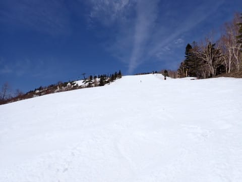

# 2024/4/20(土)の志賀高原焼額山スキー場は…ほぼ終日晴れ，気温は高めだったけど朝はいい感じで締まり気味．雪はそこまでひどくならなかったよ

📅 投稿日時: 2024-04-21 00:05:01

🏷️ カテゴリ: [2024スキー滑走日記](c453f687e8a0f05679e95831d0a02cd0c.md)

ということで．

本日も志賀高原で滑ってきました～！！

いやー．

まだ，思ったより雪が残ってますね…

悲惨だった昨シーズンの同時期よりも，

雪の量はずっと恵まれている感じです…！

うーん．

志賀高原，これからの気温が平年並みだったら

間違いなくGW最後まで行けそうな感じなん

ですが…

とりあえず，GW前半の3連休は間違いなく

焼額のゴンドラは行けるはずの積雪量です！

ってなことで．

本日の志賀高原の詳細レポート！！

まず．

早朝に間に合うように出かけるのはあきらめ，

８時からの通常営業をスタートに間に合うよう

焼額に到着しましたが…

今日もすっきり晴天ですね…

いや．雪が解けるから晴れなくて

いいんですが．

で．

朝は風が強いということで，昨日から

２本のゴンドラで早朝営業を開始している

焼額．

今朝は第２ゴンドラの運転が見合せになり，

第１ゴンドラのみでの早朝営業でしたが…

第１ゴンドラ，そんなに混んでません．

通常営業開始を待っているのはせいぜい

これくらい．

で．

朝8時の通常営業開始と同時にゴンドラに

乗り，山頂へ向かいますが…

朝8時の段階で，山頂の気温すでに+3℃（泣）

でも，過去2週間の週末の異常高温を考えると，

まだましなレベルかも…

ということで，朝から日差しは強かったのですが…

実は今朝は未明にかなり冷えたみたいで，

朝8時の段階では，まだ硬さも残る，

結構楽しいバーン！！

焼額にしては珍しく，圧雪の継ぎ目に

ちょっと凸凹があったけど．

でも，朝のうちはかなり締まった

いい感じのバーンで．

すっきり晴天だったけど，朝のうちは

先週に比べればまだ涼しさを感じるほどで．

さらに早朝営業が終わると帰っちゃう人が

多いのか．

パノラマコースも…

GSコースも，誰もいないガラガラ

状態で．

朝10時ごろまでは，そこまでひどく荒れて

おらず，雪もひどく緩んでいないガラガラ

バーンを結構気持ちよく滑れました～！！

この1週間の高温で心配された雪解けですが．

確かにクローズされたオリンピックコースは，

先週に比べれば土がかなり出ちゃってて，

あぁ…雪解けが進んだんだな，という

感じですが．

焼額山は，クローズしたコースから

雪をかき集めて滑れるコースに

片っ端から集めているので．

きょうオープンしていたコースは，

雪不足の心配がこれぽっちも感じられない

感じ！

パノラマインコースも，まだコース幅

全面滑れるし…

（ちなみに，朝は営業見合わせしていた

第2ゴンドラですが，風が弱まったのか

10時過ぎには営業開始してました～！）

パノラマコースも，上の部分はまだ

全く土が出てくる気配もなく，

幅いっぱい雪がついてるし．

いつもは雪が薄くなる上のほうの

廊下部分もまだ大丈夫そうだし．

この落ち込み部分が，ちょっと雪が

薄いところもあったけど．

まだ幅いっぱい雪があるので，雪を

寄せれば1週間以上は持ちそうだし．

サウスコースも，人工雪をたっぷり

つけたからか，まだ雪の厚みはかなり

ありそうな感じ…！！

そして．

いつも一番最初にコースが途切れる

危機が訪れる第2ゴンドラ側のサウス

コースから第1ゴンドラ側に戻る

連絡コースも…

まだまだ雪はいっぱいあって．

昨年の4月第1週と同じくらいのレベルで

雪が残ってます…！

うん．

感覚的には，4月の雪解けがひどかった

昨シーズンに比べ，2週間ほど雪解けが

遅い感じ…

ここももう2週間は持ってくれそうな

雪の量ですね…

そして．

GSコース側も．

山頂部分は，まだまだ幅いっぱい

真っ白だし．

雪解けの早い年なら，もう土が一部

顔を出すこの部分も，まだ全く土が

出てくる気配はありません！

ただ…

この写真の左側の部分．

先週は一部土が出始めていた

ところもあったけど．

クローズしたオリンピックコースから

雪を大量に入れたのか，今週は土が

隠れてましたね…

でも，ごく一部，草の頭が雪の上に顔を

出し始めているところもあったので，

そろそろヤバくなってきたか…？

ただ，まだ1週間は問題なく行けると

思います．

GSコースもこの辺りは，しっかり

3月に人工降雪を打ち足したようで．

ここら辺はまだ全然大丈夫そう…

ただ．

この右ドッグレッグ部分．

左側のコース幅1/3は雪よせされていて．

夕方にコブコブになってくると，こんな

感じでコブ溝部分の数か所，雪が薄い

部分が出てきたので…

この辺りが一番ヤバそう．

でも，そこから下の平坦部分は

まだ雪が幅いっぱい残ってるし．

迂回コースから下は，雪寄せ＆クローズした

オリンピックコース下部から雪だし

されていて，

滑る部分の厚みは十分確保されてたし．

高温が続いたら，GW最後までもつかどうか

きわどいけど…

GWの前半3連休は大丈夫そうだし．

平年並みの気温なら，GW後半まで

もってくれそうな予感…！

ってなことで．

意外と雪が残ってくれていた本日．

さすがに昼になると雪は荒れ始めて

来たし．

昼前には，緩斜面の板の滑りがちょっと

悪くなってきたところもあったけど…

でも，最高気温は+7℃と，先週より

10℃くらい低いよ！！

さらに．

昼から予想通り曇り空になり，太陽が隠れた

こともあって…

日差しがなくなると，緩斜面でも

板が滑るようになりますね！！

これはいい…！

と思っていたら．

また午後2時前には晴れ始めて…

また，緩斜面では滑りが悪くなって

来ました（涙）

さすがに午後2時を過ぎると，

バーンも全面的に荒れ始めてきましたが…

でも，人が少なかったので，この程度の

荒れ具合．

このくらいなら，VolklのDeaconなら，

それほど苦も無く蹴散らせるのだ！！！

…ということで．

今日も最後の1時間ほどは，ほぼ無人の

貸し切りゲレンデを．

ひたすら営業終了まで滑り倒してきたのでした…

ってな感じで．

志賀高原，まだまだ雪はたっぷりあります

よ～！！

昼頃にはやっぱり雪は荒れちゃうけど，

早朝から午前中だとかなり快適に滑れ

ますよ～！

来週のGW前半も，まだいけると思います．

ってなことで．

明日も焼額山で滑ってます～！

## 💬 コメント一覧

### 💬 コメント by (いか)
**タイトル**: Unknown
**投稿日**: 2024-04-21 09:37:31

昨日はありがとうございました〜

思ったより暑くならずいい感じでしたね！

雪寄せの努力にも感服した次第です。

来シーズンになろうかと思いますが、またよろしくお願いします〜

### 💬 コメント by (Skier_S)
**タイトル**: ＞いかさま
**投稿日**: 2024-04-22 01:06:07

こちらこそありがとうございました～！！

土曜はそこそこ楽しめましたね！

GWまで雪がもってほしいところ…

今シーズンはこれで最後とのことですが，また来シーズンよろしくお願いします！

### 💬 コメント by (新米パパ)
**タイトル**: Unknown
**投稿日**: 2024-04-23 23:00:38

お疲れ様です。

まだ楽しまれてるのですね。

一月からヤケビで行方不明の女性がコースから数メートル離れた所でお亡くなりになられていたという悲しいニュースを見ました。

子供を連れていく身としてはとても心配ですが、そんな場所がヤケビのコースにあります？

2ゴンからのパノラマの崖とかから落ちると、、ですか。

数メートルとは、、

