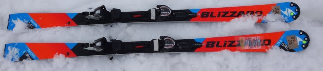
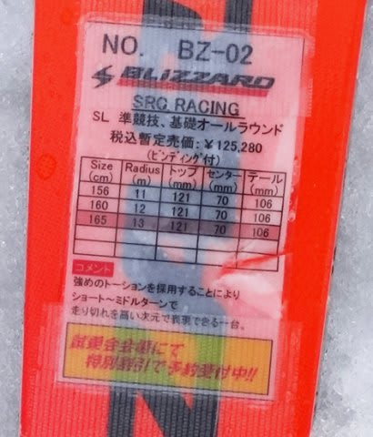
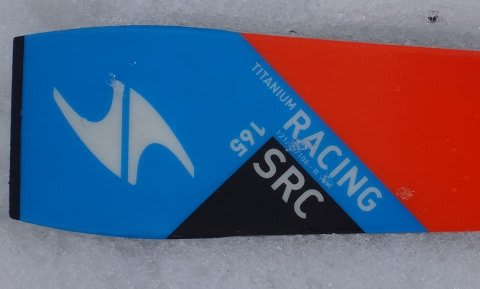

# 2016シーズンモデル，スキー試乗レポート第20回…BLIZZARD編その2

📅 投稿日時: 2015-06-03 00:59:30

えー．

まだ終わっていない，2016シーズンモデルのスキー板の

試乗インプレッションですが．

あと少し続きます．

本日は，ブリザード編．

では，どうぞ～！

○BLIZZARD SRC Racing 165cm

SL競技用．

…レース用セカンドモデルで，基礎小回り用にも行けるってことのようですが…

基本的には，ビンディングも今シーズンモデルと変わってないようですし．

来シーズンはコスメチェンジのみのキャリーオーバーなのかな？

で．滑ってみると．

典型的な平板っぽい乗り心地です．

トップやテール付近のエッジが頑張って，線で強くグリップするというより，

板の足元付近がしっかりしていて，板全体で雪面を抑えて行く感じ．

この日の雪では，トップのグリップがちょっと弱く感じるのに，

スピードを出していくとググッとたわんでクルクル回るという，

不思議な動きをしました…

ちょっとトップのグリップが弱めで，キョロキョロする感じを受けたのですが．

おそらくこの板，谷回りでかなりトップ目を抑える想定の板なんでしょう…

この日の板が埋もれていくようなザクザク雪では，トップを抑えると

突き刺さりそうで怖くて，谷回りでトップを抑えに行けなかったので，

ちょっとこの板の本領が出せるポジションに入れてなかった気がします．

それでも，山回りでは板がかなりたわんで，かなり小さい半径で

回っていったので．

板自体は，小回りスペシャルなのかな．

この板も，[大回り用のWRC](ee50de0fe2426b04a534ca1f1f676ce83.md)同様，谷回りでしっかりトップをたわませに行く板だと

思うので．

最近のロッカースキーはどうも…という，

昔からの乗り心地が好きな人にはいいのかも．
