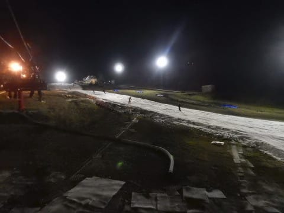

# 10月28日(土)のイエティ詳細レポート…2018/2019シーズンオープン一週間後のコース状況は？

📅 投稿日時: 2018-10-30 00:37:12

ってなわけで．

日曜に行ってきたイエティ．

昨日は速報モードだったので．

本日は写真たっぷり，詳細モードで…！←こんな記事書いている時間あるのか？？（自己突込み）

えー．

昨日書いたように．

この日の朝はすっきり晴天っ！！

イエティに向かう道から，富士山が

すっきりきれいに見える朝．

8時のオープンにはそこそこの人がゲート前に

並んでますね…

今日は混みそう…

そうそう．

昨シーズンは無くなった，シーズンインの

割引料金．

今シーズンは復活して．

土日は一日券が3000円と，割安になってます…

メール会員に登録すると500円割引の2500円です．

安いのはなんにしろ嬉しいこと…

で．

ゲートオープンと同時にゲレンデになだれ込みますが．

シーズン券特典で，通常オープンの30分前，

7:30からシーズン券の人が滑っているので．

ゲレンデはフラットシマシマじゃなく．

あさイチから結構荒れ気味…（ちょい涙）

雪質は，緩み気味のザラメで．

硫安が効いているところがところどころ固くて．

それ以外は板が軽く潜るような感じ．

うーん．

あんまり気持ちよくかっ飛ばせるバーン

状況じゃないなぁ…

でも．

あさイチは天気も良く．

ゲレンデも比較的すいていて．

リフトもそんなに混んでないし．

ゲレンデはちょい荒れぎみなものの．

結構気持ちいいかな！！

と，気持ちよく滑ってたら．

1時間も経たぬうちに…

ありゃ…？？

曇り出してきたなぁ…

まぁ，曇ってた方が雪が解けなくて

いいんだけど．

結局この日は，このあとはずっと曇り空．

気温は10℃以下と，結構冷え気味だったので．

太陽が隠れてからは，ウェアのジャケットを

着てた方がいいくらいに寒く感じます…

結構寒いよ…！

で．

オープンから2時間後．

午前10時ごろ．

あぁ…人が増えて，リフト待ちが長くなって

きましたね…（涙）

これ以上，増えないといいなぁ…

…

…

うーーん．

なんだか，だんだん列が伸びて行っている気が

するのですが…

そして．

10時20分には…

なんじゃこりゃーっ！！！

イエティ史上最高の列の長さじゃないだろうか…！！

…でも．

まだ，軽井沢の待ち時間よりは短い！

軽井沢は，20分以上待った思い出があるからなぁ…

と，自分を慰めてましたが．

10時半には，隣のペアリフトが動き出し．

それ以降は，クワッドリフトは平均的に

こんな感じで，2-3分待ち程度が続き．

ペアリフトはほぼ待ちなしで

乗れるようになり，一安心…

ただ．

やっぱりクワッドとペアが両方動き出したので．

ゲレンデの人口密度は，ちょっと

上がっちゃったかな…（涙）

でも，先週よりはコース幅が多少広がって

いるからか．←あるいは，自分の感覚がマヒしているから…かも

時折団体さんに捕まることもあるけど．

それ以外は，そんなにひどい交通渋滞状態では

無くて．

ゲレンデ混雑は，まだマシだった気が

します…

ただ．

人が多く滑ったからか．

ゲレンデの荒れは進んで行き…

昼ごろには…

かなり雪が薄いところが出てきたなぁ…（涙）

と，思っていたら．

午後になると…

うむ？？

穴が！！？？

ゲレンデにボコボコ穴が！！

決してコース全面がボコボコになった

わけではないのですが．

このあたりの長さ数10mにわたって…

コース幅いっぱい，デンジャラス土エリアが

コンニチハしています…（涙）

午後2時半には，こんな感じで，

かなりヤバい状況に…

午後4時からのコース整備で，この穴を

埋めるべく，横に雪山を作ってましたが…

コースの穴の開いてないところが，

雪山で完全に覆われてしまったので．

穴の開いた土の上を滑るか，

雪山を登るかの，どちらかを選ばなくては

ならないというコースになってます(笑)．

まぁ，でも穴が開いていたこのあたりを除いては．

16時の整備タイム直前でも，こんな感じだったので．

[昨シーズンの営業最終日のかぐら](eace8b43fda6465bb1544b0876ba42f6d.md)より

マシだったかな！！←比較対象がおかしい

ってな感じで．

16時に，一旦コースクローズとなり．

必死の圧雪作業でゲレンデの回復を

図りますが…

どうも，ゲレンデ状況がひどすぎたからか．

コース整備に時間がかかり．

営業開始予定の17時を過ぎても，

コースオープンせず…

完全に夕暮れ時となった，17時15分過ぎに．

ようやくコース整備終了！

圧雪かけたてのコースへ飛び込む！！

うはーーー！

今シーズン初のシマシマっ！！！

硫安が効いて，気温も5℃以下と冷え込んでいるので．

結構いい感じに板が走るシマシマっ！！

いただきまーーーす！！

いや！

気持ちいいっ！！

今シーズン一番の気持ちいい一本！←って，まだシーズン2日目でしょ

…でも．

ゲレンデに穴が開いた部分は．

そのまま穴を埋めるのをあきらめて．

横に作った雪山をつぶして，そちら側を

コースにしたようで．

微妙にこの部分，シケインになってました…

ちょっとこの写真では荒れて見えるけど．

ナイターオープンから2-3本は．

人も少なく，雪も締まって．

結構いい感じで楽しめましたよ～！！！

しかし．

ナイター開始後，しばらく経つと…

うむ？？

あいや～．．．

混んできましたね…（涙）

日曜夜のナイターというのに，

こんなに人がいるんだ…（ある意味感動）

リフト待ちはそれほどでもなかったものの．

ゲレンデの人は割と多く．

オープンから2時間も経つと，雪も結構荒れて

きてました…

だもんで．

午後7時過ぎに．

「この程度で許してやるか…」←なぜそんなに上から目線？？

と，大人の私は，リフトがまだ動いているにも

関わらず切り上げて．←いや，大人なら朝8時から夜7時まで滑らないから…

帰路についたのでした…

いやー．

でも．

先週は雷雨で中断という．

ちょっと欲求不満が溜まる終わり方だったけど．

今回，朝からナイターまで滑れて．

シーズンインした…という実感が，やっと

ちょっとだけ湧いてきた，Skier_Sだったのでした．

## 💬 コメント一覧

### 💬 コメント by (ほっぽ)
**タイトル**: 昨夜のイエティ
**投稿日**: 2018-10-30 06:39:55

Ｓさん

日曜日はゲレンデが結構ダメージ受けたようですね。

知り合いも日曜ナイターが悲惨だったと画像付きで投稿していました。

で、月曜ナイターに参戦、かなり修復されてゲレンデコンディションは回復してきました。

微妙に茶色い部分はありましたが、問題ない範囲でした。

下記ＵＲＬに滑走記録をアップしてあります。

http://www2.tokai.or.jp/nana_hoppo/

### 💬 コメント by (若杉勲70)
**タイトル**: 大人の私
**投稿日**: 2018-10-30 12:44:02

はじまりますね。今年もよろしくお願いします。大人の私なら、引っ越しの準備ですよね。大人げない私、ですね。素晴らしい！

### 💬 コメント by (つーちゃん)
**タイトル**: Unknown
**投稿日**: 2018-10-30 19:00:33

穴ぼこがなければ、そこそこ快適に滑れそうですね。

勝つ気のない物欲選手権も一通り終えたので、

今週末あたり行ってみよう、、、かな？

### 💬 コメント by (Skier_S)
**タイトル**: 今週末はYetiに行けず
**投稿日**: 2018-10-31 00:39:31

＞ほっぽさま

月曜はガラガラだったようですね…

いいなぁ～！！！

穴も埋められたみたいで，週末より

コンディション良さそうですね．

今週も冷えるので，今週末はコンディション

良さそうなのに…

引っ越しで滑れません（涙）

＞若杉さま

お久しぶりです！

今シーズンもよろしくお願いします～！

今週土日で引っ越しです．

もう，普通ならこの日曜，滑りになんて行きませんよね，確かに(笑)

＞つーちゃんさま

意外と快適に滑れますよ…

…って，私がこの時期のYetiに慣れちゃってるだけかもしれませんが(笑)．

今週末，ぜひ滑ってみてください．

今週は冷えるので，コンディションいいと思いますよ．

…でも，私は今週末は滑れない…（涙）

### 💬 コメント by (ほっぽ)
**タイトル**: 10月最後のイエティ
**投稿日**: 2018-11-01 07:08:34

Ｓさん

昨夜も10月最後のイエティに行ってきました。

夜になると冷えるので雪質もこの時期にしては良好で、

ゲレンデ幅も広がってきて、今年は順調に来ているなと感じます。

イエティに来られるのもあと１回でしょうか。

私はクリスマスまではイエティで足慣らし？の予定です。

http://www2.tokai.or.jp/nana_hoppo/

### 💬 コメント by (Skier_S)
**タイトル**: ほっぽさま
**投稿日**: 2018-11-03 02:37:42

この10月は，結構冷え気味なので

コンディション良さそうですね～．

今週末，Yetiに滑りに行けないのが残念…

しかし，12月末までYetiですか！

さすがに飽きませんか…？

