# 2024/12/22(日)の志賀高原焼額山スキー場，速報レポート！…朝の積雪60cm，激冷え雪降りの一日

📅 投稿日時: 2024-12-23 01:30:55

🏷️ カテゴリ: [2025スキー滑走日記](cacd3fbf84d4a679ee61a5894c3f95e14.md)

ということで．

今日もいつも通り，しっかりラストリフト

まで滑って帰ってきました～！

今日はちょっと早めの10時には帰宅できた

けど．その後片付けやら板の手入れやら

していたらあっという間に12時…

土曜は2時間睡眠でスキーに行き，

昨日の夜も宴会して寝不足なので，

明日の仕事のことを考えて，今日の

志賀高原レポート，帰宅日恒例の

速報モードにて…

えー．

まず．

昨晩から激しい積雪が続いていて，

かなりの降雪の中，志賀高原を登りますが…

視界が悪くなるほどの降りですね…

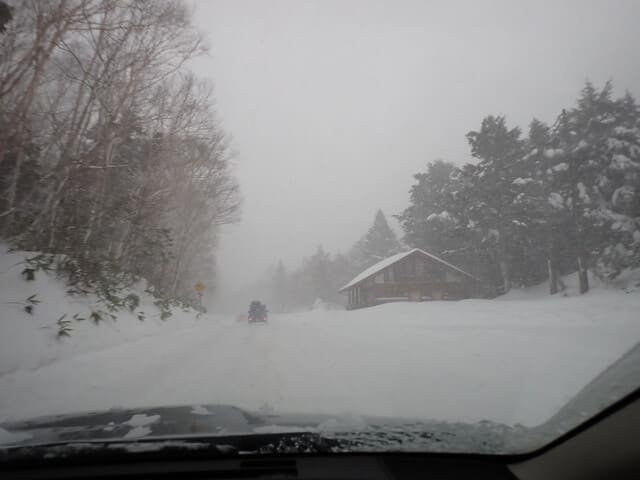

朝の志賀高原の積雪は約60cm！

積もりましたね～！！

積もっただけじゃなく，風も強めで，

奥志賀は全面運休，高天ヶ原クワッドも

止まったようでしたが…

焼額は今シーズンの営業がまだ始まって

いない第3高速を除くと，リフト・ゴンドラ

全てが運転してました～！

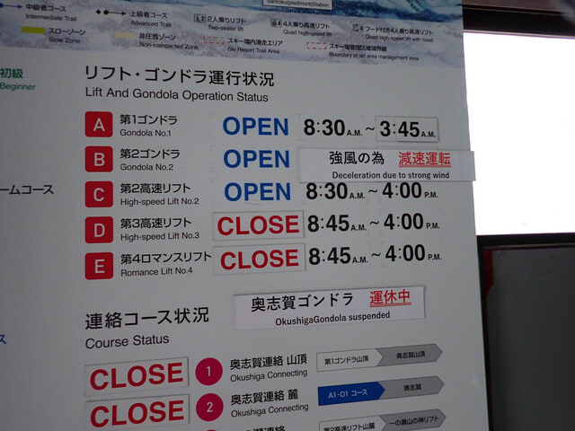

朝イチは圧雪バーンも新雪が10～20cm

乗っている状態で，圧雪コースも全面

パフパフ新雪！

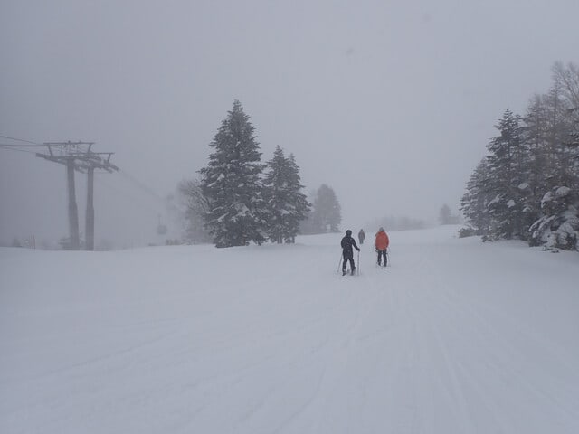

今日は太板を履いて出動するのが正解

でした～！

雪もちょっと重めだったので，圧雪コース

でも太板があったほうがいいレベルで，

コース外は脛～膝パフだったけど，

かなりブレーキがかかる危ない雪でした…

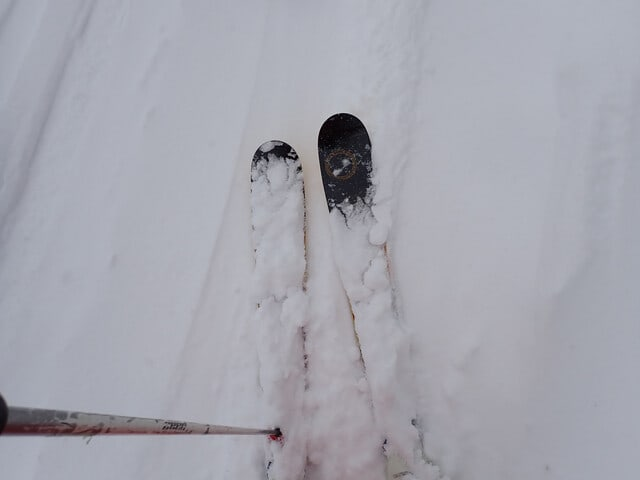

で．

今日は雪降り・低温・強風・視界悪という

4重苦で，根性の無いスキーヤーふるい

落とし機能がフル発動したため，

お客さんが少なく．

1ゴンのみ，10時～11時くらいに最大で

搬器4-5台の待ちがあったものの，

他のリフトや第2ゴンドラは待ちがなく，

1ゴンも午後はガラガラでした…

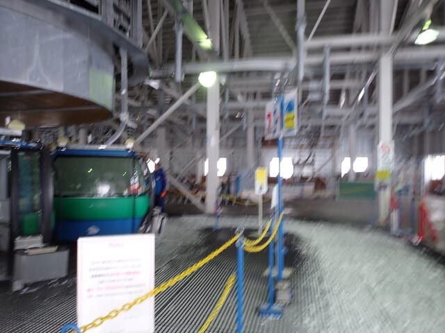

コース上も終日視界が悪く，土日にしては

人が少なめでしたね…

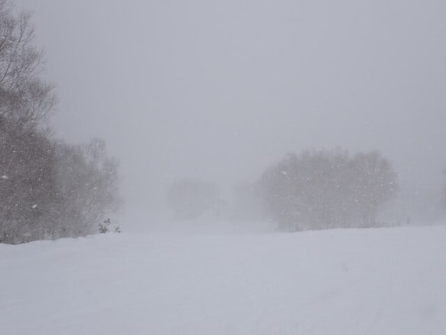

昼間も雪が降り続けたので．

コースは終日モサモサ，荒れ荒れで．

そこそこ人が滑るGSコースは結構ボコボコ(泣)

人が少ないコースは，午後になってもプチ

新雪状態でした…！！

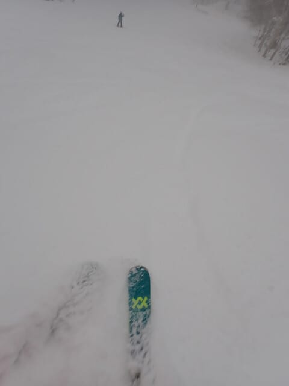

気温は昼間も-10℃以下と寒く．

ゴーグルは凍るし，ゴンドラが減速運転

するくらいの強風だったけど…

午後までプチ新雪が楽しめたので

良かったかな…！！←普通の人は楽しめない状況だったから…！

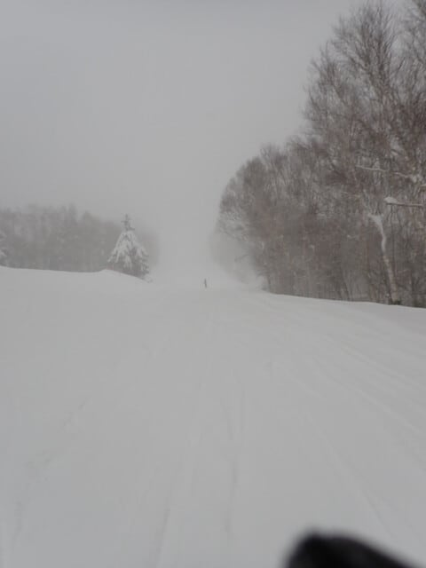

ってな感じで．

いつも通り，ラストの16時までしっかり

滑って車に戻ると…

…昼間だけで，こんなに積もったのか…！！

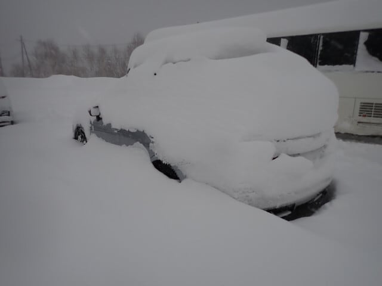

ということで．

ボコボコモフモフバーンを一日滑り続け，

かなり疲れて車に戻った後に，

車を発掘するというさらに疲れる作業を

やってから，帰路についたのでした…

ということで．

かなり雪が積もった焼額山．

明日の月曜から，ブナコース，オリンピックコース，

パノラマインコースがオープンですよ～！！

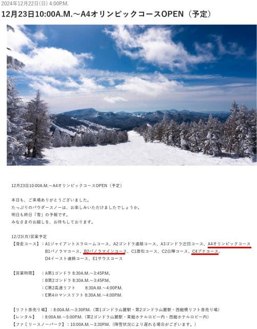

（[焼額山スキー場ホームページ](https://www.princehotels.co.jp/ski/shiga/winter/)より）

ちなみに．焼額山のライブカメラを見ると．

土曜の夜に0cmまで除雪されたこの積雪計．

日曜朝は積雪60cmになり…

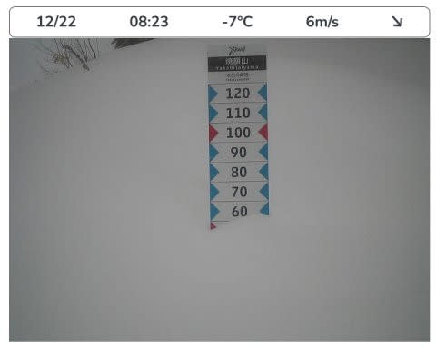

（[焼額山スキー場ライブカメラページ](https://www.princehotels.co.jp/ski/shiga/livecamera/)より，以下同じ）

日曜の夕方はさらに30cm積み増して，

積雪90cmまで行ってますね…

でも，車の上の積雪を見ると，昼間の

積雪は30cm以上あった気がする…

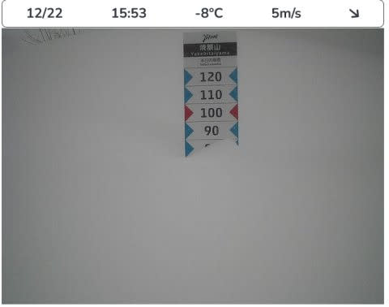

そして．

日曜夜には1mを越えて…

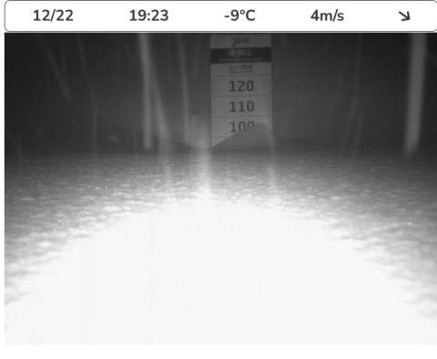

日曜深夜23時過ぎには120cmを

越えたので．

月曜も，かなりの新雪を楽しめると

思います…

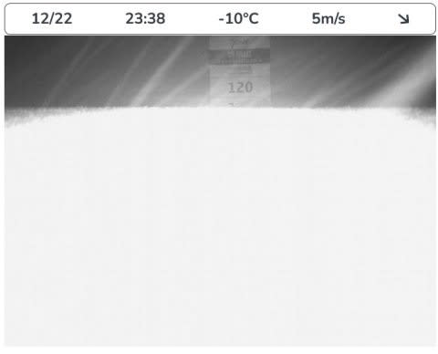

ちなみに，深夜1時過ぎでは，この積雪計

カメラは完全に雪に埋もれたようで，

真っ白になってました…

カメラが埋まった後もまだまだ雪が

降り続けているようなので．

明日までに一体何センチ積もるんだろう…？？

ってか．

この雪は月曜も一日降り続けそうです．

このあとも年末の27日あたりから

またかなり降りそうなので…

これで志賀高原も雪不足の心配を

しなくて済みそうな感じ…

というよりも．

年末年始休みは雪が降り続けて．

晴れの日がなさそうなくらいの予感…
