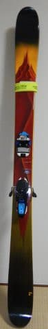
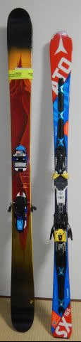
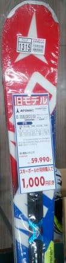

# Skier_Sはここ10年で何セット板をヘタらせたのか？ちょっと振り返ってみる…その3

📅 投稿日時: 2021-08-29 00:08:21

🏷️ カテゴリ: [スキー雑談](c1f9d2cb7478308da16419928ea3945e9.md)

昨日は焼額・奥志賀スキー場共通シーズン券の

スキーネタでしたが．

本日もスキーネタ．

例の，Skier_Sが出していると言われる，←誰が言ってるんだ

スキー板をヘタらせる特殊電磁波

を浴びた板たちの物語のその3です．

[その1](e1b41689e375309af18ba585df30d2526.md)，[その2](ef1cb973a6460000b4a38af1b0e1ef871.md)はこちらです．

では，どうぞ～！

ーーー

○2017シーズン

購入：2セット

○購入1セット目：'16 Salomon X-race 175cm（2代目X-race)

初代X-raceはまだヘタってない…買わなくていい…

と暗示をかけようと思ったけど．

1年型落ちの板を，先代X-raceからのビンディング

使いまわしで激安になったので．

ついつい[第6回物欲選手権](e7e02015f03823884a3522a56c651a398.md)に負けてしまったのが

この板です…

○購入2セット目：Atomic Bluester DD SX(二郎君)

昨シーズン2か月しか履いていない一郎君．

このシーズン買ったばかりの強くて長いX-raceと

履き比べると，

「やっぱり小回り板のSXはグリップも優しいし，

クルクル回って軽四みたいだな」

と思っていたところ．

「実は…まさか一郎君，ヘタってるのかも？」

と思い．

[一郎君がヘタっているのかどうか，確かめなきゃ](e922ef4eede2bd4d2b900bd4bf1b03156.md)…

と，[新物欲選手権](eda7898d5cb5580b1871f3cbef83241ac.md)に負けて，

シーズン途中の2月末に

予想外に購入した板です．

死亡：1セット

○Atomic Bluester DD SX 一郎君…1シーズン未満，40日でヘタリ，その後剝離

ってなことで．3月頭に購入した二郎君と

履き比べて．

わずか40日ほどしか履いてない一郎君，

[かつてSXだった何かというレベルまで
ヘタっている](e27e2a7149d362e76794896614d0f18f3.md)ことが判明し．

さらに，シーズン終わりの石ころ踏み用

として使っていたら，[シーズン終わりに剝離](e47d1e19d01c13226c42e0d2378bfd4e1.md)

までしてしまったので…

完全に引退となりました．

これまでは，短くてもギリギリ1シーズン

以上は板がもっていたのに．

ついに1シーズン未満で死亡とは…(泣)

板が1シーズンもたない伝説は，

この時から始まりましたね…（涙）

○2018シーズン

購入：3セット

まさか，1シーズン3セットも板を

買うとは…！

昨シーズンは2セット買ってるので．

2シーズンで5セット購入！？？

…それもこれも，私が履いた板は

なぜか根性無しばっかりなので，

次々ヘタッちゃうから，

もうやむを得ず…

ええ．やむを得ず…ですから．

○購入1セット目：LINE Sir Francis Bacon（太板）

かねてより欲しかった太板．

けど，ロングとショートの板2セットだけでも

大変なのに，太板まで…と控えていたけど．

[第7回物欲選手権で撃沈](e1964ba91aa7855224b31d139e5419962.md)．

○購入2セット目：'17 Atomic Bluester DD SX(四朗君)

二郎君を昨シーズン後半に買った

ばかりというのに．

あまりもの一郎君の寿命の短さと．

SXが気に入りすぎているのに，このシーズン

からAtomicがモデルチェンジして，SXが

ラインナップから無くなってしまったので．

型落ちの在庫があるうちに…と，

[第7回物欲選手権](e1964ba91aa7855224b31d139e5419962.md)で太板と同時に

買ってしまった板です…

○購入3セット目：'16 Atomic Bluester DD SX(三郎君)

お店の値段が[間違ってビンディング抜きの
価格で表示されていた](e8f6f10c51443780808e48b1f54c3ed5b.md)のか，ありえないほど

安かったのと．

剝離した[一郎君が修理不能ということで
保険金が下りた](ed868696918a40419c43706429d5d8193.md)という，二つの要因により．

'17 SXを買った2週間後に

[物欲選手権番外編2](e08f88a704470a5656ebc84fecc72aa08.md)を開催して

発作的に買ってしまった板．

買ったのはこっちが後だけど，

使い始めたのはこっちが先なので，

こっちが三郎君となります．

この結果，ついにSX4台そろい踏みという

恐ろしく偏った状況が発生したのでした…

死亡：0セット！！！

昨シーズンの3月から使い始めたばかりの

Atomic Bluester DD SX 二郎君が．

昨シーズン3，4月とこのシーズンの12月の，

まだ3か月しか履いてないのに，

[このシーズンの1月初めに剝離](ed5767135dfb18a758390c3e37aae05b5.md)してしまいましたが…

それでも2019シーズン途中まで，

剝離したまま使いつづける

という涙ぐましい努力で，

この年は，ヘタって引退した板がゼロという，

意外な年でした！！

…でも．

板が剝離したのに，死んでないって

言い張るのもあれだな…

実質的には，1セット死亡してますね．

（まだ続く…意外と長いシリーズになったな…）
