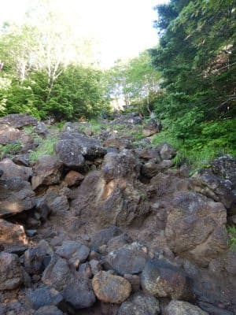
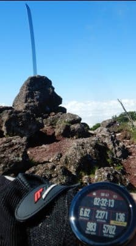
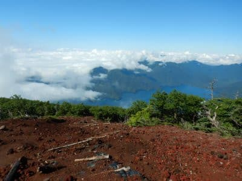
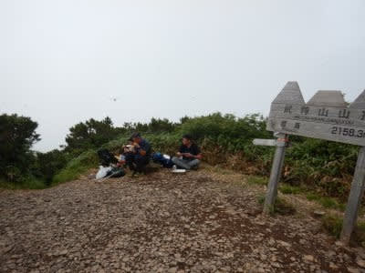
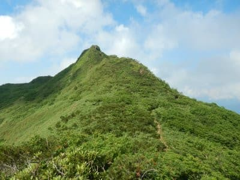
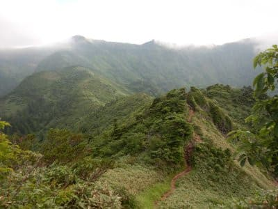
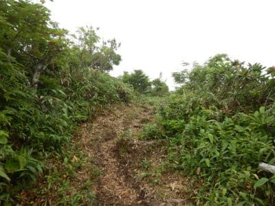
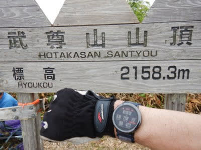

# 4連休後半2日，登山に行ってたけど…人生で二度と出くわしたくない経験をした

📅 投稿日時: 2021-07-26 01:23:19

ということで．

今日…

というか，もう昨日になりますか．

朝9時ごろに，山頂から生中継(？)しましたが．

今日は男体山に登ってました～！

男体山，その山容から想像の通り，

途中は岩場をよじ登るような，

かなりの急登のところもありましたが．

上りは2時間半，

山頂休憩30分のあと，下り2時間の

計5時間でピストンしてきました…

で．

男体山を登る前日，昨日も武尊山を

登ってたわけですが…

(残念ながら山頂の視界ゼロ(涙））

今朝がたのレポートで書いたように．

この日，

山で出会いたくないものに会ってしまいました

…そう．

それは，剣ヶ峰～武尊山のルートの予定で，

まずは剣ヶ峰山頂に登り…

(とがってるのが剣ヶ峰)

そこからこんな感じで，武尊山頂へ向かう

稜線コースっぽい，いい感じのコースを

歩き続けていた時．

ちょっと熊笹が茂っていて，

見通しが効かない，こんな感じの

登山道の角を曲がった瞬間．

…なんと．

登山道の上，

目の前4-5mのところに．

熊

がこちら向きで立ち止まって

ました…！！！

…この，目の前すぐに熊がいた時の

驚きは．

[ジンベエポイントではないところの
ダイビングでジンベエザメを見た驚き](e1870442964e5e766af156b160fd89602.md)を

遥かに上回りましたね…←比較対象がおかしい

まず思ったのは．

「熊って，黒くてつやつやしてるんだな…！！」

「体長1mちょいってところか…小熊？」←後で調べると，ツキノワグマは成獣でそのくらいのデカさらしい

「目がクリクリしてて，

　意外と小さくてかわいいけど…

　戦ったら負けるな」

と，0.2秒ほどで思ったあと．

かなり距離が近い．

3歩以上は離れてるけど．

車一台の長さよりはずっと近い距離．

…そして．

身体はこっちを向いてるけど．

横を見てて視線は合ってない．

で．

私はちょうど熊笹の陰から飛び出した

形なので．

2歩下がれば，陰に隠れられるよな…

と，冷静に判断し．

熊から目を離さないように，振り返らず

後に3歩下がって．

熊が見えなくなったところで．

急がず慌てず．来た道を戻るという．

教科書通り（？）の対応をしたのでした…

しかし．

「まさかホントに熊に会うなんてことは

　無いだろうけど，会ったらこう

　対処しよう…」

とシミュレートしていたおかげで．

慌てず騒がず，声ひとつ上げずに

その通りの対処ができた自分を

ほめてあげたい．

戻ってる間，後から熊に襲われないかな…

と気が気ではなかったけど．

こちらから何かしなくても人を襲うような

ヒグマじゃなく，ツキノワグマだし．

たぶん，向こうもびっくりしてるはず…

まぁ，ここまで来たら，向こうから

襲ってくることは無いだろう…

と思いつつも．

1分弱ほど戻ると，2人の登山客と

出くわしたので．

「熊が出ました」

と伝え，しばし一緒に引き返して

もらいました．

そして．

5分ほど下った，ちょっと見晴らしが

効くところで．

出くわした2名の方と一緒に

「どうしましょうかねぇ…剣ヶ峰まで

　戻りましょうか…？」

などと作戦会議(？)をしていたところ．

山頂方向から下ってくる登山客が…！

私「熊，みませんでした？？」

登山客「え？熊？みませんでしたけど…」（あくまで冷静な答え)

…うん．

この目で熊を見てないと，

「なに言ってるんだ？この人？」

って感じでしょうね…

私「さっき，登山道の上で熊を見たんですよ…」

登山客「え？熊？」

私「まさにこの道，ここから数分登ったところです…」

登山客「ええ！？？全然見てませんけど？？」

その後しばらくすると．

さらにもう一組下山してきたので．

…どうやら，もう登山道は大丈夫

みたいだな…

と判断し．

再び来た道を登り返し，無事武尊山頂へ

到達できたのでした…

とりあえず．

熊に会った瞬間は．

「これ，生きて下山できたら，

　登山はもうやめようかな」

と思ったけど．

性懲りもなく，翌日に男体山を登っている

自分がいたのでした…

あと．

ダイビングでも，ジンベエポイントじゃない

ところでジンベエザメに会うとか．

神子元でいきなりマンボウに出くわして

ガイドの方が大喜びとか．

いろんな予想外の大物に出くわす

大物運をもっているのが自慢の私ですが．

まさか登山でも，こんな大物運を

発揮するとは思わなかった…

この運の強さ、宝くじでも買おうかな？

## 💬 コメント一覧

### 💬 コメント by (しんちゃん)
**タイトル**: Unknown
**投稿日**: 2021-07-26 01:55:26

ご無事で何よりです<(_ _)>

この引きの強さが、シーズン券の抽選や、降雪予報にも回りますように(笑)

### 💬 コメント by (西舘)
**タイトル**: Unknown
**投稿日**: 2021-07-26 08:22:33

Sさんご無事で本当に良かった！

コメント常連で、昨シーズンこのブログで

アイドルになった某大先輩様は、

何頭も見てるようで、

見たいでしょう！見に来ていいよ、

なんて悪の囁きをしますが、

私は見なくていいです、

天然ものは見たくありません！

### 💬 コメント by (ikkun)
**タイトル**: Unknown
**投稿日**: 2021-07-26 09:59:56

おはようございます❗えーluckyじゃない出会いは勘弁願いたいですね？何よりでしたm(__)m私し一昨日地元キャンプ場横でまったりでした☺️エアコンいらないはいいですね❤️ちなみに昨日は逆に知り合いのお店の野外イベントお手伝いで妬けました……彼女でもなんでもないんですが(笑)

### 💬 コメント by (yama)
**タイトル**: Unknown
**投稿日**: 2021-07-26 12:02:30

自分も東北で会いました、場所は熊見平です。最初は岩の上に黒い犬がいると思いました。近付いて熊と気がつくと目があって立ち止まると茂みに消えました。

### 💬 コメント by (ホンダ)
**タイトル**: Unknown
**投稿日**: 2021-07-26 18:06:57

私も草津から志願に向かう道路脇で小熊に会いました。急に黒いものが動いていたので犬？なんて思いましたがハッキリみえました。母グマが近くにいるかとすぐに窓しめました。私は車に乗っていたからまだ良かったですが、目の前に現れたらもっとビックリ😱☀️

御無事で良かったですね。

### 💬 コメント by (mae)
**タイトル**: Unknown
**投稿日**: 2021-07-26 20:11:55

昔、北海道の暑寒別岳でご対面しました。

実は昨日まで北海道の7座に登ってきましたが、羅臼岳とトムラウシではヒグマに怯えながら登頂しました。

利尻島以外、北海道の山では、ご対面した時のために皆さん熊スプレーを装備してます。

私も今回は装備して登りました。

### 💬 コメント by (初投稿)
**タイトル**: Unknown
**投稿日**: 2021-07-26 20:23:48

初めて投稿させて頂きます。

20年以上前になりますが春のクローズされた焼額のGSコースを奥志賀に抜ける時にゲレンデを走る小熊を見たことがあります。

毎年志賀に行きますがそれっきりです。

### 💬 コメント by (yumi)
**タイトル**: Unknown
**投稿日**: 2021-07-27 02:14:39

Ｓさぁ～ん🐻👀❗

くま🐻は

志賀高原で🏔️1度❗車の中🚙から 見たことが👀有ります😱

くま🐻の 足跡なら🐾

奥志賀で2回、ヤケビで1回です😅

### 💬 コメント by (Skier_S)
**タイトル**: 回答遅れました！
**投稿日**: 2021-07-28 02:31:09

＞しんちゃんさま

私はいろいろ運がいい（？）人間なので，普通なら出くわせないような

経験を数多くしてる気がします…

出来れば，珍しい経験でもいい方の経験をしたいもんです．

＞西舘さま

熊さんも，遠くから見てるならまだいいのですが，

4-5mの至近距離では会いたくなかったです…

某大御所は，熊と戦ってそうですよね（笑）．

＞ikkunさま

山は涼しくてエアコン要らなくていいのですが…

熊やらヤマビルやらマダニやら，会いたくない危険生物はいっぱいいます（涙）

残念なことに，今回の熊との遭遇で，これら3大危険生物すべてを体験してしまいました（泣）

＞yamaさま

あら．

やっぱり山登りをする人は一度は見かけてるんでしょうか…

どのくらいの距離で見かけたんでしょうか？

＞ホンダさま

志賀高原も，結構熊さんがいるみたいですね…

私は志賀高原では見たことが無いのですが．

普通はあんまり道路脇とかには出てこないみたいですけど，

最近は人間を恐れない熊が増えてるみたいですね…

＞maeさま

暑寒別って，ヒグマじゃないですか！

いや…ヒグマは嫌ですね．

熊スプレー，私も気になって調べましたが，結構いい値段しますよね．

でも，北海道では必須ですね…

もう北海道登山は終わったんでしょうか？

お気をつけて登山してください！

＞初投稿さま

えええ？？

ヤケビのGSコースに熊がいたんですか！？？？

それはびっくりです．

スキーシーズンは熊がいないと思ってたんですが，

春営業の時期だと，もう冬眠は終わってるんでしょうか…

＞yumiさま

私もヤケビで熊の足跡は一度だけ見たことがあります…

オープン直後の12月だったかと．

普通はシーズン中は冬眠してるもんだと思ってたんですが，冬眠直前だったのかな…

志賀で熊さんを見たのは何月くらいですか？

やっぱり春営業の時期でしょうか？？

