# 2010年7月，2歳の子連れで座間味でダイビング！その5…2日目スタート，今日の午前は妻が潜って自分は子守り

📅 投稿日時: 2021-09-25 00:14:41

🏷️ カテゴリ: [ダイビング日記](ce3a7a8d424d112fce83ee85c81a0e344.md)

本日，気象庁から，正式名称

「全般季節予報支援資料  寒候期予報」

という，12月から2月の長期予想が発表

されました…！

この，[専門天気図FCCX94](https://www.sunny-spot.net/chart/FCXX94.pdf)．

読み解くまでに時間がかかるので，

また明日あたり，記事にしますね…！

ってことで．

今日はまた，10年以上前の座間味ダイビング

日記です．

では，どうぞ～！

ーーーー

明けて，座間味の2日目．

7:30から，宿の朝ごはん．

…今は大人一人分以上の量を食べる

娘だけど．

このころは親のごはんをちょっともらう

だけで済んでたんだなぁ…

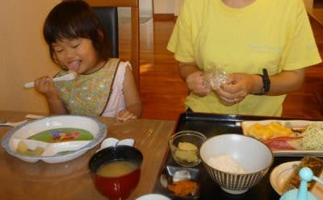

ダイビング開始は9時からなので，

朝食後に少しのんびりタイムが

ありますが．

食堂の壁に貼ってあったお魚ポスターを

興味津々で必死に見る娘．

私「それは，ツバメウオ」

娘「ちゅばめうお…！」

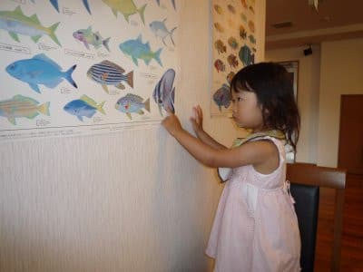

このころは，まさか娘が将来ダイバーに

なって一緒に潜れるとは思ってなかった

けど．

このころから，海や魚に対する興味が

強かったな～…．

こんな子供が，今やダイバーですよ…(昔を懐かしむ目)

ってなことで．

9時に送迎の車に乗って，

宿から港へ向かいますが．

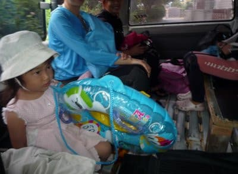

今日のダイビングは，

午前のダイビングが2本．

午後のダイビングが1本．

…というわけで，この3本，どちらが

潜って，どちらが子供の面倒を見るかを

相談したところ…

私は昨日1本潜っているので，

午前2本は妻がダイビング．

午後1本は私がダイビング

ということになり．

まずは妻がボートに乗り込んで

ダイビングへ向かいます．

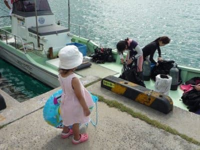

うーーーーん．

一日1本だけ…

昔では考えられないなぁ．

とりあえず，妻が朝1本目のダイビングに

出航していくのを見送った後…

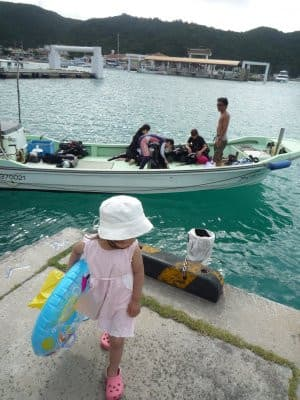

自分は娘と一緒に，徒歩10分ほどかかる

道を歩いて「阿真ビーチ」へ．

座間味の欠点は，港(集落)のそばにビーチが

無く，炎天下徒歩10～20分ほど歩かないと

泳ぎにいけないことだなぁ…

暑い中，娘を肩車して20分．

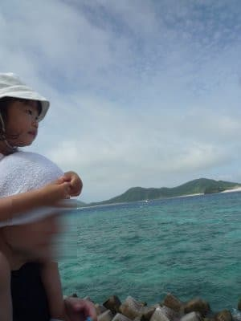

途中，座間味が舞台の「マリリンにあいたい」とか言う映画の

主人公（主人犬？）のマリリンの銅像などを見つつ…

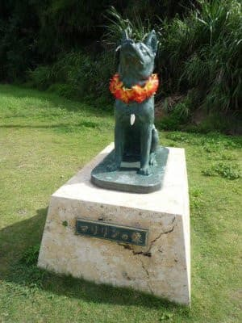

こんな感じの道を，えんえんとぼとぼ歩きます．

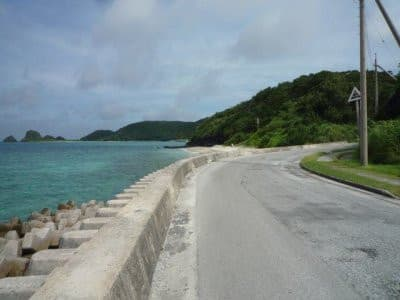

途中，公園があって．

娘が遊びたがったので，

ちょっとひと遊び．

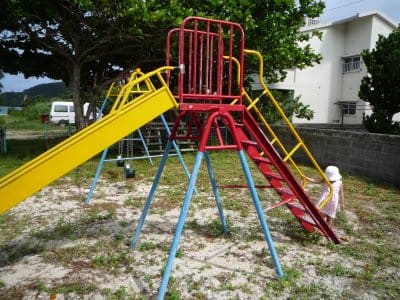

うーむ．

公園は家の近所にもあるから．

せっかくだから，海で遊べばいいんだけど…

と思いつつ．

娘が楽しそうだから，いっか．

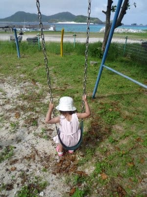

ってなことで．

しばらく公園で遊んだあと．さらにちょっと

歩くと，阿真ビーチに到着！

座間味は，古座間味ビーチが有名で，

ほとんどの人はそっちに行くので．

阿真ビーチは，無人の貸し切り状態です…！

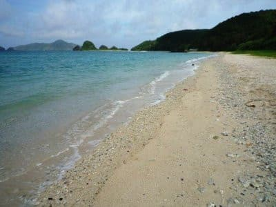

このビーチ，海の家的なお店もパラソルなんかを貸しだす

店もない，ホントに海があるだけのビーチ．

私はこういうビーチのほうが好き．

ということで，子供を水着に着替えさせ，

遊びますか…！

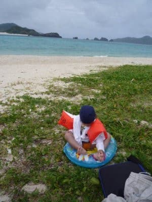
