# 2022/11/23(祝)のイエティで滑ってきた…かなりの雨だったけどガラガラ！リフト飛び乗り！最高！

📅 投稿日時: 2022-11-24 02:44:37

🏷️ カテゴリ: [2023スキー滑走日記](cd943df30cfcc3d0896469e2ff98720cd.md)

えー．

本日．

滑ってきましたよ．

どしゃ降りの雨の中，イエティで…

…たぶん，先週末にイエティで滑ってたら，

今日の天気だったら滑ろうと思わなかった

だろうけど．

先週末は濃厚接触者の待機期間で

滑れなかったという憂さを晴らすべく．

土砂降りの雨の中，滑りに行きましたよ．

ええ．

行ってきました…

で．

イエティのレポート前に．

最新の天気の情報を書いておくと…

11月29日までは，850hpa気温を見ても，

赤い0℃線は北海道より北にある

レベルのダメさ加減なのに…（涙）

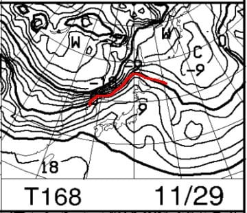

11月30日の850hpa気温図をみると

をを！

0℃線は志賀近辺まで下がってきてるし…

それに．

普段日本に近づくことがない，

水色の-18℃という恐ろしい線が

日本にかかってます！！

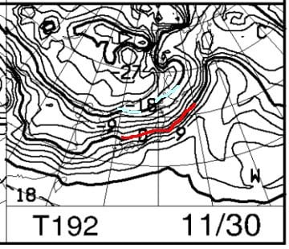

…これは，冷える．

11月30日の夜中～12月1日の朝

くらいから，かなり冷えて，

このまま行ってくれれば，

12月1日から3日まで，結構雪が降りそうな

天気図なのだ！

2週間予想を見ても，12月に入ったら

冷えそうなのだ…！！

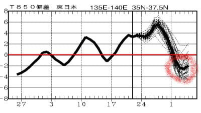

ってなことで．

今週末まではダメダメですが．

12月3日の週末に向けて．

11月30日の夜中以降の天然雪に

期待…！！

というところで，本題へ．

本日．

悲しい雨のイエティで滑ってきたわけですが…

朝，9時オープン前からすでにかなりの雨（涙）．

オープン時にゲート前で並んでいるのは，

わずか3人程度でした…

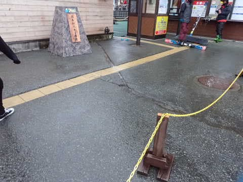

ってなことなので．

オープン最初の1本は…

完全貸し切り状態！

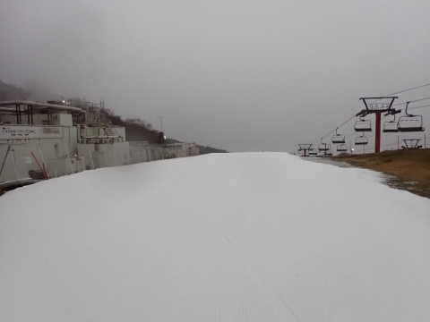

あさイチの雪は，雨で緩んでるかな？

と思ったけど．

そこそこ硫安が効いて，板が滑る

結構いい雪！

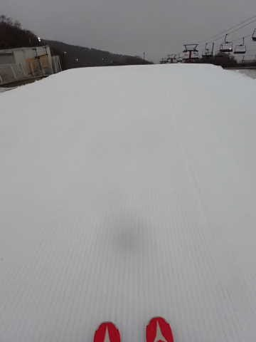

雨でゴーグルに水滴がついて見にくい

けど…

でも，貸し切りで誰もいないバーンを

滑りたい放題！！

ホントに貸切りだよ！！！

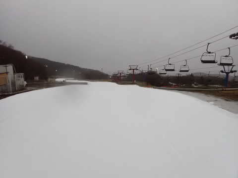

いつもなら，人が少ないのは

せいぜい朝の2-3本程度だけど…

今日は雨が強いので．

2-3本どころか．

1時間経っても，人が全然来ないんですけど！？？

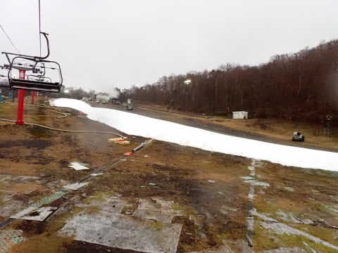

午前中，ずっとリフト待ち0が

続くんですけど？？

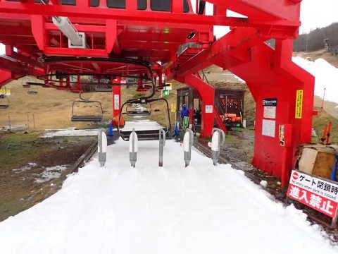

いつもの休日のイエティはどこへやら…

1時間経っても，2時間経っても，

全然コースの人が増えてきませんよ！！

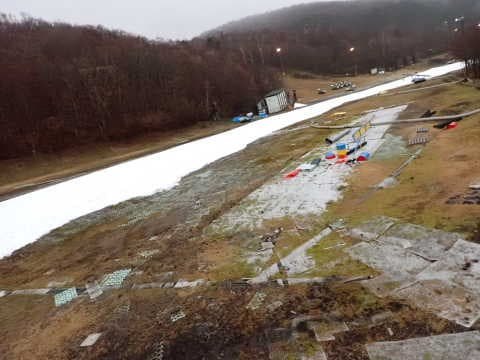

ただ…

11時頃になると，朝より雨がさらに

強くなってきたけど…（泣）

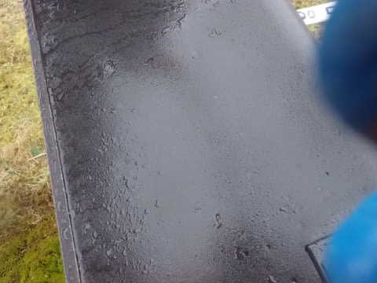

レインウェアがないと絶対滑りたくない

雨の中．

ゴーグルが水滴で見にくいのさえ我慢すれば．

いつもなら絶対人が溜まる最後の落ち込みも

無人状態！！

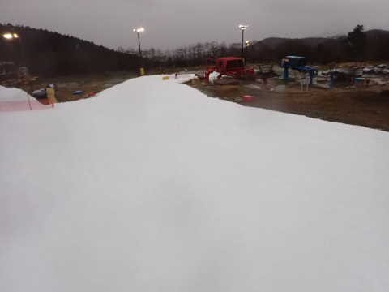

さすがに11時ごろには，ちょっと人が

出てきたけど…

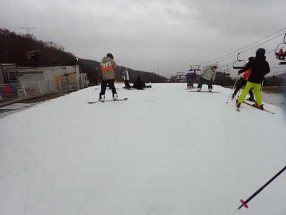

それでも，コース上の人口密度はせいぜい

この程度．

普段の休日と全然違うよ！！！

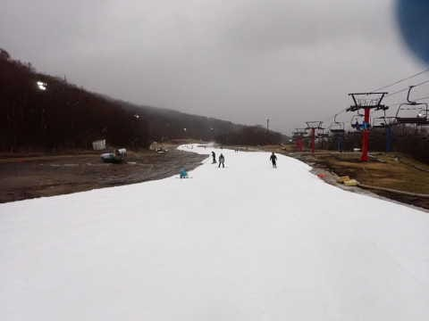

そして．

昼になってもリフト待ち0は続き…

いや．

こんなにガラガラだったら，

雨の日のイエティもいいじゃないか！！

コースも硫安で締まっていて，

人も滑ってないのでそこまで荒れて

ないし…

むしろ，これからも雨が降って

ほしいかも？？

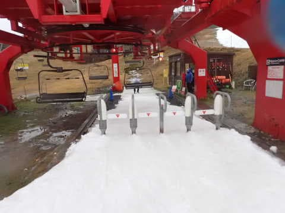

…ということで．

雨のせいでガラガラのバーンを滑ってみると．

シーズン初めは，滑れるだけで感動して

いたのであまり気にならなかったけど，

実はいつものコース上超絶人口密度の

イエティは楽しくない

ということに気づいてしまい．

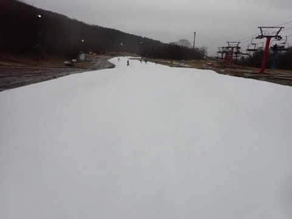

雨でガラガラのおかげで．

今日は午前中だけで，いつもの16時までと

同じ本数が滑れたし．

それも，全てがいつもの朝イチと同じレベルの

誰もいない気持ちいいバーンが滑れて．

午前中だけで，いつものナイターまで

滑った日よりも満足できたよ…

…

…

ってなことで．

雨がかなりひどくなってきた昼過ぎ．

いつもの1日分以上滑ったというのもあり，

今日は珍しくラストまで滑らず，

早めに切り上げたのでした…

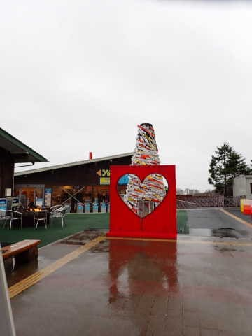

いや．しかし．

…次の週末も雪が降らず，他のスキー場が

オープンしそうにないから．

たぶんイエティで滑ることになるだろうし．

だったら，雨でいいんじゃないか？

というか．

ガラガラなコースをリフト待ち0で滑れる，

雨の方がいいかも…？？？

と危ないことを考えるようになった，

Skier_Sだったのでした…

## 💬 コメント一覧

### 💬 コメント by (ダウンヒル)
**タイトル**: Unknown
**投稿日**: 2022-11-24 17:46:51

咋シーズン...

雨中、カッパ着て滑り倒した...雨粒の鬱陶しさや拭う手間とかありましたが、人はまばらだし、ジャイアントの横幅全部使って練習できたりで...意外に滑るし意のままやりたい放題で...確かに満足でしたねぇ...

滑りたいぃぃぃ～!

冷え冷え降れ降れ踊り、全開で踊ります！!!

### 💬 コメント by (アツシ)
**タイトル**: Unknown
**投稿日**: 2022-11-25 01:07:13

雨降り貸切、といえば私も思い出しました。一昨年シーズンの最後の春、土砂降りの中一ノ瀬ダイヤでラスト１時間ちょい、完全貸切で１人で滑らせていただきました。完全貸切ですよ、誇張なしに。ゲレンデも無人、リフトに乗る人も皆無で大雨の中カラの搬器だけが回る中、当然リフトも1人乗り。自分と係の人以外誰もいない１時間。幸せでしたねー。ずぶ濡れでもいいじゃない、貸切なんだから。って感じでした。

Sさまも、これはクセになるかもしれませんね。要はカッパ次第ですよ。今週末もザーザー降りだといいな😁なんて願うことでまた一つ、大人への階段を登りましたね🤣

### 💬 コメント by (Skier_S)
**タイトル**: 雨で滑るのも悪くない
**投稿日**: 2022-11-25 02:18:52

＞ダウンヒルさま

雨の日は空いてるし，板も滑るし悪くないんですよね…

レインウェアを着ていれば，気になるのはゴーグルの水滴くらい．

とは言え，シーズン中の雨は困るので，冷え冷え踊りお願いします！

＞アツシさま

一の瀬ダイヤ，完全貸し切りですか…

「皆の衆，余のためにリフトを動かしてくれてご苦労」

って言いたくなる気分ですね（笑）．

でも，雨が降ってくれた方がいいかも…と思うのは，結構終わっている人の

仲間入りかと思います（笑）

