# 2021/1/2，新年2日目の志賀高原は…朝は積雪3cm，一日冷え冷え雪降り，最高雪質の一日！

📅 投稿日時: 2021-01-02 23:27:36

🏷️ カテゴリ: [2021スキー滑走日記](c2b0fc073d6357d3b786f6ca655147f7d.md)

ということで．

読者の皆さんも，

Skier_Sはいったい何日間志賀高原にいるんだ…

と思ってるでしょうが．

今日も志賀高原で滑ってました～！

えー．

雪降りで始まった朝．

これはさぞかし積もっているか？？

…と思ったら，昨晩からの積雪わずかに3cm（涙）

昨日同様，太板の出番を期待したけど．

残念ながら，太板を出せるコンディションでは

ありませんでした（泣）

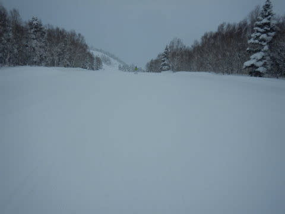

朝イチの山頂気温は-12℃と，

昨日ほど冷え込んでないけど，かなりの

冷え冷え！

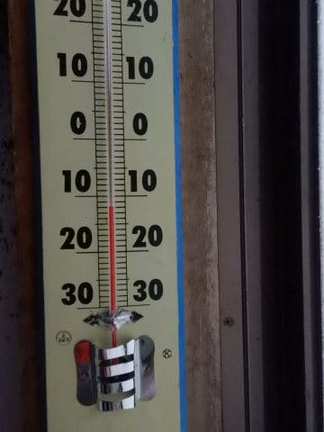

そして，ゲレンデの雪質は…

やわらか冷え冷えの最高圧雪！

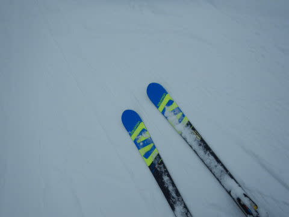

-10℃を下回る冷え冷え気温でしっかり

圧雪されていて，自分がうまくなったんじゃないかと

勘違いする，激烈勘違いバーン！

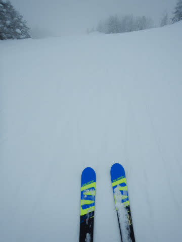

ただ，新雪を期待したオリンピックコースは

せいぜい3-5cmのうっすら積雪で，ちょっと

期待外れでしたが…

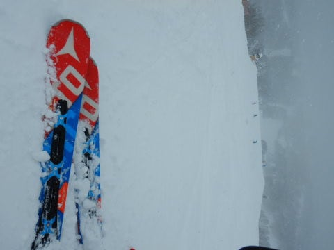

でも，これはこれで滑りよくて楽しい！

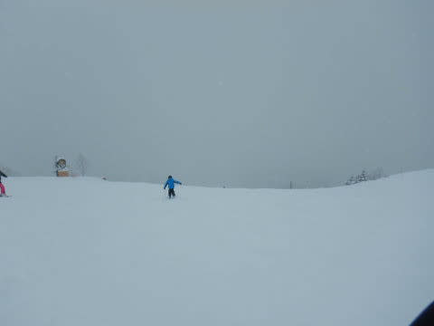

あ，コース脇には，昨日からのパフパフが

わずかながら残ってました…

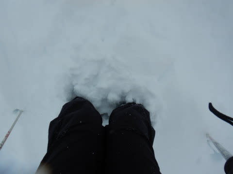

で．

今日も朝10時くらいまでは，コース上は

それほど混まず，好きなライン取り放題の

ガラガラゲレンデ！

冷え冷えの最高雪質で，正月休みなのに

こんなにガラガラバーンを滑れるとは…！！

…でも．

今日は10時をすぎたらゴンドラの列も

ゲートの外に伸び始め…

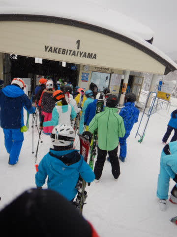

11時ごろには最大15分待ちになったようです…（涙）

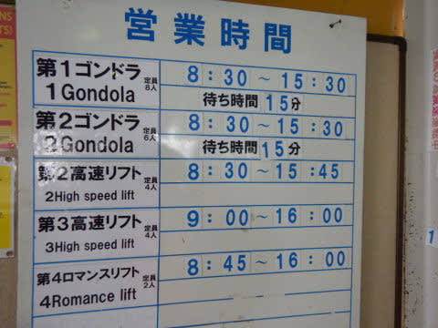

でも，ゴンドラの待ち時間が伸びたのも，

10時半ごろから11時過ぎのわずか1時間弱で，

午後はゲートの外まで列が伸びるかどうか程度．

そして，リフト待ちは，終日完全0だったので，

ゴンドラが混む時間帯も，リフトに逃げれば

待ちなしで滑ることができ．

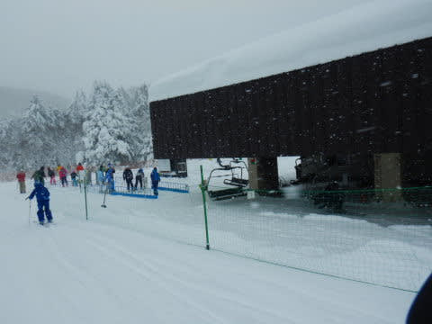

乗車定員制限で，ゴンドラはとんでもなく

混むんだろうなあ…

と思っていたこの正月休みですが．

意外と混まずに済んでます…！

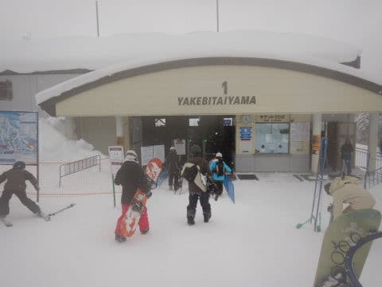

（お昼12時の焼額第1ゴンドラはガラガラ）

で．

今日の天気は，雪が時折強く降ったり…

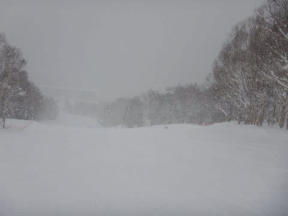

ごくわずか薄日が差したり，という

感じでしたが．

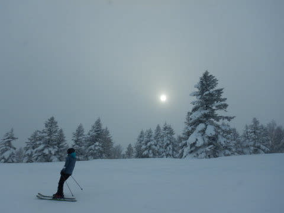

おおむね一日雪降りで．

かつ，気温は最高でも-10℃ほどまでしか

上がらない，激冷えの一日で．

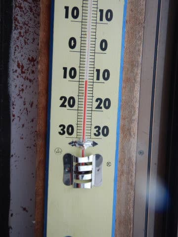

昼間にも最高雪質の冷え冷え雪が数㎝積もり，

ゲレンデ上をうっすら覆ってくれて．

最高冷え冷え雪質な一日でした…

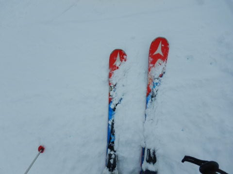

ってなことで．

今日も人がいなくなる，16時のラストリフトまで

滑り続けましたが…

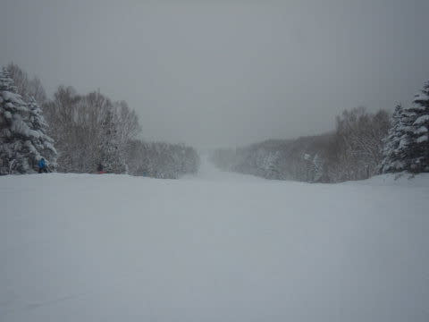

（ホントに誰もいない，貸し切りバーン）

…

…終わらない．

そうです．

まだ終わりませんよ～．

30，31日と2日間，行く気満々だったのに

中止になった憂さを晴らすべく，

今日も焼額ナイターへ出動！

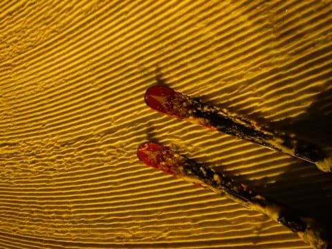

圧雪をきれいにかけなおしてくれる，志賀高原の

ナイターはやっぱり最高！

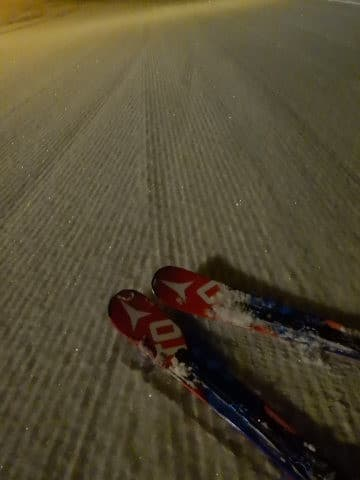

本日のナイター時，気温は-16度まで下がったようで．

激冷えでしたが，リフトはフード付きなので

そこまで冷えてる感じはなく，

20時のラスト1本まで，気持ちいいシマシマフラットバーンを

おなか一杯堪能してきたのでした！

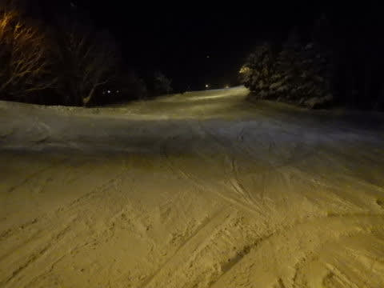

天気は晴れとは言えないまでも

やっぱり，今シーズンは恵まれてます…！！

## 💬 コメント一覧

### 💬 コメント by (しんちゃん)
**タイトル**: Unknown
**投稿日**: 2021-01-03 01:42:46

ヤケビのナイターの圧雪は、本当にピカピカのシマシマバーンですよね。

お昼のままのバーンでナイター営業になるゲレンデが多い中、ありがたいと思います！

### 💬 コメント by (西舘)
**タイトル**: Unknown
**投稿日**: 2021-01-03 02:12:08

今日もたくさんの皆様にご一緒頂き、幸せな時間でした。

あぁ本当に昨シーズン頑張って良かった（感涙）。

ちびっ子たちがしていた遊び（小山を見付けると駆け上がる、木と木の間に入りたがる、小ジャンプしたがる）は、Jr.も一緒でした。付いて滑るのが大変だったなぁ。

「気が合う、あっち行きたい！」と興奮していました。

奥志賀にフリーラインパークがあって、例年2月1日オープンなので、2月3週目に一緒にどうですか？

### 💬 コメント by (ももも)
**タイトル**: Unknown
**投稿日**: 2021-01-03 07:30:12

S様

いつも楽しいブログありがとうございます!　本年もよろしくお願いします。

昨日のサンバレーナイターもシマシマでガラガラで良かったですよ。　今日は奥志賀〜一の瀬辺りをグルグルしようかな…　西館さんに会ってみたいなぁ

### 💬 コメント by (かず)
**タイトル**: Unknown
**投稿日**: 2021-01-03 10:14:41

明日積りそうですかね？？

### 💬 コメント by (m＆t)
**タイトル**: Unknown
**投稿日**: 2021-01-03 15:36:08

昨日は無事新年のご挨拶をさせていただき、ありがとうございました。やはり東館某所にてお会いする確率多し！ですね。

昨日の志賀高原は最高の雪質で、8時から16時のラスゴンまで滑り倒しました。泊まりだったら、ヤケビのナイターも参戦したい位でした。

本日は大人しくホームアサマ2000にて朝練をしてきました。が、元旦に存在していたフカフカな雪はどこ行った？というアサマ特有の固い雪面でした（笑）。

１月中にまた志賀高原に行く予定ですので、その時はよろしくお願いします^_^

### 💬 コメント by (べー)
**タイトル**: Unknown
**投稿日**: 2021-01-03 17:16:55

昨日今日と1ゴン一人乗りレーンから乗り込むSさんをお見かけしました～

明日は志賀の天気を決めているSさんのお力で晴天でお願いします(笑)

### 💬 コメント by (アリス)
**タイトル**: 1/4まで志賀高原滞在予測
**投稿日**: 2021-01-03 18:42:05

Skier_S様

Sさん、このまま1月一杯志賀高原でスキーをしている勢いを感じます♪

さすがに、－16℃は応えますね。

もしかしたら、Sさんと同じ宿に泊まってるかもです。

### 💬 コメント by (ももも)
**タイトル**: Unknown
**投稿日**: 2021-01-03 21:15:41

S様

本日はありがとうございました。お会いできて嬉しかったです！

今日もサンバレーナイターがあり、ポチる時間も惜しんで滑りました（笑）。昨日より混んでましたが、シマシマを楽しみました。S化が進む家族です。

konsuke様

赤のステッカーありがとうございました。どこに貼ろうかな？！

### 💬 コメント by (Skier_S)
**タイトル**: 今日も最高の一日でした
**投稿日**: 2021-01-03 21:42:46

＞しんちゃんさま

やっぱり，シマシマバーンを一日2度楽しめるのは最高ですよね…

ナイター料金を払うかch氏はあります！

＞西館さま

昨日も楽しんでもらえたようで良かったです～

焼額の知り合いがいっぱい増えましたね！

奥志賀パークはいいのですが，子供たちが焼額限定券なので，

スキー子供の日を狙って遠足する形がベストでしょうか…

＞もももさま

今日は無事お会いできましたね．

サンバレーナイター，今日もあったんですか！！

焼額ナイターはなかったのに…（涙）

ナイター終了後にポチるじかんがありますよ（笑）．

＞m&tさま

またいつもの場所でお会いしましたね（笑）．

今日も焼額は最高雪質でしたよ…

ホームゲレンデを志賀に変えてはいかがでしょうか…とお誘いしてみる

＞べーさま

あ，発見されてましたか．

明日はすっきり晴天とならなさそうですが，

晴れ間がありそうだと思ってます…

＞アリスさま

あれれ？同じ宿ですか…！？？

全く気付かず…

このまま1月いっぱい志賀に滞在したいです（笑）．

