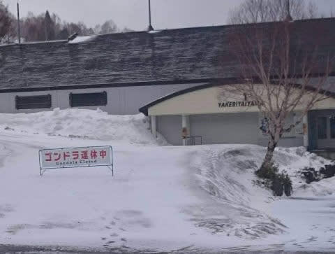

# 2021シーズンモデルのスキー板，試乗レポート…ATOMIC Redster S9

📅 投稿日時: 2020-04-14 01:47:41

えー．

昨日予想した通り，

やっぱり，本日はすごい暴風雨だった

ようですね…（涙）

　早朝は雪かもしれないけど，

　基本的に限りなくみぞれに近い雪で，

　午前中には雨になる．

と予想した通り．

明け方に雪が降り，路面には積雪が

あったようですが．

　かなり強い南風が吹き付け，ゴンドラどころか

　リフトの営業もヤバいかも．

と予測した通りの，荒れ荒れ天気となり．

焼額は第1ゴンドラも…

第2ゴンドラも運休になったようです(涙）

…それどころか．

志賀高原は，一の瀬ファミリーのリフト1本を除き，

全て全滅したようで…

(一の瀬ファミリーの1本以外，全て運休で真っ赤なリフト営業案内）

（[志賀高原索道協会ホームページ](https://www.shigakogen-ski.com/live-lift-status/list)より）

そして，予想通り朝のうちに雪は

みぞれ→雨と変わっていき．

スキー場の雪は，雨で濡れて

いったようですが…（涙）

ただ，その雨も，

　午後になると気温が冷え，雨から雪になり，

　吹雪っぽい感じに．

という予想通り，午後4時ごろには

路面に雪が積もり出し…

そして，深夜0時半の段階では，

結構雪が積もってます！！

これから明日，14日(火)の朝にかけて

雪が降り続け．

明日の朝は10～20cmほどの積雪でスタートしそう！

朝には雪が止んじゃうけど．

明日は一日冷え冷えで，とても

4月中旬と思えない一日になりそう…！

北風がちょいと強いので，奥志賀は

ゴンドラ営業厳しいかもしれませんが…

しかし，この時期にこれだけ冷えて，

結構雪が積もるとは…っ！！

すばらしぃっ！！！！！

これはやはり．

今シーズンは，奇跡の4月だっ！！

…

…滑りに行けないのが悔しいけど…（激涙）

ってな感じで．

GW以降まで期待がもてるいいニュースの後は．

本題の，来シーズンモデルのスキーの

試乗レポートです！

前回までは，3月上旬に志賀で試乗した板の

レポートでしたが，

今回からは，3月下旬のアサマ2000で試乗した

板のレポートになります…

この時の試乗コンディションは，朝はガッツリ

エッジが効く雪だったけど．

じき雨になり，かなり重い湿った雪の

コンディションで試乗したものです．

ってなことで．

テククラも指導員資格も持ってない，

単なるレジャースキーヤーによる

スキー試乗レポート（というより，

個人的ひとりごと）です．

今回は，アトミック編．

では，どうぞ～！

○ATOMIC Redster S9＋X12 GW 165cm

SL競技用＆基礎小回り

ATOMICのSL競技用は，トップモデルとしてS9 FISが

あり，競技用セカンドモデルとなるこの板．

トップモデルは，トゥピースとヒールピースが

金属バーでつながれたVARビンディングを使ってますが，

このモデルはVARビンディングより弱い，

GWビンディングを搭載したモデル．

この板のコアを，軽量カルバコアにしたのがS9iですが，

普通のレース用板と同じコアを使っており，

S9iよりはちょっと重めとなるこの板．

履いた感じは…

激重のVARビンディングを使った，ATOMIC Bluester SXを

普段から履いている自分にとっては．

そんなに重さを感じず．

むしろ適度な重みが安定感をもたらしつつも，

軽快に動かせる感じ．

勝手にロッカー構造の板のトップが食らって

オートマチックに谷回りに入っていく

Bluester SXとは全く違う感じで．

谷回りで動かしてたわみを作っていくと，

そのたわみに沿って板がターン弧を

描いていく板．

谷回りで結構板が動かしやすく，

狙った谷回りが作りやすい．

テールの張りは，Bluester SXより弱め．

ガッツリ板が捉えて切れて行って，

山回りでテールに乗るとすっと板が

反対側に抜けていくSXと違って，

山回りでも板のテールを動かす自由度があり，

切り替えから次のターンの谷回りにかけて

板が勝手に反対側にふっとんでいく感じは無く，

切り替えから谷回りでも，板にちゃんと

ついて行ってしっかり重さを乗せて

切り替えることができる感じ．

それでいて，山回りでもしっかり板が

雪面を捉えてる感があり，適度な

しっかり感があって，スピードを出しても

板がふらふらするような感じは全く無し．

板が軽快で動かしやすいのに，

板に重さをしっかり掛けられて，

スピードをガンガン出しても

それに負けない張りがあり，

どっしりと安定感を感じるという

不思議な感覚．

柔らかい荒れた雪の中ながらも，

かなりスピードを出しても板が叩かれる

ことなく安定してるし．

それでいてガンガンハイスピードになると，

よくありがちな板がガッツリとらえて

どうしようもなく板なりに下りて

くるしかない板と違って，かなりの

ハイスピードでも板を動かして

いくことができます．

オートマチックでターンが始動する

板ではないので，滑りはじめに一瞬

板がルーズに感じましたが，

谷回りでしっかり外足を動かしていけると，

動かした量に伴う回転弧できれいに回って

くる感じで，これは結構いい板かも…

ただ，試乗した雪面が柔らかい

春雪だったので，

すごい固い斜面でどういう反応に

なるかちょっと気になりましたが．

柔らかい雪だと，かなりのスピードを

出しても安定していたので，

硬い斜面でもそこそこ滑れるんじゃ

ないかな～．

軽快なのに安定感があるという

不思議な感じで，結構気に入りました．

## 💬 コメント一覧

### 💬 コメント by (ほっぽ)
**タイトル**: S9
**投稿日**: 2020-04-15 23:17:12

Ｓさん

この板、私も試乗しました。

ツルツルのアイスバーンでもガッツリエッジが食いついてアイスバーンを感じさせなかったです。

安定感ピカイチでした。

ややどっしり感はありますが、自分から動かしていくことも出来たので

私もかなり気に入りました。

アイスバーンでの安定感ではＳ９ｉ　Ｐｒｏにはかないませんが、

その分操作性はＳ９が上だと感じました。

Ｓ９ｉ　Ｐｒｏには試乗されたのでしょうか？

もしも試乗されていたら比較インプレッションも読みたいです。

### 💬 コメント by (Skier_S)
**タイトル**: ＞ほっぽさま
**投稿日**: 2020-04-16 01:14:05

あ，S9とS9i Proは全然違うと感じました．

S9i Proの方がおっしゃる通り，よりどっしりしてより安定感が

高い感じです…

ただ，重い分パワーが要ります．

体力を消耗する板です．

また，詳細レポートをやりますが…

順番的に，もう少し後になりそうです…

### 💬 コメント by (ほっぽ)
**タイトル**: S9とS9i　Pro
**投稿日**: 2020-04-16 08:10:41

Ｓさん

やはりProは安定感がより高いですよね。

ドッシリしていてアイスバーンをものともしないエッジグリップと安定感でした。

しかし、重量感があって重い、パワーが要りますね。

ビンディングの影響がどの程度あるか？ですが、

S9とS9i　Proで同じビンディングで比較してみたかったです。

まだまだネタは豊富でスキーに行けなくても当分はblogネタに困りませんね(^^♪

### 💬 コメント by (Skier_S)
**タイトル**: ＞ほっぽさま
**投稿日**: 2020-04-17 01:09:04

S9のVARビンディングが選べるモデルだと，

S9 FISになりますよね…

板自体もS9とS9 FISはかなり違いそうですが，S9 FISは履いてません…

S9i ProでVARビンディングじゃなくGWビンディングだったらどうなるかは，

確かに興味があります…

