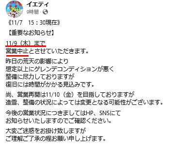
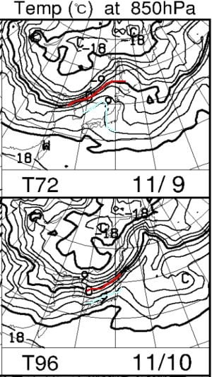
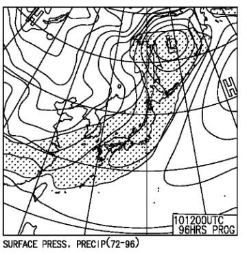
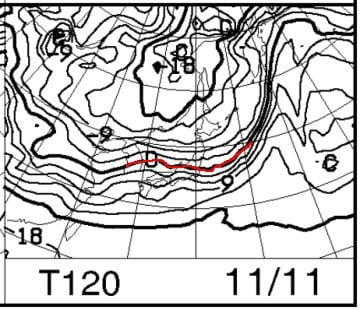
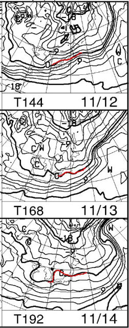
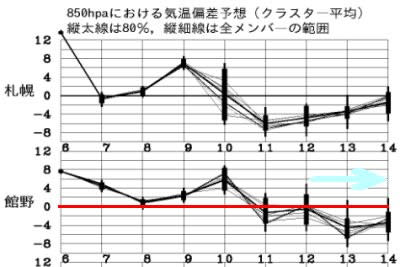
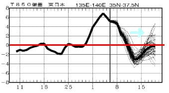

# ええぇ！？イエティゲレンデ状態悪化で営業休止！？10日(金)に営業再開めどらしいけど…天気は10日夜にまた高温の雨予想

📅 投稿日時: 2023-11-08 03:29:57

🏷️ カテゴリ: [日記](cc4b5682fb7b8b144980957a978653fb0.md)

うぎゃーーーーー！！

昨日からの雨で，イエティのゲレンデの

雪が消滅したといっていいレベルで

溶けちゃったようです…(涙)

（[WNIのイエティライブカメラ](http://webcam.wni.co.jp/KAC24326/loop.html)より）

もう，ゲレンデの雪が途切れ途切れでしか

残ってませんね…（涙）

このせいで，イエティは

本日から11月9日まで営業中止

となり，ゲレンデの雪づくりを全力で実施し，

10日(金)からの営業再開を目指すようです…

（[スノーパークイエティFacebook](https://www.facebook.com/YetiSnowtown/)より）

うーん．

やっぱり，暖冬の前触れなのか…(涙)

ここ数年，一旦オープンしたイエティがゲレンデ

状況悪化でクローズすることはなかったんですが…

2017年に10月第1週にオープンしたときに

第2週で一旦クローズになって以来じゃないかな？

あ，軽井沢のゲレンデは何とかもったのか，

軽井沢の営業は無事続いているみたいです．

とりあえず．

今回の高温はこれで終わって，

この後は冷えて10日までにゲレンデが

回復しそうかどうか，気になって

寝られないので．←あなたは気になることがなくても，

いつも夜に寝てる暇がないでしょ

これから先冷えるのかどうか，天気図を

読み解くわけですが…

…再オープン予定日前後，9，10日の

850hpa気温を見てみると…

うぎゃーーー！！

ダメだ！！

赤い0℃線は北海道より北のレベルで

北上しちゃってるし．

本州にかかっているのは水色の+9℃線…

これはもう，9日と10日は全然ダメな

レベルで高温ですね（泣）

で，10日の地上天気図を見ると…

…

…（屍）

ダメだ．日本を見事に覆うように降水域の

網掛けがかかっているので…

10日は，夕方あたりから高温の雨

になりそうです…（激涙）

雪が…雪が溶けていく…（滴り落ちる涙）

うーん．

9日までは高温ながら，雨が降らないので

アイスクラッシュ全開で何とかゲレンデを

復活させたとしても…

ぎりぎり復活したばかりの雪が薄いゲレンデ．

再オープン日の10日の雨でまたやられて

しまいそうな予感…

今週末，イエティ大丈夫かな…（心配）

でも．

翌11日の土曜の850hpa図を見ると…

をを！！

赤い0℃線が本州にかかり始め…

冷え込みが始まりそうな予感…！！

これ，横手山は人工降雪機動かせるかも？

そして，12，13，14日の850hpa図は…

うををを！！

12日は赤い0℃線が志賀高原にかかって

いて，13日は太平洋側まで下がります！

14日もぎりぎり志賀高原そばにいて

くれるので…

これは12日から13日は，天然雪も

期待できるレベルで…

横手山では3日間ぶっ続けで

人工降雪機が動かせるかも？？

気温傾向を見ても…

12日以降は水色矢印で示したように，

気温が低くなる傾向が予想されて

います！！

…週末に間に合わないけど，この冷え込みに

期待！！

ただ…

この冷え込みはそんなに長く続かなさ

そうで．

2週間気温傾向を見ると，16日ごろには

平年並みの気温に戻っちゃいそうです…

でも．

熊の湯も18日オープンを目指している

ようだし．

オープン直前の冷え込みはありがたい限り！！

ってなことで，

東京で27℃を越えるような高温の

翌週には激冷えがやってくるという，

ちょっと極端な天気になりそうな

今週から来週にかけてですが．

そのあとも気温が冷え続けるように，

また寒いギャグを言い続けて地球を

冷やそうかと思っているのですが…

どうやらここ数日の睡眠不足で

疲れているらしく，

「フットバスを吹っ飛ばす」

くらいのギャグしか思いつかないので．

ちょっと地球を冷やすには力が足りない…

地球を冷やすべく，寒いギャグを

考え続けるための気力を養うために，

これから寝ます…

おやすみなさい

## 💬 コメント一覧

### 💬 コメント by (1kamakura)
**タイトル**: Unknown
**投稿日**: 2023-11-08 06:08:18

強風で布団が吹っ飛んだ

荒川区　洗濯物が　あら乾く

### 💬 コメント by (1kamakura)
**タイトル**: Unknown
**投稿日**: 2023-11-08 17:46:20

江戸の秋

Sさんのために

私の明朝のブログの題名に

寒寒のダジャレをかましておきましたよ〜。

お忙しいでしょうから題名だけでも、

よかったらご覧ください。

### 💬 コメント by (Skier_S)
**タイトル**: ＞江戸の秋さま
**投稿日**: 2023-11-09 02:06:30

地球を冷やす活動にご協力ありがとうございます（笑）．

実は過去の記事で，基本的なベタなダジャレを使い切ってしまっていたので…

面白くてはダメなので，なかなか新しいネタが出てこないです（笑）．

明日の記事を楽しみに読ませてもらいます～！

