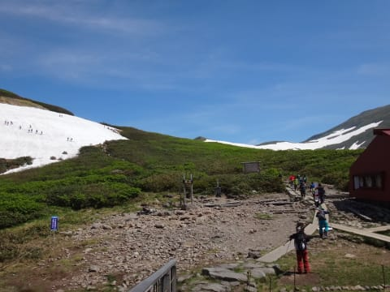

# 6月11日，土曜の月山詳細レポート…普段より2-3週間雪解けが早いよ！もう終わりげな感じ…

📅 投稿日時: 2016-06-15 04:39:22

えー．

昨日は．

Gooブログのメンテナンスにより．

記事もアップできなければ

コメントも返せない…

という状況で．

…月山レポートが書けませんでしたが．

今更ですが，土曜の月山の詳細レポートですっ！！

＃そして今日もとんでもない時間に更新

えー．

まず．

朝ですが．

遠くからくっきり月山が見える，

すっきり晴天でスタート！

駐車場からリフト乗り場へ向かう道は…

ええ？？

両脇に雪があるものの，

歩いていく道には，もう全く雪がない状態

なんですが…っ！？？

…あり？

いつもだったら，まだ6月上旬のこの時期．

多少は雪の上を歩かないといけない気が…

で．

一応，公式には．

すでにコースが途切れてしまい，リフトは滑って

降りられない状況になっているということなので．

リフト券も一日券や半日券は無くなり，

往復券，1回券，回数券のみになっちゃってます…

そんな状況なので．

リフトは超ガラガラですね…

と

とりあえず．

晴天のリフトに乗って…

山頂が近づいてくると…

うむ？？

なんだ？？

いつもは土が出ていないところに

ぽっかりと土がっ！

そのせいで…

Tバーの位置は，この島の上．

こんな感じの場所に掛かってます．

ということは…

リフトを降りて，雪面に出てから，

こんな感じでかなり登らないと．

Tバーには，行けないということか…（涙）

これは，7月並み

いや，7月第1週でも，これよりひどい年は

そんなにない気がするんだが…（泣）．

とりあえず．

リフトを降りたら…

こんな感じのところをひたすら登り…

向こうに見えているリフト降り場から，

これだけの距離を歩いて，やっと雪面に出ます．

リフト降りてから雪面に出るまでの石段の

距離，これまでの最高記録かも…

いや，ホントに7月並み．

んで．

雪面に出たところから上を見ると…

Tバー乗り場ははるか先ですな…（涙）

ただ．

Tバーはかなり人が多く，混んでるっぽく見えたし．

どう見ても，かなりTバーで滑れる距離も短そうだったので．

…

…Tバーは諦めた！←あきらめ早いよ

リフトでの下山コース．

…コースが途切れているらしく，

一応ロープが張ってあるものの．

リフト券売り場では

「10mくらい板を脱げば，滑って降りられる」

という説明だったので．

大斜面へ向かうのだ！

大斜面へ向かうには…

この斜面を，赤矢印のところまで登って，

紫線に沿ってトラバースする感じになっており．

…いつもなら全く登らなくてもトラバースできるのに．

今シーズンは，トラバースのためにかなり

登らないといけません…

で．

トラバースすると…

やってきました，大斜面！

…しかし，ここ数日．

ほとんど滑る人がいなかったため．

コブはすごい浅くなってますね～…

雪質は…

うーむ．

決して滑りよい雪ではないなぁ…

しかし，そんな中．

さすが土曜日だけあって．

意外と滑っている人，いますねぇ…

そして，大斜面の途中に一か所ボトルネックポイントが．

下から見るとこんな感じで．

これも，あと1日くらいで途切れそうな感じ…

このボトルネックは，下から見ると，

この矢印部分になりますね．

で，大斜面を降りきって．

そのあとのリフトへ向かう落ち込み部分…

ヤバいのは，ここなのだ．

ここが一番最初に途切れるのだ．

近づいてみると…

うむ．終わりげ（涙）．

ただ，まだ藪漕ぎになってないだけマシじゃないか…

と，板を脱いでここを乗り越えて…

そして，その先を見ると．

あり？まだ板が履けないの？

まだ土が出てる箇所があるのね…．

と，近づいてみると…

おう！なんだ，こりゃ！

水が流れ落ちる，落差1mほどの岩場が！

写真だと段差があるように見えないけど…

結構大変な落差です．

下から見ると，こんな感じ…(泣）

これを乗り越えると．

あとは，リフト乗り場の小屋の下，

ここまで滑りこめます．

そして，リフト乗り場に行くためには．

目の前の泥坂を上っていかないといけないわけですね（涙）

ちなみに．

この先はもう雪が途切れて，下には滑っていけません…

しかし．

さっきの落差のある岩場さえ乗り越えれば．

後はちゃんと滑って来れるじゃないか…！

…ということで．

この日は，Tバーが混んでいたこともあり

（朝）

（昼ごろ）

…ひたすらリフトグルグルで大斜面を滑ります．

だけども．

かなり歩いたり登ったりのため．

リフト1本滑るのに，約45分くらいかかるんですが（涙）

午前中で5本滑るのが精いっぱいだったんですが…

でも，イイのだ．

雪不足の今年．

この時期まで滑れれば，文句は言えないのだ！

ということで．

例年より2-3週間雪解けが早く．

まさか，6月第2週に大斜面側コースが途切れるとは

思いませんでしたが．

それでも，何とかぎりぎりリフトを滑ることができ．

…無事，私の2016シーズンのラストデーを

終えることができたのでした…

シーズン64日．

長いようで短かった今シーズンも，これにて終了です…

## 💬 コメント一覧

### 💬 コメント by (れお)
**タイトル**: 今シーズンもお世話になりました～
**投稿日**: 2016-06-15 15:36:23

シーズンお疲れ様でした!!

今シーズンも、楽しいスキーブログありがとうございました。

ホント、今シーズンは、少雪・暖冬で、残念なシーズンでしたね…。来シーズンは、ガンガン冷えて、ドカドカ降って欲しいものです。

オフシーズンの物欲選手権も期待しております!!

また、来シーズンも志賀高原でお合いになれましたら、よろしくお願いします～!!

### 💬 コメント by (元オデッセイ乗りのレヴォーグ愛情注ぎ)
**タイトル**: やっぱりいたんだ！
**投稿日**: 2016-06-15 19:13:15

お久しぶりです。

やっぱり同じ日に月山にいたんですね！

私も雪の少なさにビックリ! 嫁を山麓駅に残して滑り、帰りの道中で月山水とか、佐藤錦とか、月山筍とか、エキソンパイとか買わなければいけなかったので、Tバー6本だけ滑りました！

スキーの姿に変身してしまうと全然わからないけど、銀色のBRも見つけられなかったなぁ～

駐車場入口近くの高台にSkier-Sさんと同じ色のレヴォーグ見かけませんでしたか？

レヴォーグ楽しい車なんですが、燃費はやっぱりいまいち！今回も満タン往復できたんですが、地元の給油で57㍑も入っちゃいました！あと3㍑で完欠でした！

1.6GT-Sなのに14km/㍑くらいなんですよ。GPS測定のスピードで105km/hで巡航したんですがね！

もう、あっという間に16,000kmです。年20,000kmペースです。

### 💬 コメント by (Skier_S)
**タイトル**: 今シーズンも終わりました～
**投稿日**: 2016-06-16 01:10:42

＞れおさま

今シーズンは，あんまりお会いできませんでしたね…

しかし，ホントに残念なシーズンでした（涙）

でも，6月まで滑れて良かった…

また，来シーズンはどかどか雪が積もった志賀高原で

お会いしましょう！

…物欲選手権は…

今シーズンは負けないでおきたいところですが（笑）

＞元オデッセイ乗りさま

お久しぶりです！

あらららら～．

月山にいらしてたんですね…

お会いできなくて残念です…

うちは駐車場入って左側奥にいたので，

上の段の車には気づかず…

レヴォーグ1.6，カタログ燃費から言うと

もう少し燃費良さそうですが…

わがBRは月山往復リッター15～16km行きますから．

でも，おそらくBRより乗ってて楽しい

車だから良いのでは（笑）

来シーズンは，ぜひ志賀高原にもお越しください～

連絡くれれば，一緒に滑りましょう！

### 💬 コメント by (元オデッセイ乗りのレヴォーグ愛情注ぎ)
**タイトル**: Dryvision入れた！
**投稿日**: 2016-06-20 08:47:49

どうもです！

スレ変えた方がいいと思いますが、まずこちらへ！

昨日、わがFB16DITに、dryvisionのブーストオプション入れました！

横浜から自宅までの首都高と一般道燃費が往路より1km以上あがって、MFD読みで16.3くらいでした! まったく同じ首都高のルート使いました。

Sモードでは、ビューンと回るようになりました。あと、全域滑らかぁ～

FB25にも対応しないのかな？

もっと乗ったら、またレポートしますね！

### 💬 コメント by (Skier_S)
**タイトル**: 元オデッセイ乗りさま
**投稿日**: 2016-06-21 01:38:41

あら！

いろいろ手を入れてますね～！

FA16って，レギュラーガソリンのノック限界

ギリギリを突いた直噴エンジンなので，

なかなかチューンは難しそうなのですが…

でも，気持ちよさが上がって燃費も良くなったなら

お金を払った価値はあったようですね（＾＾

また，もう少し走ったらどんな感じかレポートしてください～！

### 💬 コメント by (元オデッセイ乗り)
**タイトル**: Dryvision良かった！
**投稿日**: 2016-06-27 08:20:04

おはようございます。

自宅から那珂湊まで、寄り道もして、300kmほど走ってきました。

走り出しのもたつきなくなり、高回転まで一気に回るようになり、エコランしているときの、ダサいエンジン音もすごく小さくなって、おまけに燃費も良くなりました！

エンジンの性格が、ヨイコになりました。

エンジンのパワーは感覚的なものしかお伝えできないのですが、燃費は17.5kmに向上してしまいました！

低速からスムーズにブーストかかって、低速域のトルクが増えたからでしょうか？

となると、JC08向けのセッティングって、ダメじゃないですかね！そもそもその規格がよろしくないかと。でも、ターボだからですかね？JC08は非ブースト域で測定するとか？詳しいことはわかりませんが、気分は上々です！

これに13.5万円が高いと感じるかは、車への愛情注ぐ価値観で別れるでしょうね！

### 💬 コメント by (Skier_S)
**タイトル**: 元オデッセイ乗りさま
**投稿日**: 2016-06-28 03:37:59

あら，エンジン音とかも変わるんですね…

そして，燃費も上がりましたか！

JC08モード改善が至上命題（？）の，市販

プログラムがやっぱり実情と合わないのか…

一体ノーマルプログラムって何なんでしょうね？？

LEVORGの場合，エンジン単独じゃなく，CVTとの

協調制御もあるので，CVTのプログラムも

変わっているのかなぁ？

しかし，燃費10％以上改善したということですよね…

うーむ．すごい…

なぜ，ノーマルプログラムでこの特性が出せないんでしょうねぇ？

直噴＆ターボってかなり危険な組み合わせなので，

ちょっと何かあると簡単にノックしたり失火したりするので，ノーマルプログラムではマージンを大きくとりすぎているのか…

マージンを削って，低負荷で燃焼温度がクリティカル

じゃない領域では，NOx規制値的にOUTになりかねない

くらいリーンに燃料を吹いて燃費を稼いでいるとか…

＃EGRクーラー付きで大量EGRしているので，

＃さらにリーンバーンにするメリットは薄いか…？？

そして，パワーが必要な領域ではしばらく

濃い目の燃料を吹いてノックマージンを広げて

ブーストを上げているのかな？

＃キャタライザが過熱しない短時間なら

＃濃い目の燃料も耐えるはず．

＃CO，HC規制値をクリアできないけど…

気になる．

いったい，何をどう変えているのか．

内燃機関マニアとしては，かなり気になるところです．

でも．

お値段以上の価値はありそうですね…！

