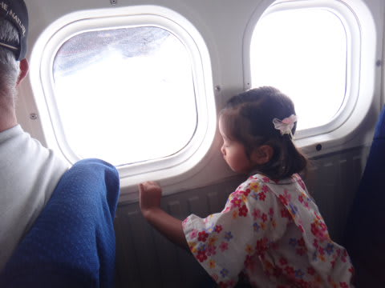
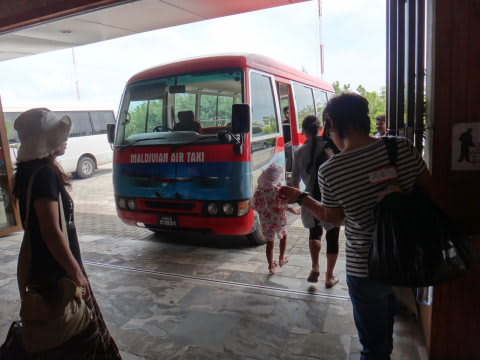

# 2012年　子連れモルジブ　ダイビング旅行記　その26

📅 投稿日時: 2012-12-18 00:19:58

えーーっと．

ここしばらく．

「徒然スキーヤー日記」

というタイトルのBlogが本来あるべき，ちゃんとしたスキーねたが続いてましたが．

…実はまだ．

モルジブダイビング旅行記が終わってなかったのだ…っ！

＃みんな忘れてる気がするけど

ということで．

この9月のモルジブ旅行記．(ああ！もう3ヶ月も前だよ…）

ラストスパート，Go!

----

思い出いっぱいのロイヤルアイランドを後にしたボートは，

水上飛行機のポンツーンへ接岸．

で．

行きのときと同じように，水上飛行機へ乗り込みます．

…両親は帰りたくない気分で落ち込んでるのに．

飛行機好きの娘は「ヒコーキ！ヒコーキ乗ろうよ～！！」

と，ハイテンション．

われわれを乗せた水上飛行機は，直ちに離陸．

無情にも，ロイヤルアイランドを離れていきます．

ああ…

さようなら，ロイヤルアイランド！

ロイヤルアイランドを後にした水上飛行機は．

また，美しい島々を眼下に見ながら，

モルジブ・マーレ国際空港への帰路を進みます．

…行きはヨロコビの中で見たので，輝いて見えた景色も．

同じ景色というのに，帰りはなぜか寂しく見えます…．

飛行機好きな娘は，相変わらずかぶりつきで景色にかじりついてますね…

そして．

30分ほどのフライトで．

首都のマーレの島が見えてきました．

そして…マーレ国際空港前の，水上飛行機着水エリアへ到着．

飛行機から降りて，

水上飛行機ターミナルから国際空港ターミナルへバスで移動します．

で，国際線のチェックインを済ませて，国際線ターミナルへ入ってみると．

マーレ空港，改修されてちょっときれいになってますね～．

…でも．お土産屋さんの少なさは相変わらず．

なんだか，あんまりいいお土産はないので，ご注意を．
