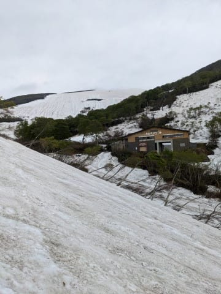
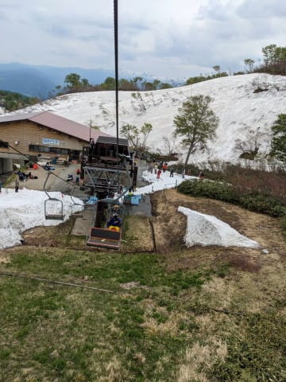
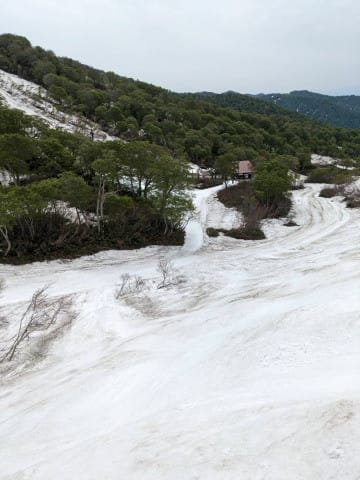
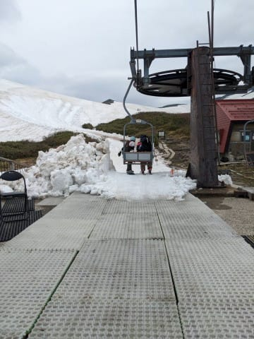
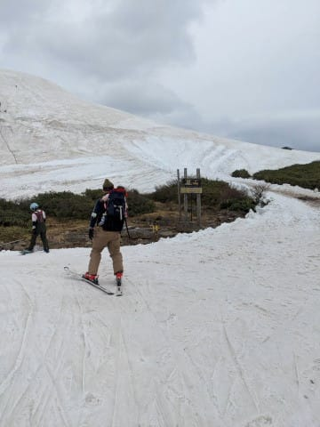
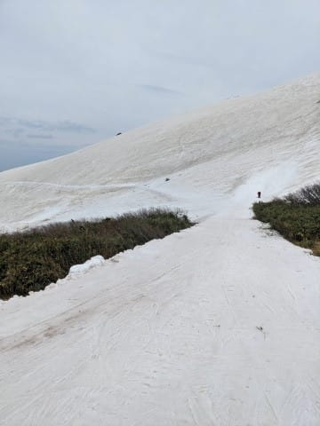
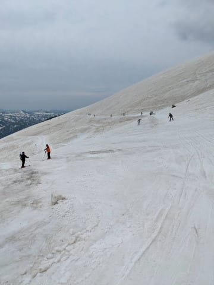
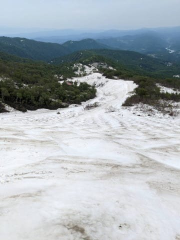
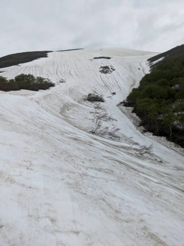
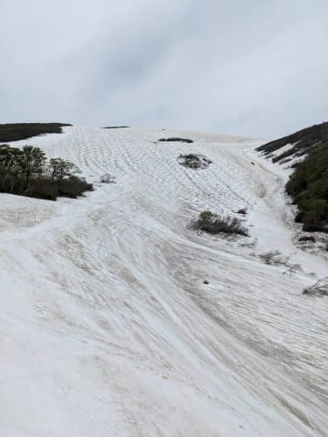

# 5/26(金)の月山スキー場，特派員情報！…例年より雪はあるかな？まだ板をはいてリフトに乗り降りできるよ！

📅 投稿日時: 2023-05-28 02:35:32

えー．

本日は月山の写真をお送りしますが…

いや．行ってませんよ！

私は行ってません！

今日は，いつもは志賀高原で滑っている

某特派員から送られてきた，月山の写真を

お送りします～！

いや．

ホントは昨日写真を送ってくださったので，

昨日記事にしたかったのですが…

昨日の夜はPCの調子が悪く，書き溜めて

おいた記事で乗り切っちゃいました．

一日遅れてすみません…

ってなことで．

一日遅れとはいえ，最新の月山情報です！！

…いつも，６月にならないと月山にいかない

私にとって，５月の月山はすごく雪が

多く感じますね…！

全景を見ると，まだまだたっぷり雪がある

ように見えますよ…！

なんと．

まだリフトは板をはいて乗り降りできる

ようで，乗り場の雪はぎりぎりっぽいけど…

ゲレンデからリフト乗り場へ向かう通路は

まだしばらくは行けそうですね…！

そして，降り場から先にも，まだ意外と

雪がありますよ…！

見たところ，この月山看板の上から雪を

降り場にかき集めてきているみたいですね…

そのおかげで，リフト降り場からゲレンデに

向かう通路にも，まだそこそこの幅で雪が

ついてます…！

そして．

この通路を通って，左に下りれば沢コース，

まっすぐトラバースすれば大斜面ですが…

トラバースルート側も，まだ全く藪が

出てきておらず，好きなところを

通りたい放題ですね～！

大斜面までのトラバースルートには

こんな一本道が何本かついている感じで，

ここを延々数100m漕がないと大斜面に

たどりつけませんが…

トラバースした先に広がる大斜面は，

全面コブながらも，まだまだ幅も

いっぱい！

下から見上げても，コブラインが

数えきれないくらいある感じですね…！！

いつも行くのは6月だから…

ここまで雪がいっぱいある大斜面，

私は見たことがないです…

この写真の右側が沢コース，上のほうが

大斜面ですが．

まだ両者を区切る藪がそんなに出てきて

ないので，大斜面から沢コースに滑っていく

ラインも結構ありますね…！！

ってなことで．

意外と雪が解けるのが早い…

と聞いていた月山ですが．

写真を見た限りでは，まだまだ

大丈夫っぽい感じです…！！

さて．

私は先週，かぐらファイナルで．

今週は滑りに行きませんが…

今シーズンは滑走日数が少なくて

スキーに行き足りない感にあふれているので．

できればあと1～2回は滑りに行きたいなぁ…

だけど…

そんな時間があるのかな…？
