# プロジェクトX2第2章…我が家の定番，手作り激安トランクカーペット！

📅 投稿日時: 2018-07-20 02:40:34

🏷️ カテゴリ: [車](cba0e8330b3f2ded7c1addfacc75d4547.md)

ということで．

本日も，「徒然ドライバー日記」

をご覧いただきありがとうございます．←訳の分からない開き直り

今日も車ネタ，行きますよ～！

…でも．

ナビ取り付けネタだと思った皆様．

残念でした．

今日はナビ取り付けネタではないんです…

実は．

私が車を購入した際に．

ナビ取り付けより先にやる儀式があるんです．

その儀式とは…

トランクにカーペットを敷くこと

です．

いや，ヘビーデューティーに車を使う我が家．

トランクにはスキー板やらスキーブーツを

始めとした，濡れモノやら汚れモノやらを

突っ込むことが多いのですが．

そのまま積むと，当然トランクが汚れます…

…かといって，ディーラーオプションの

ラゲージトレーやらマットやらを買うと，

2万円位と，かなり高い（涙）．

だもんで．

我が家では．

汚れてもいいトランク用カーペットを

毎度自作しているんです…

材料は，こいつ．

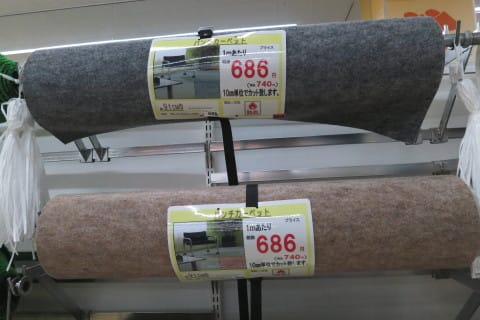

そう…

ホームセンターで1mあたり700円弱で売られている，

幅91cmのパンチカーペット．

これを2.5mほど買い込めば，作れます…

お値段は，2000円でおつりが来ます！

ということで．

ディーラーからの帰り道．

ホームセンターに寄り道して

カーペットを買い込み．

まだシートにビニールがかかっている，

購入後1時間の新車の…

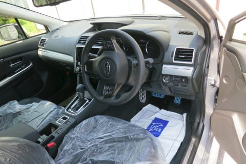

トランクスペースで…

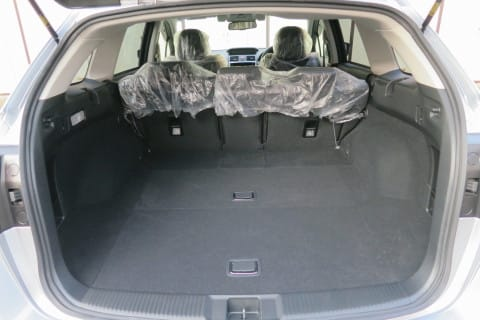

作業開始！

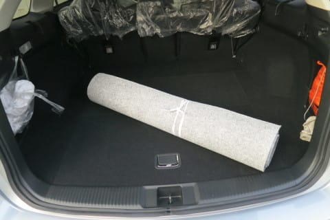

まずは，適当に広げて．

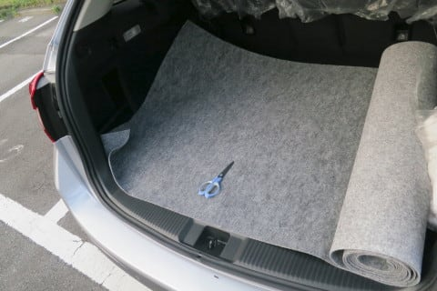

あとは現物合わせで，トランクの

床の形に合わせて切っていくだけ！

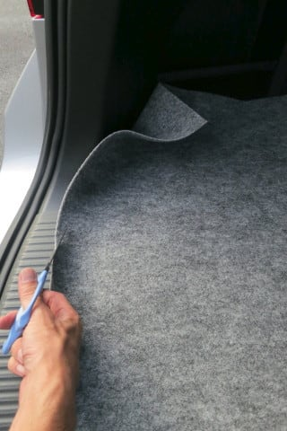

こんな感じでカットしていきます…

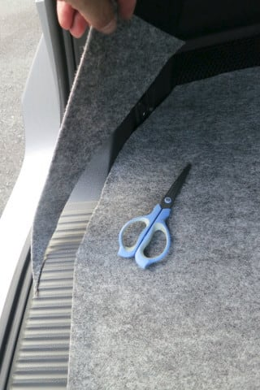

どんどん切っていきましょうね～．．．．

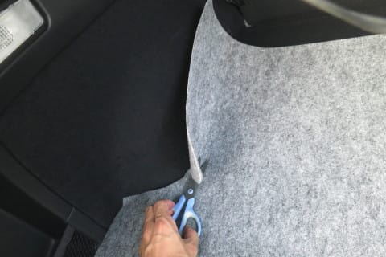

こういう難しい形のところは，マジックで

線を引いてから切っていけば楽です．

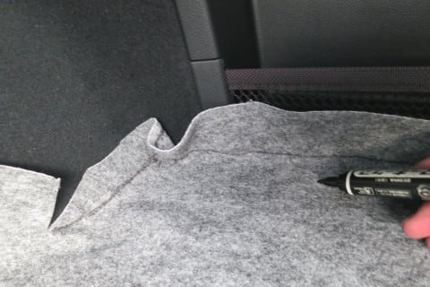

って感じで．

ガンガン切っていきます…

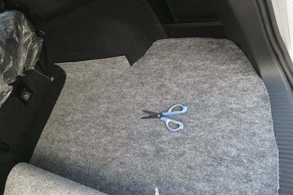

そして．

トランクの床面が完成したら．

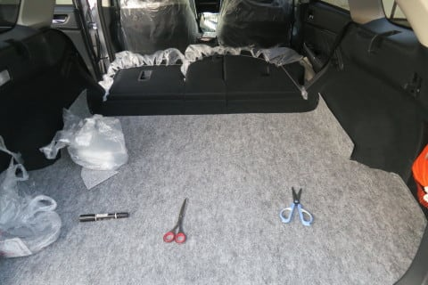

…次は，シートの後ろ部分！

ここも，シートの形に合わせて切って

あげて…

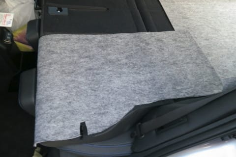

ここは，ヘッドレストにハマる穴を

開けてやって，ヘッドレストを

差し込めば…

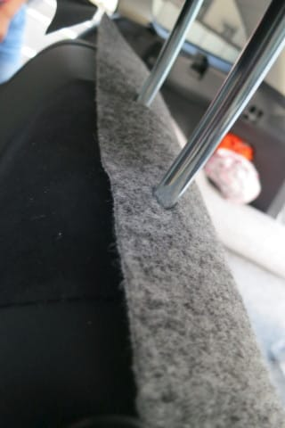

こんな感じで固定できます．

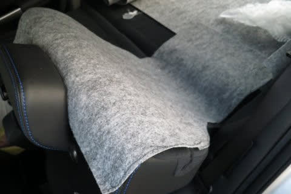

シートを固定するアンカーを受ける

キャッチャーがリアシート後ろには

あるので…

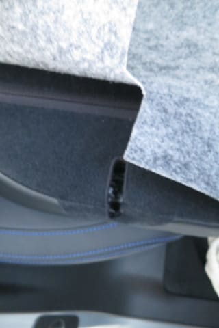

これを避けるように，スリット状に

切り込みを入れておきましょう．

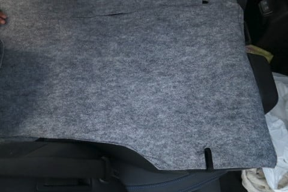

…ってな感じで．

手作りトランクカーペットの完成！

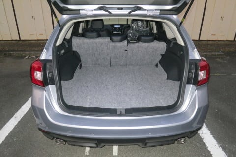

この，パンチカーペット．

撥水性もあり，結構汚れに強いです．

すごい汚れたら，また1mほどカーペットを

買ってきて，汚れた部分を取り換えれば．

また新品になりますから．

安心して汚れ物を突っ込めます．

トランクにスキー板などを積む人は，

2000円でお釣りがくる，このカーペット．

汚れ・傷防止に抜群の効果を発揮！

…ちなみに．

1mほど余計にカーペットを買ってきて，

こんな風にトランクから垂らせるように

しておくと．

荷物の積み下ろしなんかのときの，バンパーの

傷つきが防止できるので，おススメ！

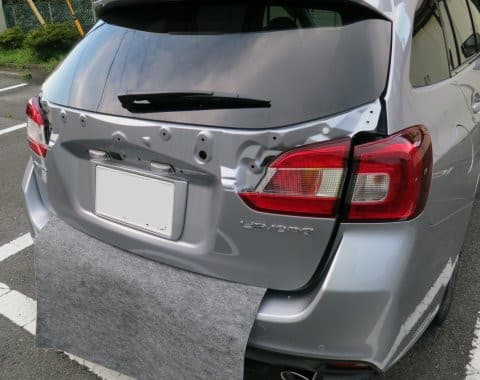

（この写真，リアガーニッシュがついてないけど，

　そこに意味は無いので気にしないでね）

こいつのおかげで，前のレガシィは．

最後まで後ろバンパーがきれいなままでした…

ってな感じで．

汚れればすぐ交換できる，激安カーペット．

スキーヤーには，かなり便利ですよ～！！

## 💬 コメント一覧

### 💬 コメント by (ほっぽ)
**タイトル**: 自家製とは、、、
**投稿日**: 2018-07-20 06:43:52

Ｓさん

数年後に私の手元にやって来る車、

丁寧に使って頂きありがとうございます。(^^;

これは素晴らしいアイデアですね！

私もカーゴルームマットを使っていますが、ヤフオクで中古をＧＥＴしました。

安く買えましたがこちらは更に安い。

リアバンパー保護のアイデアも素晴らしいです。

これだけ丁寧に使ってもらえる車も幸せだと思います。

### 💬 コメント by (Hide)
**タイトル**: 私も・・・
**投稿日**: 2018-07-20 07:14:35

S 様

着々と自分仕様になっていきますね。

今が一番楽しい時期ですね。

猛暑なので作業お気を付け下さい。

コレ私もやります。

私、以前の車はこのカーペット買うつもりでホームセンターに行きましたが、隣で巻で売っていた人工芝を買ってみました。

ラゲージで荷物が動かなくて意外と良かったです。

防水を意識して薄手のゴムシートで作成した時は・・・ニオイがきつかった（汗）

運転中も長靴の中に入っているようでした（笑）

### 💬 コメント by (michi)
**タイトル**: なるほど、、、
**投稿日**: 2018-07-20 14:33:59

自分は前の車からそのまま移行してますがリアバンパーの保護にこの手があるとは、、、

参考にさせていただきます。

### 💬 コメント by (Skier_S)
**タイトル**: 自家製カーペット，便利ですよ
**投稿日**: 2018-07-21 02:14:46

＞ほっぽさま

とりあえず，車は大事に使いますので…（笑）．

トランクから垂らすカーペットは，ぜひ使ってみて

ください．

スキーをトランクに立てかけたり，

トランクに座ったりしても傷つかないし．

知らぬ間に傷つくリアバンパー上が，

全く傷がつかなくなります．

＞Hideさま

あ，自家製カーペット派ですか！

それも，人工芝ですか…

人工芝，確かに行けそうですね．

リアシート後ろ部分は，人工芝だと厳しいかな？

人工芝マットは，穴が開いていて水が漏れたり

しないんでしょうか…？

＞michiさま

リアバンパー保護は，もうかれこれ15年以上

この手を使ってます．

私がトランクにスキー板を立てかけているのを

見たことがあるかと思いますが，このカーペットが

あるからこそできる技です…

トランクに座ってのブーツ脱ぎ履きとかでも，

ズボンの裾が汚れたバンパーに直接触れることが

無くなるので，いいですよ．

1mあれば十分です．

700円で行けますよ～！

