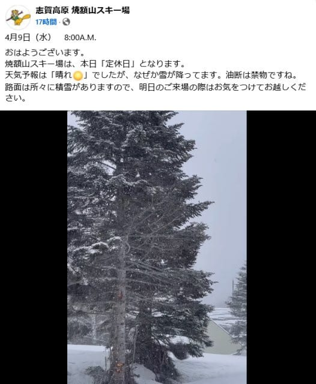

# 4月12，13日の週末の志賀高原スキー場の天気は…土曜は晴れて暑いくらいの気温に，日曜はまだ分からないけど強風の雨の可能性が高いよ！

📅 投稿日時: 2025-04-10 02:43:02

ってなわけで．

どうやら本日の志賀高原．

わずか数cmですが，朝は雪が積もった

ようです…！

（[焼額山スキー場Facebook](https://www.facebook.com/yakebitaiyama/videos/1172177687783329/)より）

雪が降ったのは朝のうちだけで，

昼前からは晴れになったようですが…

意外とここしばらく雨が降らず，

降っても雪になってくれてますね．

ということで，今週末までにまた

雪は降ってくれるのか？？

週末は気温が上がらずにいてくれるのか？？

水曜深夜恒例の，週末の志賀高原の天気予想

です…！！！

でも．

今日もちょっと帰宅が深夜で．

さらに明日も出張に行かねばならず

バタバタしているので…

今日は天気図解説なしで，いきなり

予想結果です！！

いや…

解説記事を書く時間を惜しんで

睡眠時間を取りたい…←ならこんな記事を書かなければいいのに…

ってなことで，結果を書くと．

10日(木)：朝から気温はプラスで，

　雪は朝から緩め．

　昼間は+8℃くらいまで上がる．

　朝は曇り．昼頃から夕方にかけて

　時折パラパラ雨が降る．

　雪は春の雪．

11日(金)：夜中から雨が降り始め，

　午前中まで降ったりやんだり．

　気温は朝から+3℃以上と高めで，

　朝イチから雨でぬれた雪（涙）

　午後は雨はやみそうだけど曇り空

　気温は終日高い．

12日(土)：早朝開始時にプラス気温．

　早朝は締まり気味だけど，表面に

　柔らかさを感じる雪．

　終日晴れで最高気温は+10℃近くまで

　上がるので，暑さを感じるほどで

　朝から雪はザブザブになっていく．

　午後はバーンは荒れそう．

13日(日)：まだ何とも言えないけど…

　朝から気温は+5℃くらいあり，

　朝から雪は緩い．

　昼に向けて南風が強まり，

　気温が上がり雨が降り始める．

　午後は雨＆かなりの風．

　ゴンドラが止まるかも…(涙）

ってな感じでしょうか…

やはり，日曜はかなり悪天候になりそうな

予想です（泣）

ただ，昨日の記事にも書いたように，

先週末の6日の日曜も本来なら暴風雨

になるはずが，結果的にはほとんど雨も

降らず，ゴンドラも一瞬減速運転する

程度で風もそんなに強くなく，意外といい

コンディションで滑れたので…

今週末も，皆さんの行いが良ければ

意外といいコンディションで滑れるかも…！！

とりあえず今週末までは，

悪いことをせず，行い良く過ごし，

困っている人がいれば助け，

悪をさばき弱きを救い，

さらに巨大な悪に立ち向かっていけば．

おそらく日曜は暴風雨にならずに

済むかもしれないので．

スキーヤーの皆様におかれましては，

週末まではこれらの行動を心がけるよう

お願いします…←え？スキーヤーは悪と

戦わないといけないの？？

## 💬 コメント一覧

### 💬 コメント by (地元民)
**タイトル**: Unknown
**投稿日**: 2025-04-11 20:27:53

山は残雪、多いんですか？

郷は、異常に暖かい期間が何回か挟まれたことで、融雪が多かったので、少雪の印象の冬でした。

### 💬 コメント by (Skier_S)
**タイトル**: Unknown
**投稿日**: 2025-04-12 08:05:33

志賀高原はここ数年でも雪が多い方です…！

気温は高いけど雨が少なく、麓が雨のときでも山はギリギリ雪だったりしたので、

結構雪が残ってますよ〜！

