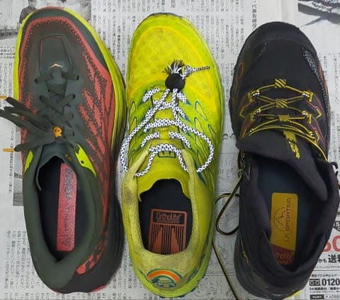

# トレランシューズ対決…今度はHOKA Speedgoat5で小仏P⇔陣馬山往復！HOKA・La Sportiva・TECNICAの対決結果やいかに！？その1

📅 投稿日時: 2023-07-27 01:49:58

🏷️ カテゴリ: [登山・旅行](c1d637a11a25b457ac978d197adbdafc5.md)

ってな感じで，[以前報告した](e767da1bb346264fd947e31b00636e60b.md)ように．

3足の靴で，小仏P⇔陣馬山往復にチャレンジし，

HOKAのSpeedgoat MID GTX：3時間27分

La SportivaのUltra Raptor2 MID GTX：3時間15分

TECNICAのSupreme MAX3.0：2時間58分

というタイム順になった

わけですが…

うむ．

このコースは，わりと平坦でよく踏まれた

走りやすいコースなので．

La Sportivaに比べ，ソールの反発力など，

フラットなところでタイムを出しやすそうな

TECNICAのシューズが速いのは納得できるけど…

私が最初に買って，グリップも強いし

クッション性も高くて膝に優しいし，

走るのも速そう…と，かなり気に入っていた

HOKAのSpeedgoatが最下位で，

TECNICAに30分負けてるってのは納得

できない！！！

たぶん，HOKAのタイムは昨年測ったものなので，

今年測ればもっと早くなるんじゃないか？？

確かめたい…っ！！！

…ということで，破壊したSpeedgoat MID GTXの

代わりに，Speedgoat5を買ってしまった…

というのが前回までのストーリー．

ってなことで．

今回，

HOKA ONE ONEのSpeedgoat5で，

小仏P⇔陣馬山往復にチャレンジしてきました～！！

果たして．

Speedgoatはクッションとグリップがいいだけで

タイムが出ない靴なのか？

あるいは，Speedgoatのみ昨年の測定なので，

この1年で体力や歩き方（走り方）に磨きが

かかってスピードアップしていて，

今年HOKAを履いてチャレンジすると

一気にタイムアップするのか？

果たして，どっちだ！？？

いざ，Speedgoatを装着して…出発！

とりあえず，3週連続で同じコースを

歩く（一部走る）わけですが…

このコース．小仏P⇔景信山は急坂だけど．

（この写真では急坂っぷりが伝わらない…）

あとはアップダウンはあっても

そこまでの急坂はないし，岩がごろごろとか

木の根っこがごろごろといった，

難しい足場のところはなくて．

しっかり踏まれてフラットな，

歩きやすい道が続きます．

木の根っこが出てて歩きにくい部分も

ところどころわずかにありますが…

それでもせいぜいこの程度．

こういう山道を，久しぶりのHOKAの靴で

歩く（ところどころ走る）と…

やっぱりHOKAのクッション性，いいなぁ…！

私にはこの程度のクッション性がちょうど

いい！←いや，ちょうどいいって言っても，これ以上のクッション性がある靴はないから…

走った時の母指球付近のクッション性は，

La Sportivaとは比較にならないです…！

でも，意外とTECNICAと同程度．

TECNICAもかなり分厚いOrtholiteインソール

が入っているぶん，インソールのクッション性は

結構優れてましたね～！

あ，ちなみに．

HOKAもSpeedgoat4とSpeedgoat MID GTX

までは Ortholiteインソールだったのに，

Speedgoat5になってから，オリジナル

インソールになりましたね…

インソールを取り出したのがこちら．

表，裏ともに，左からHOKA，TECNICA，La Sportiva．

HOKAはオリジナルインソール，

真ん中のTECNICAと右のLa Sportivaは

どちらもクッション性が高いOrtholite

インソールです…

インソールの厚みは，意外と一番右の

La Sportivaが一番分厚くて…

その次にTECNICA．

意外とHOKAが一番インソールが薄い…

（HOKAは端っこが折り曲げてあって

この写真では厚めに見えてる）

とりあえず，インソールのクッション性は，

La Sportiva（圧勝）＞＞TECNICA＞HOKA

です！

ただ，ヒール部分は．TECNICAも結構

分厚かったです…

とりあえず，La Sportivaの靴，結構インソールの

クッション性が効いているので．

この靴，インソールは標準のまま履いたほうが

いいかも…

で．

インソールではなく，靴本体のクッション性は…

見ての通り，HOKAとTECNICAは，ミッド

ソールの上にクッション性が高い，穴を

あけたPUフォームが貼り付けてあって．

この両者のクッション性は高め．

La Sportivaはクッション性がほとんどなく，

かなり硬い感じ…

PUフォームのさらに下，ミッドソールの

柔らかさは，

HOKA（圧勝）＞＞TECNICA＞＞La Sportivaの順．

なので，PUフォームとミッドソールを合わせた

靴自体のソールのクッション性は，

HOKA＞＞TECNICA＞＞＞La Sportiva(圧倒的に固め)

という感じ．

さらに，インソールのクッション性は，

靴自体のソールのクッション性と逆で，

La Sportiva（圧勝）＞＞TECNICA＞HOKA

だったので．

インソール＋靴自体のクッション性は

HOKA＞TECNICA＞＞La Sportiva

という感じでしょうか…

ただ，履いて走った感じは，HOKAのほうが

圧倒的に柔らかく感じます！

アウトソール（靴底）がTECNICAのほうが硬く，

HOKAのほうが柔らかいので．

クッション性はHOKAとTECNICAは近い

感じだけど，とがった石の上とか

根っこの上とかの点接触になるところに

足を置いた場合，HOKAのほうが圧倒的に

柔らかく接地します！！

…これはたぶん．

下の写真，真ん中のTECHNICAのソールが

全面ビブラムソールなのに対し，

一番左のHOKAのソールはビブラムなのは

一部，赤い部分のみ．

黄色い部分は柔らかいミッドソール素材

なので，これがHOKAのアウトソールの

柔らかさを生んでるんじゃないかな？

凸凹が強いところを走った際に，ソールが

凸凹を包み込むように感じる理由なんだろうなぁ…

特にかかとのクッション性．

これに関してはHOKAの圧勝．

踵でガツンガツン接地するような

下品な走り方をしても，

膝にも踵にも優しい…！！

ちなみに．

この踵のクッション性の良さは…

ソールのかかと部分．

この部分の出っ張りがHOKAのほうが

突き出していて，ここがすごく柔らかく

ショックを吸収してくれるのが効いてます！

で．

どうでもいいのですが…

おなじサイズの靴なのに．

ソールの幅がTECNICAと全然違う…

ちなみに，TECNICAとLa Sportivaでは

同じくらいのソール幅なので，

HOKAのソールが圧倒的に幅が広いです．

シューズ内の足幅はそんなに変わらないので…

HOKAのほうがソールが下広がりになってる

感じ．

この幅も，グリップとクッション性に効いてるのかな？

ってなことで．

とりあえず，小仏P⇔陣馬山往復では．

久しぶりのHOKAを履いて，

膝に優しいクッション性，それもフォアフット

じゃなくて踵からガンガン着地するような

走り方でも踵や膝への負荷が少ない…

というのを強く感じて．

あとは，鬼グリップ！！

La SportivaのUltra Raptorもグリップは強め

の靴という評判ですが…

HOKAのSpeedgoat5のグリップはやっぱり

圧倒的！！！

特に，こういうちょっと濡れた感じの

粘土っぽい土の急斜面．

ほかの靴ではツルツル滑ってかなり

怖いけど…

HOKAだと問題なく普通に歩ける！

かなりラグが深めで，マッドコンディションでの

グリップが強めだったSpeedgoat．

さらにSpeedgoat5からはラグの出っ張りに

細かなトゲみたいなのがついて…

これまでよりも，粘土っぽい地面での

グリップがアップした感じ！

石の上やコンクリート，乾いた土では

TECNICAもLa Sportivaもかなりの

グリップを誇るけど…

濡れた粘土っぽい土でのグリップは

HOKAの圧勝！！

いや．

怖くない！！

ツルツル粘土の下りでもスピードが

のせられる！！

ただ．

HOKAの靴はクッション性が高い分，

ソールの反発力はそれほど感じられず…

平坦で踏まれたところでは，TECNICAの

ほうが反発力を活かして走れるかな．

ってな感じで．

靴のインプレッション比較が長くなったけど…

果たしてタイムはどうだったのか…？？？

次回へ続く！！←ここまで来て引っ張るなよ…
