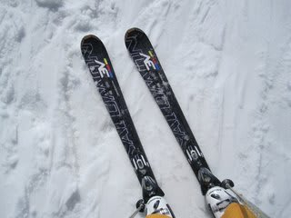
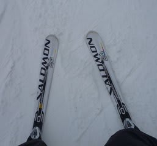

# SALOMON　3V RACE Powerline履いてみた

📅 投稿日時: 2011-04-21 02:01:57

で．

前にも書いたように．

私はブーツサイズが合って履ける板は履いてみる，という

物好きな人間ですので．

今回．

一緒に行った人が履いていた，今シーズンモデルの

SALOMON 3V RACE 165cmを履かせてもらいました．

これは，私が普段はいているSALOMON 24hours LMの

元になった板ですね．

この板のトップシートなどを変えて，マイルドな方向に

デチューンしたのがLMだという話ですが…

履いた感じは．

「お，重い…」

昨シーズンモデルを履いたときと全く同じ感想．

手で持ったときの重さはLMと変わらない感じですが，

はいたときはなぜかLMよりずっと重く感じます．

…これでコブには突っ込みたくないなぁ，という重さ．

でも，重さは足元に集中しており，トップとテールは

すごい軽いので，まるで150cmの板を履いているかのような

振りやすさを感じるんですが．

あと，やっぱり張りが強いです．

コアにしっかり感がある張り．

POWERLINEのバーが，LMより強いのかなぁ？

スピードが出て，圧がたまらないとたわませられない感じ．

うーむ，手ごわい．．．．

…と思ったら．

スピードが出てくると一変します．

重さが作り出す雪面に張り付くような安定感．

板の長さが175くらいあるのか？という感じ．

板が飛ばされる・浮かされることがなく，急斜面を

かなりのスピードで落ちていけます．

板自体の返りは，小回り競技用と考えるとマイルド．

板を抑えていくポイントはわりとトップよりかな．

トップを押さえて落ちていけば回ってきます．

でも，R=12よりは大きい旋回半径に感じます．

3VからLMに履き替えると，LMはフレックスに粘りがあって，

トップとテールが雪面に粘りつくような感じがしますね…

ズラシもLMの方がやりやすく，やっぱりこっちのほうが

やさしい感じですね．

…最初に履いたときは，LMも結構強い板だと思ったんですが．

さらにさらに．

全く予想外なことに．

この3V.

板がもぐってしまうような，柔らかい春雪で抜群の性能を発揮！

うーん．

私が春雪用として絶大な信頼を寄せているATOMIC D2 DEMO Type-Aとは

全くの対極なんですよ．春雪での履き心地が．

D2は，雪面の上を浮いていくような，浮力の大きさでザク雪の上を

自由に乗り越えていくような履き心地ですが．

3Vは，雪面の表面から5cmもぐったところを，その上の雪が

どんな状態であろうが全く関係なく，まるで整地のように

滑り降りていくという…

ホントに，やわらかく荒れた春の斜面のでこぼこを全く感じさせない，

完全に平らな斜面を滑っているかのごとくの安定性．

ううううーーーむ．

これ，結構面白い…

しかし．

この板でコブは厳しそうだな～

LMの方が好きだな．やっぱり．
