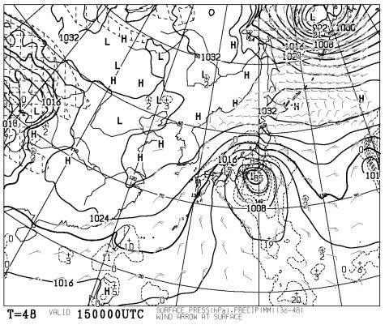
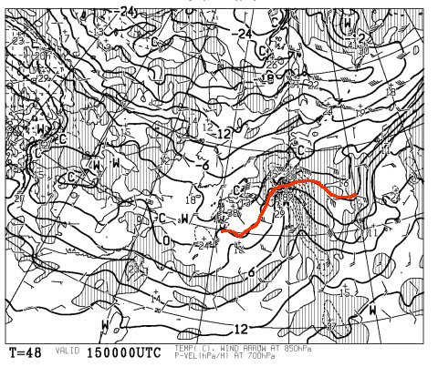
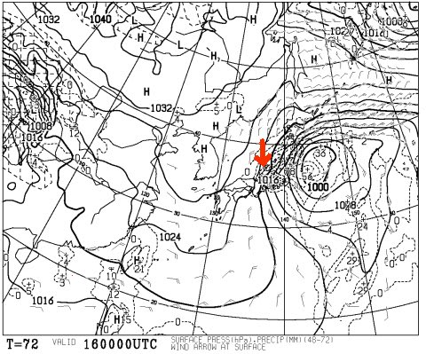
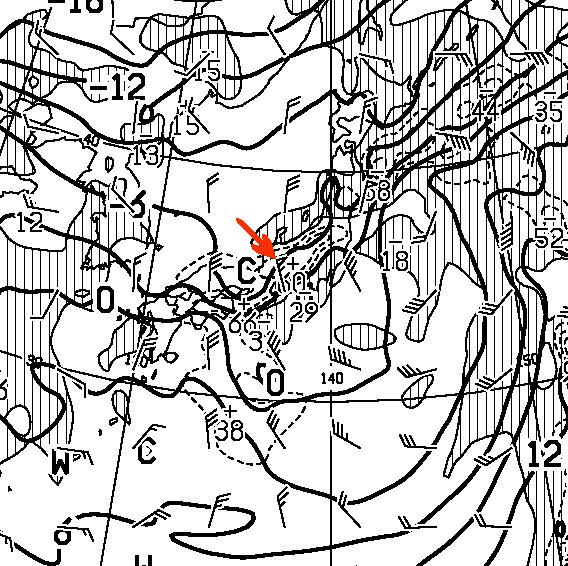

# 定番！この週末の志賀高原の天気は…かなり荒れそうな週末

📅 投稿日時: 2014-02-14 00:39:30

なぜ．

なぜ．

なぜ，3週連続，週末に南岸低気圧がやってくるのだ…っ！(涙)

えー．

この週末ですが．

私の嫌いな南岸低気圧パターンです．

これが，土曜の朝9時の予想天気図なんですけど．

…見事なまでの，南岸低気圧ですな．

この．南岸低気圧．

・気温が上がって，ヘタすると雨

・わずかな低気圧の位置の違いが，大きな気温＆天気の差になっちゃって，

　予想が非常に難しい←よーするに，天気予想をはずしやすい，ってことだな

という二つの理由で．

だ一い嫌いなんです(泣）．

とりあえず．

南岸低気圧が近づいているので．

この土曜日．

気温はぐぐぐっと上がります．

土曜の朝9時の850hpa気温はこんな感じで…

0度線は志賀高原近辺まで上がってきちゃいます．

まぁ，なんとかぎりぎり雪にはなってくれると思いますが．

朝のうち降る雪は，ウェアにつくとすぐ溶けてびしょぬれになるような，

かなり湿った雪かと…

でも．午前中に低気圧通過後，風向きは北に回って，気温も下がり始めますね．

…っつーより．

土曜日．

強烈に発達を続ける低気圧がすぐそばを通るので．

すごい風が強くなって，荒れそうなんですが…

吹雪きますね．

思いっきり(大量の涙)

また，先週土曜と同じく，風が強くて．

リフトが止まっちゃう可能性が高いんですが…(涙)

そして．

日曜日．

こーんな感じで冬型になり

矢印で書いたように風も北風で．

大量の雪が積もりそうな感じではあるのですが．

850hpa図を見ると…

こんな感じで，志賀にはー6度線がかかって，冷えて，よさそうなんですが．

…矢印で示したところの風速．

なんだか．風速20m以上の風が予想されているんですが…

…ってことで．

この日も，激烈な吹雪です．

前が見えないほどの吹雪です．

ゴンドラどころか，リフトも動かないのがありそうな勢いの

強風です(激泣)

なぜ，なぜ週末に限ってっ！！！！

とりあえず．

悲嘆にくれながらも，まとめると

土曜：朝から強風．朝のうちは湿った雪が吹き付ける．

　　ゴンドラ・リフトは動くのか？

　　昼ごろには気温も下がるが，荒れた天気が続く…

日曜：朝，昨晩からの雪がかなり積もってそうだけど…

　　すごい吹雪．この日もゴンドラ・リフトが動くのかどうか…

　　朝は新雪がかなり積もってそうだけど．

　　風が強いので…先週の日曜と同じ，ウインドクラストっぽい

　　感じかも．午後まで吹雪は続く

って感じです．

うーむ．

雨にはならずに済みそうだけど…

なんだか，ダメな感じ(涙)

## 💬 コメント一覧

### 💬 コメント by (ゆうこ)
**タイトル**: 行くんですか？
**投稿日**: 2014-02-14 18:50:21

高速道路は通行止め区間がかなり出ましたね。

今夜車で行くんですか？

私は、諦めて新幹線のチケット買いました。

明日からは白馬に行きます。

### 💬 コメント by (Skier_S)
**タイトル**: ゆうこさま
**投稿日**: 2014-02-14 19:06:04

あ～

新幹線の方が賢明ですね…

私はどうしようか悩んでますが

なんとか車で行こうかと…

行けるかなあ（心配）

### 💬 コメント by (ゆうこ)
**タイトル**: 気をつけて！
**投稿日**: 2014-02-14 20:53:18

くれぐれも事故には気をつけて下さい。

### 💬 コメント by (Goku)
**タイトル**: Unknown
**投稿日**: 2014-02-14 21:22:03

え～長野はですね・・・

先週よりひどい感じです。

多分高速は全滅になるでしょう。

下道もかなり渋滞が酷いです。

くれぐれも気を付けて来てください。

私は今週はお休みです。

### 💬 コメント by (komu)
**タイトル**: うーん(ー ー;)
**投稿日**: 2014-02-14 22:01:57

高速ことごとく止まりましたね…

あきらめてイエティでガマンかなぁ～

### 💬 コメント by (Skier_S)
**タイトル**: うがー！高速みんな止まってる…
**投稿日**: 2014-02-15 00:00:42

＞ゆうこさま

ありがとうございます～

行けるようなら（？）気を付けて行ってきます～

＞Gokuさま

あら…

先週よりひどいですか…

先週はぎりぎり雪が積もるまえに長野に

たどり着けたんですが…

今週は無理かな～（涙）

＞komuさま

止まりましたね…

どうしよう…

とりあえず、夜中に起きて高速状況を

チェックしつつ、開通したら動き出そうかと。

うーーん。

行けるかな～。

