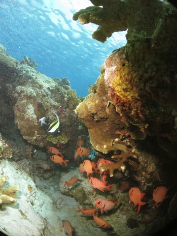

# 2017年8月，小学生の子連れで座間味でダイビングその3…座間味のダイビング1本目

📅 投稿日時: 2017-10-27 03:09:51

🏷️ カテゴリ: [ダイビング日記](ce3a7a8d424d112fce83ee85c81a0e344.md)

えー．

どうやら本日26日．

Yetiが無事，ナイターの17時ごろから

再開したようですね～．

…とりあえず，一安心…

が．

そう．

あいつ．

あいつが近づいてます．

うむ．

昨日の予想より，さらに接近が遅くなったか…

29日の日曜に関東をかすめる予定だったのが，

接近予想日がだんだん遅れ，現時点の予想では，

30日の月曜から31日の火曜にかけての

関東最接近になりそうで．

さらに，コースもかなり南寄りにずれましたね～．

…これだと，土曜は雨が降らずにもつかも…

日曜は台風がまだはるか九州の南の予想ですが，

台風が運ぶ南風で，残念ながら日曜はYetiも雨です（涙）．

ってな感じで．

また今日も．

本題のダイビング日記へ，Go！

ーー

ということで．

子供たちは，ショップのスタッフに連れられて，

みんな，待ってましたと言わんばかりに

海に泳ぎに出ましたが…

さすがにこの船に乗るような子供たちは，

かなり海に慣れてますね～．

ちっちゃい子でも，足がつかない海を

怖がるようなことはなく．

みんな嬉々として泳ぎにでてます…

うちの娘も，泳ぎたくてたまらなかったらしく．

海に入れて，はしゃいでますねー．

ってことで．

子供たちが遊んでくれている間に．

大人たちは，ダイビングタイム！

潜るポイントは…

「ガヒキンメの根」

その名の通り，キンメモドキがついている

根があるポイントのようで…

いざ，座間味の1本目へ，エントリー！

…ってか．

これが私にとっての2017年の初ダイブじゃないですか！

以前に潜ったのが，昨年8月のモアルボアルなので．

約11か月とちょっと．

ほぼ1年ぶりのダイビングです…

スキーのオフシーズンは3か月ちょいというのに，

最近では，ダイビングのオフシーズンがほぼ1年…

というか．

昨年は8月にしか潜ってないよ（涙）．

昔は，6月から11月までの半年は海に潜っている，

健全なダイバーだったのに…←健全か？？

しかし．

11か月ぶり以上のダイビングだというのに．

座間味に来る前に，ひたすら昨年のダイビング

レポートの記事を書き続けていたからか．

あまり久しぶりのダイビングって感じが

しないなぁ…

もう，全然11か月ぶりのダイビングって

感じじゃないよ．

…最近，どうも．

スキーシーズンもあっという間に終わっちゃうように

感じるし．

なんだか，時間が経つのが早くなってきた

気がするんだけど…

…歳ってこと？？

…いや，そんなことないよね…

とか，考えてたら．

メインのキンメモドキがついてる根にやってきましたが…

あら．キンメモドキ，

それほど大量についてないなぁ…

でも．

海は透明度が高くてきれいだし．

流れも無くて，水温も高くて

穏やかで．

久しぶりのリフレッシュダイビングには，

こういうゆったりしたダイビングがいいな！

…って感じで．

ゆったり，のんびりと．

南国っぽい海を眺めて50分．

夫婦そろっての，ブランクからのリハビリダイブの

この1本．

リハビリダイブとしては，

ちょうどのんびりしていい感じだったなぁ…

と，エグジットしようとすると．

あぁ…君たち．

我々がダイビングしている間，1時間以上．

ずっと泳いでたのね…

さすが，この船に乗る子供たち．

わが娘と同じくらい，海が大好きな子供が

揃っているようです…
