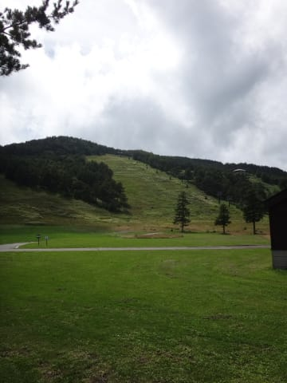

# 夏のアサマ2000と湯の丸へ行ってみた…その1

📅 投稿日時: 2015-09-09 02:00:04

🏷️ カテゴリ: [登山・旅行](c1d637a11a25b457ac978d197adbdafc5.md)

とゆーことで．

この週末，どこに行ってきたのかというと．

…はい．

この写真を見たら，もう分かりますよねっ！←この写真だけでわかる人って，

そんなにいないって…

そうです．

ここは，冬はこんな感じのところ．

…はい．正解．

アサマ2000に行ってきました～．

…うちの娘．

前回行った，志賀高原でのトレッキングがよほど

楽しかったのか．

「また，山歩きがしたい～！」

とのたまっていたので．

うーむ．

本格的な山歩きは無理だろうから．

…駐車場から，30分くらい歩けば山頂に着けて，

そこそこ景色が良くて，素人でも簡単に楽しめそうなところ…

と，探していたら．

なんと．

アサマ2000のすぐそばにある高峰山って…

まさにその条件にピッタリじゃないか…っ！！

ということで．

夏のスキー場巡り第2段を兼ねて．

行ってみました，高峰山です．

さっそく，登ってみましょうか…

9月になったばかりというのに，気温は18度．

肌寒いくらい．

山道を歩いていくと…

リンドウやら

咲き誇るマツムシソウ．

ハクサンフウロなど…

この時期でも花がいっぱい咲いてるし．

そして．

これなんか，ブルーベリーそっくり．

クロウスゴかな？

味もブルーベリーチック．

こいつは，シラタマノキ．

湿布薬のような，独特な味でした（笑）．

というような感じで．

花や木の実を見つつ，ゆっくりゆっくり歩いても，

わずか40分で，

やってきました山頂へ．

…これが山頂なのね．

天気がいいと，八ヶ岳やらアルプス，富士山まで見えるらしいけど…

…雲で景色があんまり見えなかったのが残念…

山頂の祠を見て，

ゆっくりお茶を飲んで一休みしたら，

下山しましょうか…

白樺やブナの木に囲まれた，いかにも空気がよさそうな．

健康になりそうな感じですね～．

また，いろいろな草花を愛でつつ，30分もあれば

下山しちゃいます．

…山頂での休憩も入れて，往復2時間で楽しめちゃうのか…

この程度の山歩きでも，結構楽しめるものだな～．

って感じで．

麓まで下りてきたので．

登山道入り口から歩いてでも行けるような，すぐそば．

アサマ2000の駐車場でひと休み．

軽くランチタイムです…

うーむ．

誰もいない夏のスキー場を眺めつつ，

ランチタイムってのも．

結構いいかも…

そして．

午後は．

冬季は閉鎖している，アサマ2000から湯の丸高原へ抜ける道を

探索してみましょうか…

（続く）
