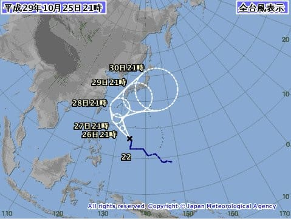
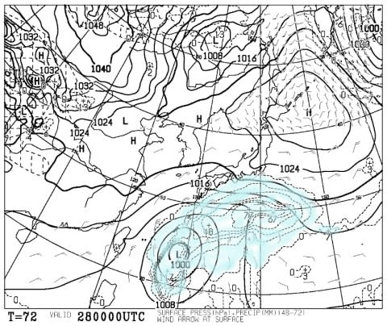
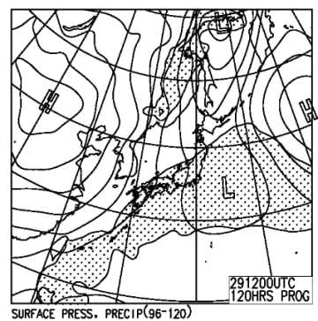
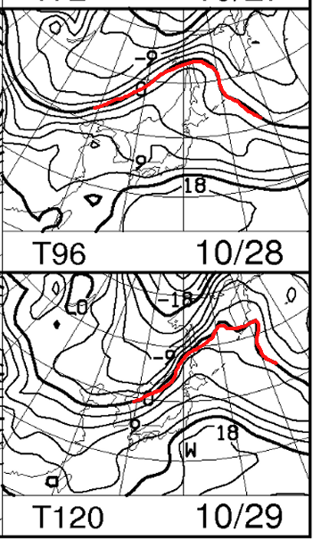
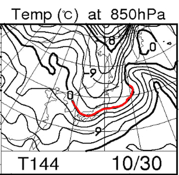

# 今週末，10月28，29日のイエティの天気は？…台風は？雪はもつのか？？スキーができるのか！？？

📅 投稿日時: 2017-10-26 01:17:01

えー．

本日も雨が降って．

Yetiは明日26日の昼間の営業をあきらめたようです…

「【10/26のご案内】

10/25（水）17時現在　イエティは雨が降っております

継続して造雪をフル稼働しておりますが、明日26日の営業は

日中営業を休業とし１７時を目途に再開予定とさせて頂きます。」

（[Yetiホームページ](http://www.yeti-resort.com/)より）

とのことらしく．

アイスクラッシュマンの力が

今一歩及ばなかったようです（涙）．

でも．

週末までに再オープンできたので，

良かったとしよう…

と，言いたいところだが．

この週末は．

やっぱりこいつがやってくるのか…？？

…この台風ですが．

昨日の予想より，日本接近が遅れて

日曜の夜9時でも，関東に達しなさそうな

予想になってきましたね～．

うーむ．

もう少し遅れて，かつ予想の最南端を通ってくれれば…

この週末，関東にはほとんど影響がなさそう

なんだけどなぁ…

とりあえず．

28日，土曜朝9時の地上天気図を見てみると，だ．

…おおっ！！！

降水域の水色，まだほとんど日本にかかってないよ！

…これは，土曜の午前中くらいは降らないで

いてくれそうな感じ…！

だけど，日曜の地上天気図には，

降水域を示す網掛けが，本州全域を

覆ってますね…（涙）．

でも．この図では．

29日夜9時の台風の位置が関東より東にあり，

29日夜9時に四国沖に予想円の中心がある

台風情報の予想進路とえらく食い違ってます…

このアンサンブル平均図ってやつは，台風が近づくと

役に立たなくなるので．

この天気図は信頼しない方がよさそうです．

とりあえず，日曜の天気は台風の進路次第で

どうなるか分からん…

というのが正直なところ．

で．

気温ですが…

28，29日ともに，850hpaの0℃線は

はるか樺太方面．

関東近辺には，+12℃線が掛かっているので…

Yetiは，+10℃を超える気温ですか．

うーむ．

この高温で，雨に降られたら…

また壊滅的状況になりそう（涙）．

ってことで．

この週末のYetiの天気をまとめると．

土曜：朝は曇り，薄日も射すかも？

　早ければ昼ごろから雨．

　運が良ければ，夕方まで降らないか，降っても

　ぽつ，ぽつ程度で済む．

　私が昨日から祈っているので，そうなってくれるはず…

　どちらにしろ，夕方以降は確実に雨降り．

　気温は高め．+10℃程度．

　この週末，行くならこの日の午前中でしょう．

日曜：…たぶん，朝から雨．終日雨（涙）．

　台風が北よりのコースを取れば…

　雨は強く降る．気温も高めで，風も強まる．

　雪はかなりの勢いで融けていきそう…

　台風が南寄り，遅れてくれれば，小雨，ちょっと

　風が強め…くらいで済みそうだけど．

　まぁ，普通の精神の持ち主なら，

　この日は行かない方が吉か．

　台風が近くを通ると，風も雨も強くなるので，

　台風の通過コースによってはナイター中止

　でしょうね…

という感じで．

また，週末を狙ったようにやってくる台風と，

アイスクラッシュマンの争いが演じられそうです（涙）．

また，営業中止とならないように…

がんばるのだ，アイスクラッシュマン！

…ただ．

来週月曜の30日の850hpa図を見ると…

うほーーー！

昨日の予想より，さらに0℃線が南下したよ！！！

この時期としては，激冷え！

…これは…月曜，日本海側のスキー場は

かなりの雪降りになりそう…

運が良ければ，Yetiも，アイスクラッシュじゃなく

人工降雪機が使えるかも！？？

あ，でも．

冷えるのは月曜から，火曜の朝までだけです．

それ以降は平年並みに戻りそう…（泣）．

まぁ．

まだいい．

今の時期は，妙に冷えなくてもいいから．

11月下旬は，しっかり冷えてくれ…っ！！！！

## 💬 コメント一覧

### 💬 コメント by (ほっぽ)
**タイトル**: 昨夜のイエティ
**投稿日**: 2017-10-27 06:40:02

昨夜、再々復活したイエティで滑ってきました。

ゲレンデの幅は一段と狭くなりましたが、厚みは持たせてきました。雨対策でしょうね。

滑走レポートをリンク先に上げておきました。

週末、天気が持つといいですね。

### 💬 コメント by (Skier_S)
**タイトル**: ほっぽさま
**投稿日**: 2017-10-28 01:43:45

またさらに狭くなりましたか…（涙）．

そして，週末は雨（泣）．

とりあえず，雨の中，廊下コースを

滑ってきます…

レポート見ると，リフト乗り場はちょっと

ヤバそうですね…

明日の雨で，リフト乗り場の雪が

もつかどうか心配です…

### 💬 コメント by (ほっぽ)
**タイトル**: Unknown
**投稿日**: 2017-10-28 04:11:08

Ｓさん

何か天気が悪い方向にいってるような。(^^;

リフト乗り場周辺の雪は少ないので、リフト待ちがあると列がどう伸びるのか？心配ですが雨で待ちが無ければその心配は不要ですね。

私は麓のサーキットでお手伝いですが、こちらも３週連続雨降りとなっています。(T_T)

### 💬 コメント by (Skier_S)
**タイトル**: ほっぽさま
**投稿日**: 2017-10-28 09:24:09

イエティは今のところ雨がぽつ、ぽつ、と

落ちてくるくらいで、レインウェア無しで行けるレベルです。

コース幅も少し広がった感じで、乗り場の雪もしっかりつけてあります。

今日もリフト待ちがほぼないので、午後に雨が本降りになるまでが

勝負です…

