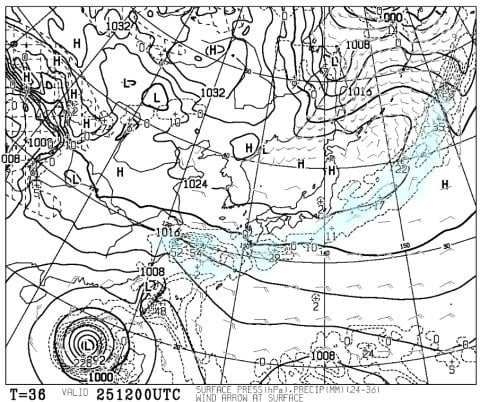
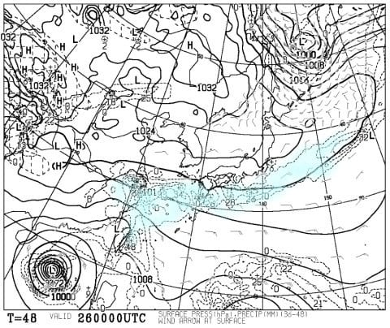
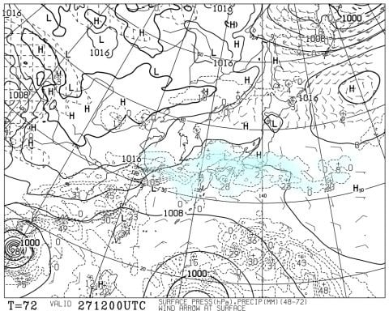
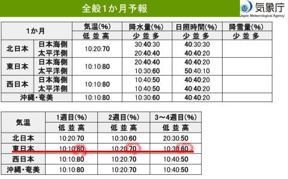
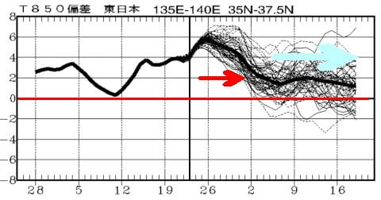
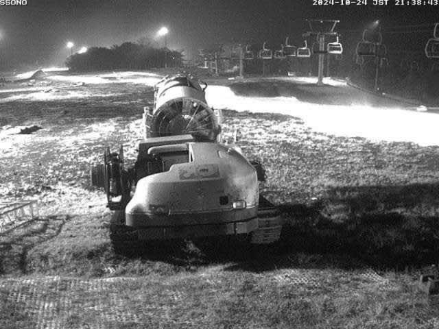
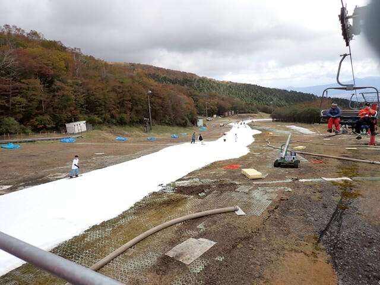

# 予想天気が変わったよ！イエティ25日は曇り，ほぼ雨は降らず．26日は曇り～晴れ．でも高温予想は変わらずスキー場の雪が解けそう

📅 投稿日時: 2024-10-25 02:09:28

えー．

昨日の天気予想で．

イエティは25日は雨が降ったりやんだり，

26日はおおむね曇り，雨がぱらつくかも，

26日も雨時々強く降る…

という予想をしましたが．

今日発表された，この金曜から日曜の

最新の天気図を見てみると…

全然昨日の予想と違うじゃないか

という天気図になってました…

いや．

昨日の予想より日本海の高気圧の

張り出しが強くなり．

そのせいで秋雨前線が昨日の予想より

南下して…

太平洋側に降水域がかかっていた

25日(金)の天気図は，

太平洋岸より南に降水域が移動して

ました…！

これなら，金曜は雨が降らずに済みそう…

そして．26日(土)の天気図は，さらに南に

降水域が移動していて．

むしろイエティは高気圧の端っこに

かかっているくらいなので…これなら，

土曜は曇り時々晴れで，日も射すかも…！

…日が射すと暑くなるし，板の滑りも

悪くなって雪も解けるので，正直言えば

日が射さないでほしいんだけど…

ただ．27日(日)は，昨日の予想と変わらず

降水域がイエティにかかっているので…

うーん．やっぱり雨かな…

ただ．昨日の予想が今日に変わってしまった

ことからも分かるように．秋雨前線が

停滞するこの時期，

わずかに前線位置がずれると降水域が

ズレちゃうので．

27日はまだどうなるかわからないですね…

日曜はまだこれから予想が変わる可能性

は高いです．

ってなことで，最新の予想は，

25日(金)：明け方雨が降るかもしれないけど，

　営業開始時には止んでいる．

　終日曇り，

　運が悪いと一瞬ポツポツ来る時があるかも

　しれないけど…服が濡れるほどは降らないか．

　気温は高め．

26日(土)：曇り時々日が射す．

　気温は高め，日が射すと暑い．

　たぶん昼間は雨は降らない．

　日が射すと板の滑りが悪くなり，

　ゲレンデに穴が開いてくるか…

　もしかすると夜になるころ，

　雨がポツポツ降ってくるかも．

27日(日)：微妙．今の天気図なら

　曇～雨．一時雨は強く降る．

　ただ，前線が今の予想位置より南に

　ずれてくれればそんなに降らなく

　なるかも．

という感じでしょうか…

うーん．

前線が停滞する時期の予想は難しい…

日曜の予想はまだ信頼度低いです！！

ってなことで．

本日は木曜日．

ご存じの方は知っている，気象庁の1か月

予報の発表日です！！！

さて．

これから1か月の予想を見てみると…

ががーーん！！！

なんだよーーーーっ！！

ダメじゃん．

相変わらずダメじゃん…

これから11/1までの1週目は高温になる確率80％，

11/2～11/8までの2週目は高温になる確率70％，

11/9～11/22までの3，4週目も高温になる確率60％

と．

これからもまだ1か月，高温傾向が続くようです…

11月に入ってもダメじゃん…

ただ．

850hPa気温の1か月予想図を見ると．

10月31日までの，赤矢印で示した

平年比+4～6℃の異常高温に比べれば．

11月に入ってからは平年比+2℃くらいで

済んでくれそうなので…

少しはマシになるのかな？？

…それでも，平年比+2℃が続くのは本来なら

異常高温に近いレベルなんですが．

最近がおかしすぎたから，基準がずれて

きてるだけですね…

だもんで．

11/22まで平年比+2℃が続くとなると．

11月中旬オープンの横手・熊の湯．

予定通りのオープンが厳しそうな予感…

というか，11/23オープン予定のかぐらとか

そのあたりのスキー場もかなり辛いと

思う…

3か月予報だと，11月に入ると平年並みに

なるはずだったのに…

とりあえず．

そんな中でも，イエティも雪山が圧雪されて，

明日オープンに向けてコース整備も進んでいる

ようですが…

（[WNIライブカメラ](http://webcam.wni.co.jp/KAC24326/loop.html)より）

やっぱり高温続き＆雨のせいで，造雪が上手く

行ってないのか．

コース幅が，かなり狭いような…？？

昨年はオープン翌日の土曜でこのくらいの幅が

あったのに比べると，ライブカメラの映像の

コース幅がそれより狭く見えるには気のせいか…？？

とりあえず．

コース幅はどうあれ．ついに明日…

というか，日付が変わって本日イエティが

オープン！

ついに2025シーズンスタートですが．

コンディションがいいことを祈るばかり…
