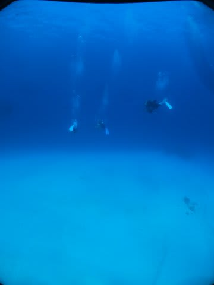
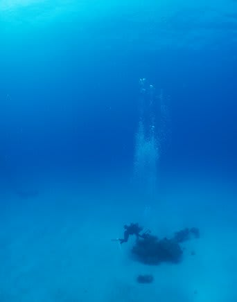

# 2013年7月　子連れ座間味ダイビング旅行記その17…3日目，1本目のダイビング

📅 投稿日時: 2013-08-15 01:44:09

🏷️ カテゴリ: [ダイビング日記](ce3a7a8d424d112fce83ee85c81a0e344.md)

えー．

ダイビング日記が続き．

水中写真が多数掲載されてますが．

…冷静に眺めてみると．

私が撮った水中写真って，同じような写真ばっかりですね…

どれもこれも似たような写真になってしまうのは，

撮影者のイマジネーション不足を如実に表しているというかなんというか…(汗）．

…私のイマジネーションはこの程度が限界ですので，許してください(^^;）

ってことで，本題へ．

-----

…この1本目．

オーナーがガイドしてくれるのはいいんだけど

＃[ザマミセーリングのページ](http://www.zamami.net/)のスタッフ欄によると，

＃オーナーはダイビング本数2万本以上らしい…

娘の面倒は，大丈夫なのかいな…

と思ったところ．

娘はすでにガイドの泰平さんとも仲良くやってるみたいで．

…これは，夫婦揃って潜りにいけそうだな～．

ザマミセーリングさんのスタッフみんな，

子供の心をつかむのが上手なことよ…

ってことで．

娘を泰平さんに預けて．

ありがたく夫婦揃って，1本目へGo!

1本目のポイントは，「アイダの根」

白い砂地にぽつんと小さな根がある，座間味っぽいポイント．

こんな白砂の上を進んでいくと…

深度18mに，まず一つ目の根が．

この根も，キンメモドキがいっぱいついてますね～

根の周りを回ると…

いろいろいますね～．

台風の影響も収まってきて，透明度もよくなってきたなぁ～．

んで，一つ目の根を外れて，また砂地の上を移動していくと…

今度は小さめの，二つ目の根に到着です．

うーむ．コンパクトな根ですね．

でも，グルクン若魚なんかがいっぱい居ついていて，いい感じ．

岩の隙間に，いっぱいオトヒメエビちゃんがいましたね～．

ダイブタイム45分ほどで，二つ目の根を後にして…

ロープをつかんで安全停止．

そして，エグジット．

うむ．

今日の一本目も，無事夫婦で潜りにいけて．

満足であったぞよ．
