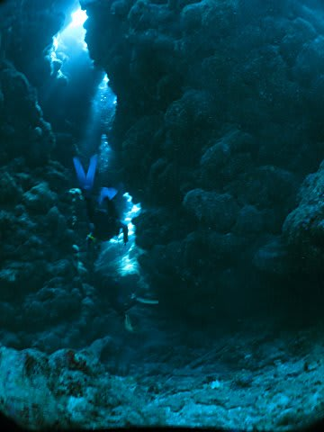

# 2014年9月　3連休，子連れ石垣ダイビング　その4

📅 投稿日時: 2014-11-12 01:08:16

ということで．

このBlogの，夏モードと冬モードがミックスしている

今日この頃．

…昨日まではスキーネタだったのに．

また，とーとつに夏のネタに戻るのだ…

では，

石垣島レポートの続きへ，Go!

----

で．

石垣の海に潜ってみたわけですが…

うーむ．

…やはり．

石垣の南エリアは，

[前回潜ったとき](e39408587711f6b9ba1518d2e381fbf76.md)と同様．

サンゴが死んじゃった，悲しい海の感じですね…（涙）．

一部，まぁ．

サンゴがちょっとずつ復活し始めている感じはありますが．

でも，カラフルな海からはちと遠い…

まぁ．

ここは地形ポイントなので．

地形を楽しみましょう…

洞窟に入り込んで，

差し込む光がきらめくのを眺めながら

クレバスを抜けていきます…

…でも．

あら．

これで終わりですか．

終わりですね．

そうですか．

…えーっと．

魚もあんまりいなかったのですが．

そうなんですね．

これで，浮上なのですね…

という感じで．

ちょっとがっかり感のある1本目を終了したのでした…

