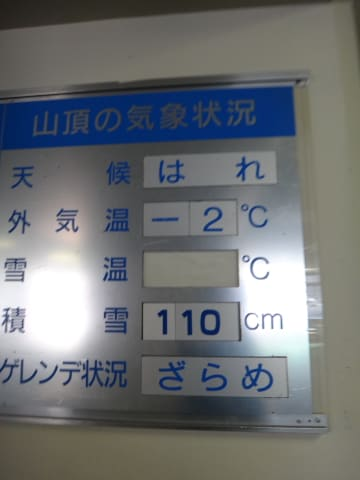
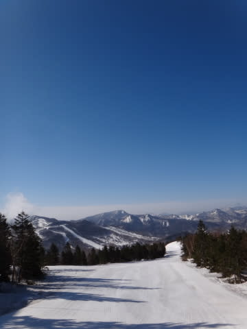
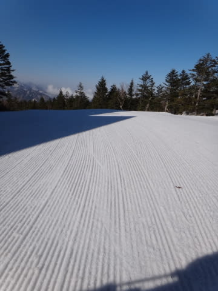
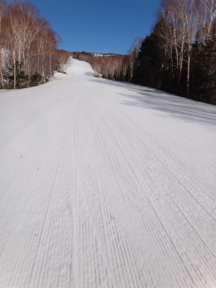
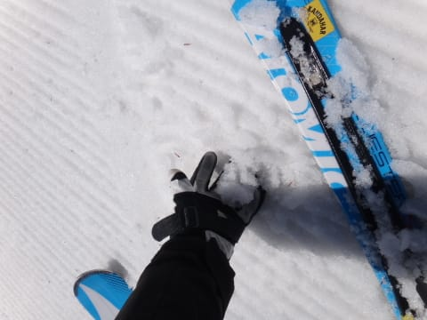
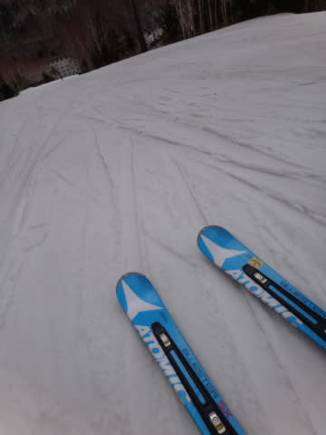
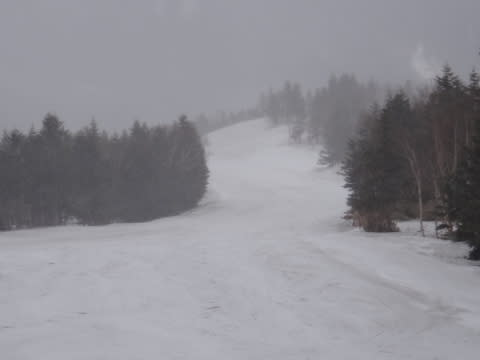
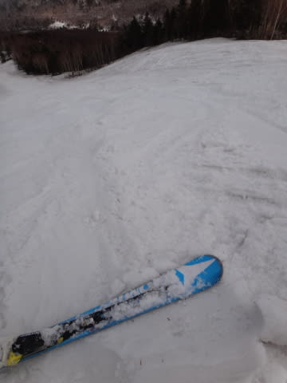
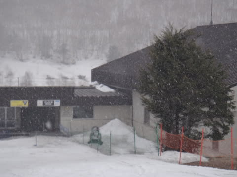
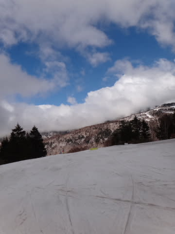

# 5月1日の志賀高原は…このGWはおかしいっ！…いや，良すぎるんですよ

📅 投稿日時: 2013-05-01 20:56:53

ふふふっふふふ．

今日．

天気図を見て．当初予定を変更してまで志賀に来たかいがあったのだ…．

いや，奇跡の3連休初日や，先週ほど良くはなかったですよ．

あそこまで良い奇跡はそんなに無いですから．

そこまで良くなかったとはいえ…

…なぬ？

朝の気温が今日もマイナスっ！！

そして…

晴天っ！

さらに…

シマシマっ！

早朝スタートの7時で，がちがちに硬いバーンではなく，表面に

適度にエッジが食い込む，超快適大回りバーン！

うひょう！

幸せ…幸せだよ，

快適なのは早朝だけで，すぐ雪が緩んじゃったんじゃないの…？

と，お思いのアナタ．

いやーーー．

そうじゃなかったんですよ．今日は．

朝10時近くても…

こんな感じで，シマシマも残ってるし，適度に硬いコンディションが続きます！

うーむ．

先週のふわふわバーンも良いけど，こういうハイスピードバーンも良いなぁ…

いつもなら気温が一気に上がる10時を過ぎても…

今度はちょうどいい感じに曇って，日差しで雪が融けることなく．

さらに雪温が低く，板が走る雪のままで．

快適大回りタイムが続きます！

で．

なんと．

なんとっ！

12時ごろに．

小雪がちらつき始めました…

ってことで．

12時を過ぎても，雪は冷えひえ，いい感じです．

さらに人も少なかったので．

午後になっても，バーンはそれほど荒れず…

午後3時の状態で，雪はこんな冷えひえザラメで．

かなりスピードが出せる，結構いい状態．

い，いかん！

今日も幸せすぎる…っ！

＃どうでもいいけど，すべての写真に他のスキーヤーが

＃写っていないところに，今日のがらがら具合が現れている…

んで．

午後4時前には…

なんだか，結構降ってきました．

…

…

あのー．

このGW,ちょっとおかしすぎませんか？

GWに，ここまで雪，降りますか…？？

ってことで．

先週や3連休初日みたいな，新雪ふかふかの奇跡は無かったですが．

超がらがらで，終日冷えて，板が走るフラットな雪が一日中続き．

かなり幸せな一日を過ごしたのでした…

んで．

明日は，今日より冷えそうですっ！

で，今，まだ雪がちらついてます…

今のところ，積もるほどではなさそうだけど…

明日の朝，どさっと積もってたら面白いなぁ…

PS．今日はblog読者のkomuさんに発見され，←犯罪者じゃないんだから

　一日一緒に滑ってもらいました．

　komuさん，ありがとうございました～．

　でも，私のBlog読者は，休まず止まらず滑り続ける方が

　多いですね(笑）．

## 💬 コメント一覧

### 💬 コメント by (gokuraku skier)
**タイトル**: Unknown
**投稿日**: 2013-05-01 23:04:26

え～「類友」とはこういう事を言うんですかね。

そのうちに「徒然スキーヤー日記 同志会」ってのができるかもしれません(笑)

明日も滑れないので、私の分までカッ飛び大回りしまくってください。

### 💬 コメント by (いか)
**タイトル**: Unknown
**投稿日**: 2013-05-01 23:15:07

大回りいいですね～！

今日は丸沼で昼前から滑っていたのですが、ちょっと飛ばすには怖くなった感じのザラメでした。朝イチは飛ばし放題だったのだと思います^^

こちらも昼過ぎから雪がちらほら舞っていましたよ♪

結局、11～16時のあいだ、ほとんど休まずコブ滑り続けていました…(笑)

### 💬 コメント by (komu)
**タイトル**: Unknown
**投稿日**: 2013-05-02 09:07:50

昨日はありがとうございました。

…Ｓさんめちゃくちゃ上手いし速いし…

ついていくのに必死でしたよ。

精魂尽きて19時に消灯。で5時起床、一の瀬早朝プレイしました。

これからヤケビ向かいますよ。

今日も猿志賀しましょう＼(^o^)／

### 💬 コメント by (Skier_S)
**タイトル**: 今日も良かったですよ～
**投稿日**: 2013-05-02 17:39:18

>gokuraku skierさま

「類友」ですか…．

そうかもしれません(汗)

徒然スキーヤー日記 同志会，会員第1号はgokuraku skierさんですね！！(笑)

今日もかっとび大回りな午前中でしたよ～！！

>いかさま

今日の雪でひたすらコブですか！

疲れそうですね～．

この時期はやっぱり朝イチが幸せかと…

混んでませんでしたか？

>komuさま

きょうも一日ありがとうございましたー！

2日連続サル志賀のあとだから，かなり疲れていたのでは…

無事にご帰宅できましたでしょうか…？

また，これからも何かの機会に一緒に滑りましょう！

### 💬 コメント by (いか)
**タイトル**: Unknown
**投稿日**: 2013-05-02 20:18:51

>Skier_S さま

1日の丸沼のコブはアイスバーン祭りでした…が、斜度と落差が普段のうさぎより楽でしたのでなんとか滑り切れました…。

混雑はまったくなく、まともにコブを滑っていたのは10人もいませんでしたよ(笑)

### 💬 コメント by (Skier_S)
**タイトル**: いかさま
**投稿日**: 2013-05-02 20:47:34

丸沼もガラガラだったんですね…

焼額もマズいくらいの空き具合でした．

全員で10人ちょっとくらいしかお客さんいないんじゃないか…？

って感じでした．

どうでもいいですが，私はアイスバーンのコブはキライです（涙）

まともに滑れません…

アイスバーンのコブを滑ろうって人を尊敬しちゃいます．

