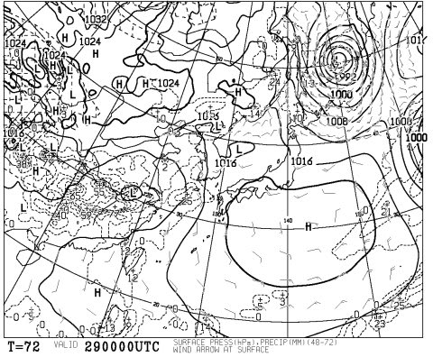

# 恒例！今週末の志賀高原の天気は…春，ですなぁ…

📅 投稿日時: 2014-03-27 01:35:53

🏷️ カテゴリ: [スキー天気予想](c6554f5c3c106093b511a8daae23757e8.md)

ぼちぼち，スキー天気予想の読者数も減りつつある，

この時期ではあるのですが．

ええ．

続きますよ．

まだまだ．

天気予想．

GWまでは，志賀高原の天気予想は続くのだ．

ということで．

今週末の志賀高原の天気をば…

…

…

…

春，ですね（涙）．

こーゆー感じで，29，30日とも，

平年より6度くらい気温が高くなっちゃうようで…（;_;)

土曜日29日ですが…

850hpaの0度線．

こーんな感じで，北海道の南くらいまで北上しちゃってます…

さらに，+6度線が志賀より北にあるくらいなので．

…これって．

朝からプラス気温になりそうなんですが…（泣）．

せめてもの救いは．

こんな感じで．

土曜日は高気圧に覆われるので．

一日晴れて，雨にはならなさそう．

…でも，この時期，ドピーカンより，ちょっと曇ってくれた方が，

雪質が悪くならなくていいんだけどな～．

…これ．

土曜は，高温＆強烈な日差しで．

雪はかなりザブザブになりますね．

ええ，ザブザブに…（激泣）．

そして，日曜．

…この日も，850hpaの0度線は北海道まで上がっていて…

さらに，追い打ち．

低気圧が通過していきます．

…これは．

ダメだ．

ダメだよ．

…雨ですね．

…降り始めがいつになるか，ちょっとまだわかりませんが．

日曜は，昼頃には雨が降っている可能性が極めて高いです…（耐え難きを耐える涙）

ってことで．

まとめると．

土曜：朝から晴れ…朝早くは前日に溶けた雪が冷えて固まったアイスバーン．

　　　午前中から気温は高く，10時ごろには日差しで雪は春のザブザブ雪に．

　　　気温はプラス5度以上まで上がる．

　　　暑いくらいの晴れの，典型的春スキーの一日．

日曜：朝から気温は高い．午前中からザブザブ雪に．

　　　ヘタすると朝からぽつぽつ雨．

　　　運が良ければ，昼過ぎまで雨が降らないでいてくれるかも…

　　　でも，いつかは降り始める．

　　　ザーザーぶりにならないのがせめてもの救い．

　　　雪質はザブザブ春の重い雪．

あー．

ダメだ．

春だ．

春ですね．

冬来たりなば，春遠からじ…

（意味）楽しい時のあとには，悲しい出来事がやってくる←違うでしょ
