# イエティの2013/2014シーズンオープンから1週間！…10月27日の日曜日，Yetiのゲレンデ状況は？

📅 投稿日時: 2013-10-27 23:49:59

ってことで．

スキーシーズンもすでに2週目ということで．

この日曜日も，イエティへ滑りに行ってきましたよ～．

うーん．

本来，1泊2日で行こうかと思っていたところ…台風が(涙)．

自分の祈りではどうしようもなかった，大自然の驚異により．

結局，日曜日帰りになりました…

んで．

今日はちょっと出遅れて，朝9時半にイエティ到着．

すでにもうゲレンデは混み始めてますな～

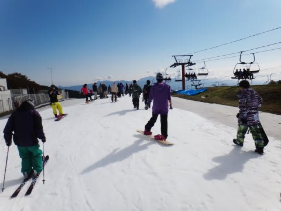

朝は台風一過，すっきりと晴れて，暑いくらい…

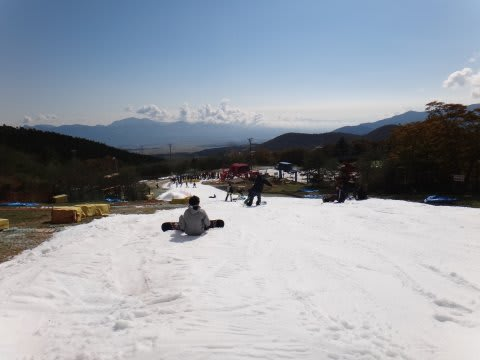

いやー．今日はいい天気で，ジャケット着てると暑いよ…

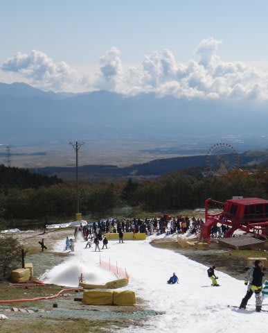

と，思っていたところ．

なんだか，10時ごろには雲がでてきて．

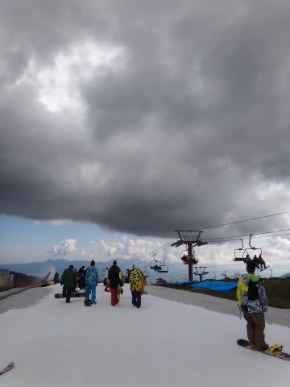

その後は午後2時ごろまで曇ってました…

日が照ると暑かったんだけど…日がかげると寒いよ！

ジャケットしっかり着ていったほうがベスト．

んで．10時ごろにはクワッドリフトが結構混みだしたけど…

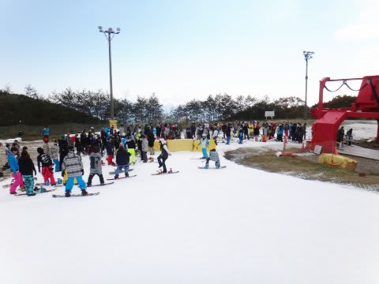

すぐにとなりのペアリフトが運転開始！

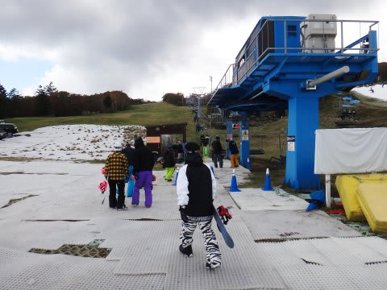

となりのペアリフトは，終日こんな感じで，待ち時間ほぼ0．

リフト待ちという点では，クワッドしか動かなくて5～10分待ちだった

先週より快適っ！

…んだけど．

ペアとクワッドの2本のリフトで，これだけ細いゲレンデに人を送り込むわけですから…

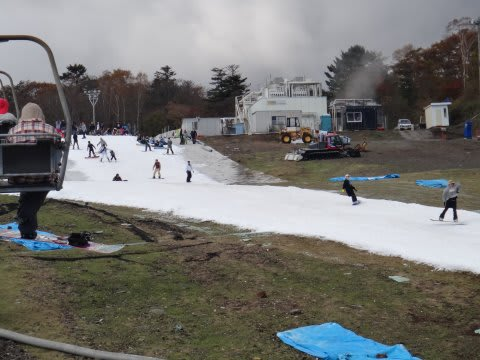

そらーもう，ゲレンデの人口密度は上がるわけで．

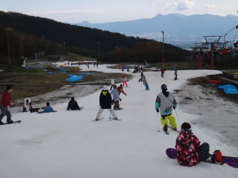

…ゲレンデの快適度は，先週よりダウーンッ!

ペアリフトが動いたおかげで．クワッドのリフト待ちも

こんな感じで減ったけど．

ゲレンデの人口密度は，戦闘意欲を失わせるものがありますね…(泣）．

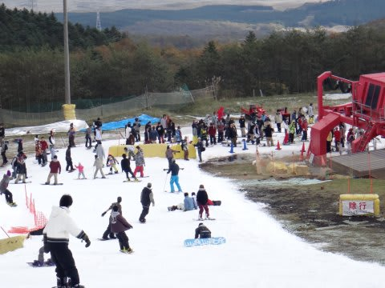

そして．

昼ごろには．

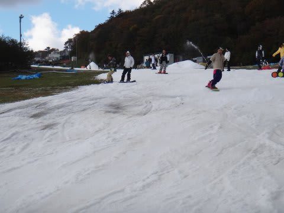

コースのところどころ．

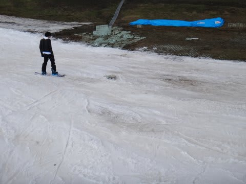

なんだか，ゲレンデにあまり出てきてほしくないものが…(涙)

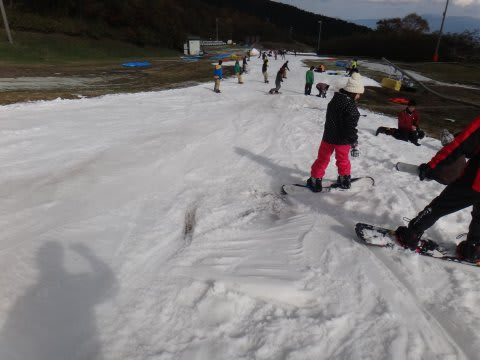

これは…板が傷つくこと覚悟じゃないと，滑れないなぁ…

午後2時過ぎには，再び晴れてきたけど．

逆に，高温でゲレンデコンディションがさらに悪化してきちゃったよ～

ってことで．

人口密度の高さもあり．

2時過ぎには，退散したのでした…

うーむ．

この次期のYeti．

もしかすると，多少雨が降ったほうが，人が少なくて

快適かも？？
