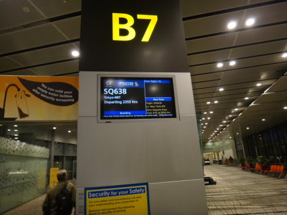
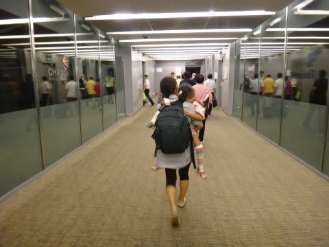
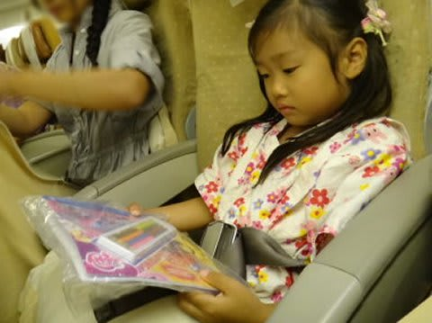
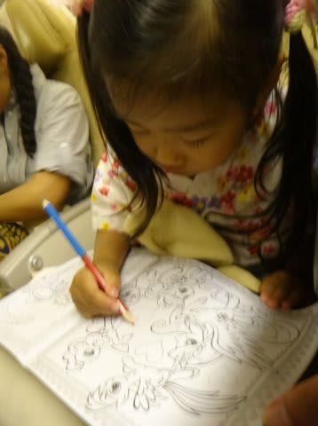
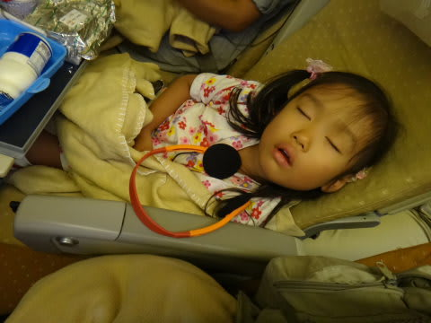
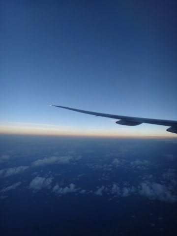
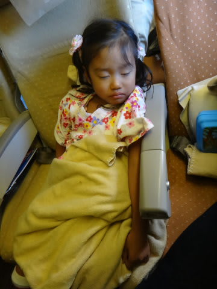
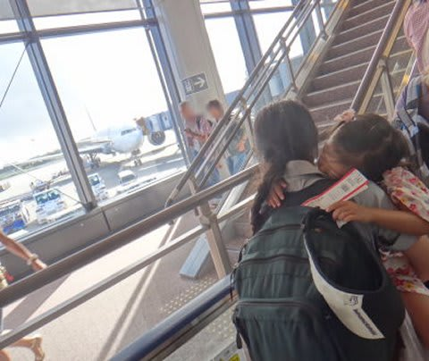
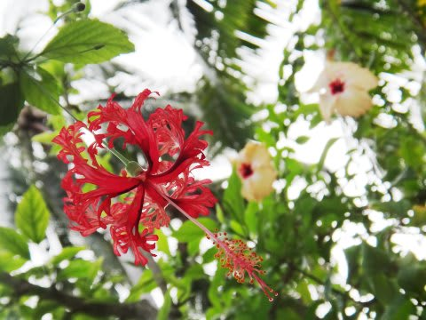

# 2012年　子連れモルジブ　ダイビング旅行記　その28

📅 投稿日時: 2013-01-29 01:05:51

最近になって，このブログを見始めた人は．

「あんだぁ？この記事は？」

…って人が多いかと思いますが．

いや．

なんというか．

このブログをずっと見てる人も．

「なんだ？いまさら？」

って感じかもしれませんが．

あー．実は．

昨年9月に行ったモルジブ旅行記，まだ終わってなかったりするんですね～．

＃あと1回だけだというのに．

で．

いまさらですが．

モルジブ旅行記の，続きをば…

＃スキー時期にダイビング記事を書くと，アクセス数が一気に減る…だろうな．

んで．

「…前回があまりにも前過ぎて，どんな話だったか忘れちゃったよ」

って人のために．

＃覚えてる人がいるわけ無いでしょ←自己突っ込み

[インデックス](ec98a006a47afaa77adc456396ee3f27a.md)がありますので，

ここから過去記事を見てやってください…

では，なんだか中途半端に残っていた最終回，Go!

----

んで．到着は夜10時半というのに，乗り継ぎ便の出発時間は11時55分．

で，10時55分には搭乗待合室への入室開始なので．

ほとんど乗り継ぎ時間がないあわただしさ．

という感じで．

最後の成田行きに乗り込みますが．

なぜか飛行機に乗ったとたん

「ヒコーキ！ヒコーキ！」と喜んで目覚める娘．

…お前，飛行機好きすぎ．

で，

機内で配られた，子供向けプレゼントを受け取って…

早速お絵かきする娘．

でも…

夜遅くのフライトだったので．

絵を書いてる途中でノックダウン．

このまま，配られた機内食を食べることもなく，

ひたすら寝続けて…

日本到着までの7時間．

成田空港に到着するまで目覚めませんでした．

おかげで両親もぐっすり眠れました．

そして．

朝8時に成田到着．

こうして．

長いようで短かった，5泊6日のモルジブ旅行を

終えたのでした…

＃レポートはいやになるほど長かったけど

（エピローグへ続く）
