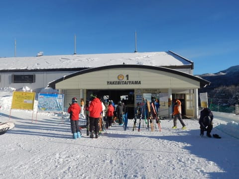
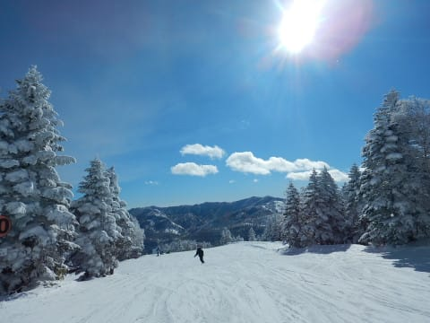
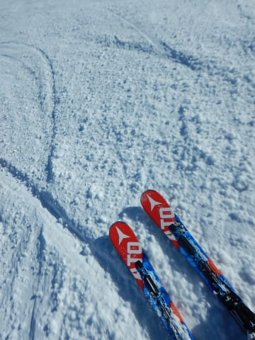
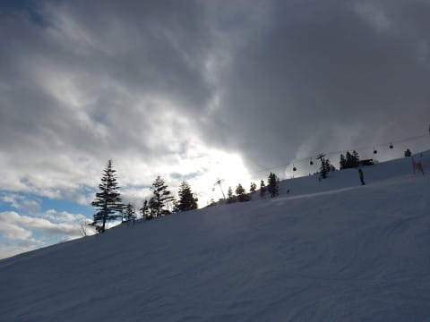
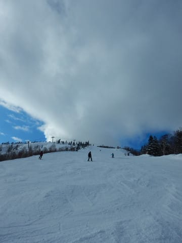
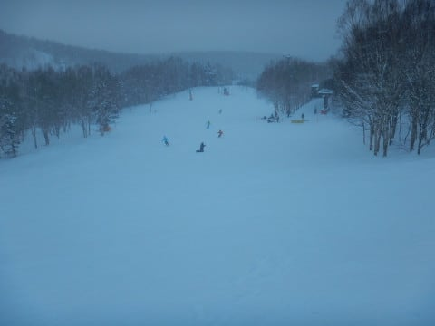

# 1月13日，土曜の志賀高原は…晴れてガラガラの一日！アイスバーンはそれほどひどくなかったよ

📅 投稿日時: 2018-01-14 01:31:21

🏷️ カテゴリ: [2018スキー滑走日記](c11b88dc181f34079ab41db74a3587646.md)

ということで．

今日もいつも通り志賀高原に来ているわけですが．

まず．

本日の朝も，

志賀高原の道路は本格積雪路ですな…

今週は年末～3連休の休み明けなので．

車はそんなに多くないなぁ．

で．

いつも通り，8時半の焼額第1ゴンドラオープンに

並ぶわけですが…

うむ．

朝イチのゴンドラオープン待ちも，いつもより

短い気が…

しかし．

バーン状況，アイスバーンか…（涙）

ってな感じで．

ゴンドラ乗って山頂へ行くと．

ふむ．

山頂の気温は-13℃ですか…

私の予想が-12℃だったので，1度の誤差．

ふふふふ．

最近の私の予想精度，

かなり高くなってる気が…

ってことで．

朝は晴天っ！

そして…

シマシマ！

ちょっと硬めだけど，

しっかりシマシマ！

コースの端っこはこの程度なので，

昨晩の積雪は5mほどと，添えほど積もっていないので，

結構硬めの圧雪だけど．

でも，シマシマっ！！

硬めではあるけど，全然アイスバーンじゃないよ！

そして…天気は気持ちよいすっきり晴れで．

で，

超ガラガラで，飛ばしたい放題！！

年末～3連休が終わった週末．

ホントに人がいないよ！！

いやー．

いいねぇ…

……

…

と思っていたところで．

やっぱり出てくる，硬めの下地（涙）

…そして．

氷の殺人コロコロたち…（泣）

でも．

ピーク時でもゴンドラ待ちはほとんどない

飛び乗り状態のガラガラの本日．

人がそんなに滑らないので，上のやわらかい雪が

それほどはがされず．

硬めの下地が出てきたのは，

斜度が急な部分の一部．

ちょっとコロコロはあったものの．

予想したアイスバーン地獄にはならず．

…ところどころ，ずるっといっちゃう硬い部分は

あるものの．

意外と滑りいいじゃないですか！

なんにしろ，人が少なくて

ガラガラ！

そして天気はいいし…

氷のコロコロと，時々出てくる硬い下地

以外は，結構楽しめるんですけど！？？

全面アイスバーン地獄を予想していた自分にとっては，

予想外にいいんですけど！？？

そして．

午後にはちょっと雲が増えたものの．

ガラガラの晴天は夕方3時ごろまで続き．

人が少なかったので，午後になっても

こんな感じの硬い下地が出てきた部分は

それほど多くなく．

…このまま，夕方まで晴れそうだなぁ…

気持ちいいまま滑れそうだなぁ…

って感じで．

日が傾く夕方になり．

あぁ…

結局，雪は降らなかったなぁ…

　朝は晴れるかもしれないけど，曇り，午後は雪降り

という昨日段階での予想，外したよ…

ここしばらくかなり正確に当ててた予想，

ついに外したか…（涙）

…

…いや．

降る．

志賀高原の天気を決めている私が

降るといったから，雪が降るっ！！！

いや，降らせるのだ！

と，黒魔術を使ったところ．

午後4時近い，終了間際．

にわかに掻き曇り…

そして…

降り始めてきたよ！

いきなり雪が降り始めてきたよ！！

ふははは！

見よ！！

わが黒魔術により，午後は雪降りという

天気予想，当たりになったのだ！！←違うから．あなたが雪を降らせたわけじゃないから

ということで．

雪降りの中．

薄暗くなる16:15のラストリフトまで

滑ったのでした…

で．

はいはいはいはい．

そうです．

まだ終わりませんよ～！

お約束のナイターです！

今日は，今シーズン初の，

ダイヤモンドナイター！

夕方から降り始めた雪が，ナイター開始までに

5cmほど積もって…

コース全面うっすら新雪！

柔らかすぎて，ちとスピードが出なかったけど．

でも，このプチぱふぱふも楽しいよ！！

…という感じで．

睡眠時間3時間以下で出てきたにも

関わらず．

いつも通りナイターストップまで

滑り倒した，Skier_Sだったのでした…

しかし．

今日は天気も良かったし，

ツルツルアイスバーンも，コース上の

ところどころに出ている程度で済んだし．

予想より良かった…

PS

ナイターまで降ってた雪は，降りがかなり

弱くなってきたので．

おそらく明日はそれほど積もってないでしょうね～．

せいぜい10㎝程度．

運が良くてブーツパフ程度かな．

でも，このうっすら雪が圧雪されて，明日の

朝イチも楽しめそうですよ～！

## 💬 コメント一覧

### 💬 コメント by (michi)
**タイトル**: 昨日はありがとうございました
**投稿日**: 2018-01-14 07:59:33

午後からずっと息子のペースで一緒に滑っていただきありがとうございましたm(_ _)m

結局、息子も休憩なしでゴンドララストまで滑りましたね（笑）

ゴンドラでの20000m倶楽部の方々の会話も楽しかったです(^^)

またご一緒させて下さい。

### 💬 コメント by (いか)
**タイトル**: Unknown
**投稿日**: 2018-01-14 20:48:52

ナイター、ご一緒くださいましてありがとうございました！ダイヤモンドでのぐるぐる、楽しかったです。スキーヤーの世界が意外に狭いことも実感いたしました。

無事下山もしまして、今日は早朝から滑っておりました（笑）昨日のナイターでは大回りメインでしたが、今日はかなり締まった、アイスバーン混じりのバーンでS9i Proを乗ってみました。大回りは引き続き良い感じでしたが、併せて小回りがかつてないキレを見せてくれました（SXだと思っていたものが、もはやSXではなくなっていたのかも。。。）。

また、今シーズン中に志賀におじゃまいたしますので、今度は焼額でよろしくお願いします～

### 💬 コメント by (しんちゃん)
**タイトル**: 無事に到着
**投稿日**: 2018-01-14 23:26:50

本日もお世話になりました。

 朝一のゴンドラはとても楽しかったです。爆走、いや読者仲間がうまく集まるものですね。

オリンピックコースをグルグル楽しかったです。

ビデオミーティングの教えが少しはできるようになって、うれしかったです。また濃厚な時間を過ごしてみたくなってしまっています（皆さんの志賀高原生活にどっぷりはまってきています・・・）

休憩とりながら、無事に自宅にたどり着きました(^^)/

### 💬 コメント by (Skier_S)
**タイトル**: 今日の天気予想，外しました…
**投稿日**: 2018-01-15 01:51:36

＞michiさま

土曜はお世話になりました～！

にぎやかなゴンドラで，楽しめましたね～．

息子さんが「なんだこのおじさんたちは？？」

と怪訝に思ってなかったか心配でしたが(笑)．

また次も一緒に滑りましょう！

＞いかさま

ようやっと初遭遇できましたね…

夜遅くの移動お疲れ様でした．

で，やはり早朝から行ったのですね…(笑)．

八方は日曜は晴れだったのですか？

志賀はちょっと残念な天気でした．

S9iPro，私の後継機候補に挙がってきました．

小回りのキレがなかなかでした．

あとは，値段がもう少し安ければ…

＞しんちゃんさま

今日も一日，お世話になりました！

まさかの1泊2日，お疲れ様でした．

日帰りより，一泊した方が楽じゃなかったですか？？

またぜひ1泊コースで参加して，

濃密な夜を過ごしてください！

### 💬 コメント by (ほっぽ)
**タイトル**: 土曜日の名言？
**投稿日**: 2018-01-15 07:29:25

Sさん

私的にとても心に残ったゴンドラ内の会話を書いておきます。

(その1)

私：ブログの画像は何時撮影してるのですか？

このペースだと私は撮影してる時がないのですが？

Sさん：滑りながら撮影してます。止まったら負けです。

私：何に対して負けるのだろうか？(^^;

(その2)

腕を怪我された方に対して。

「腕なら滑れますよね。」

私：マジか！

でも、その方と奥ゴンでご一緒したときは、正しい判断なんだ！

と実感しました。

### 💬 コメント by (Skier_S)
**タイトル**: ほっぽさま
**投稿日**: 2018-01-17 04:18:03

すいません～！

コメント返信，遅くなりました！！

いや．しかし．

20000mクラブな方々と接触していると．

ホントに日々名言が生み出されていくのですが…

私まで名言を生み出していたとは(笑)

最近は，朝の1ゴンが社交場（？）と化して，

面白いバカ話ができるのが楽しい今日この頃です．

### 💬 コメント by (ほっぽ)
**タイトル**: 社交場ですね。
**投稿日**: 2018-01-17 08:01:07

Sさん

ホント、朝の一ゴンは楽しい、濃い会話が一杯で楽しいです。

また、その会話に参加させて下さい。

ついでに書くと、カップラーメンお湯と箸だけもらうこととか、

ニゴンが止まったのはあのお二人が昼飯食べてたから、とかも私には受けました。

### 💬 コメント by (Skier_S)
**タイトル**: ほっぽさま
**投稿日**: 2018-01-18 02:36:19

いやーー．

ホントに朝の1ゴンは濃いですよね～(笑)

このBlogでも書ききれない，いろんな人の

いろんな伝説が次々と…

また朝の1ゴン，ご一緒しましょう！

