# これから週末まで，志賀高原スキー場はかなり冷え込んで，結構な積雪になりそう…！！！！

📅 投稿日時: 2024-01-24 03:52:00

🏷️ カテゴリ: [日記](cc4b5682fb7b8b144980957a978653fb0.md)

えー．

23日深夜…

というか，日付が24日に変わった，深夜3時の

段階で．

志賀高原は結構雪が積もり始めてるみたい

ですね～！

予想通り，23日午後から雪が降り始めた

みたいです！！

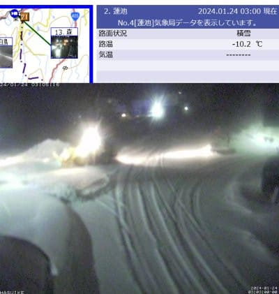

（[北信建設事務所道路気象状況カメラ](http://hokushin.pref-nagano-roadcamera.jp/)より）

なんてったって，23日夜9時の地上天気図を

見ると…

見事なJPCZが見えてますよ！！！！

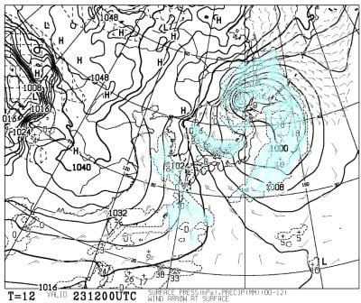

拡大してみるともっとはっきりわかりますが．

赤矢印の方向に，JPCZが伸びてます！！

…多少東にたなびいているので，

西風の傾向がありますが…

でも，能登半島より西にJPCZが突き刺さる

くらいの風向きなら，志賀高原も積もるのだ！

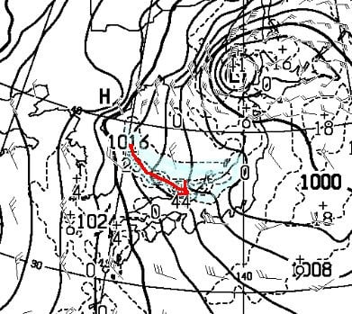

気象衛星の写真を見ても，JPCZが

すごいきれいに出てますね…

教科書に出してもいいレベルのJPCZの

写真で．

このJPCZの強さを見ただけでも，ものすごい

雪になりそうな気配があふれてます…

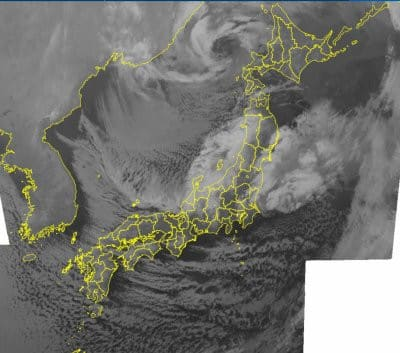

分かるとは思いますが．

JPCZは赤くくくったこいつ．

地上天気図の赤線のJPCZの通りに，

衛星写真に写ってます…！

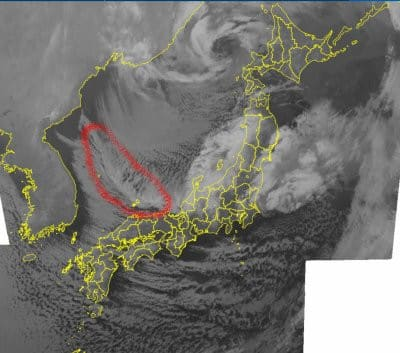

さらに，850hPa図を見ても，志賀高原には

-9℃の水色線がかかる冷え冷え具合で，

山頂付近では-10℃を下回る気温だし…

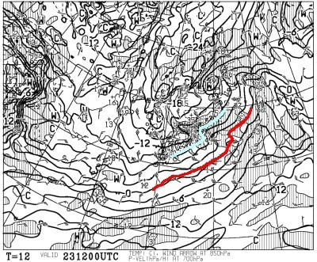

そのうえ，500hPa気温図…TVとかでは

上空5000m寒気と言ってるやつを見ると．

大雪の目安である赤い‐30℃線が本州を

すっぽり覆うくらいで．

ドカ雪の目安の水色の‐36℃線が志賀高原に達してます！

…‐36℃線がかかると，西風でも，根性がある

雪雲が北アルプスを越えてくるレベル．

これだと…

今晩から明日にかけては，結構降りそうな

感じ…

そして．

この雪はしばらく続きますよ～！！

24日の水曜日の夜9時の地上天気図を

見ても，見事な縦じまの冬型天気図だし．

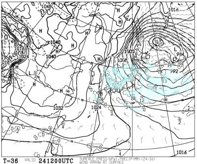

こいつを拡大しても，見事なJPCZが

出ているし．

さらにJPCZがほぼ南に流れる北風で…

これなら，北アルプスに邪魔されず，

ダイレクトに志賀高原に雪雲がかかる

風向きです…！！！

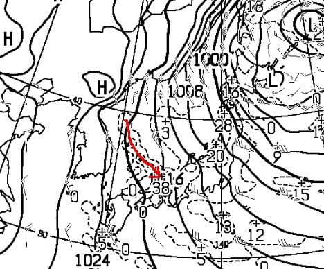

さらに，この日の500hPa気温図は…

この日も，ぎりぎりドカ雪の目安の

－36℃線がかかってます！

24日，降ります．一日かなり雪が降り続け

ます！！

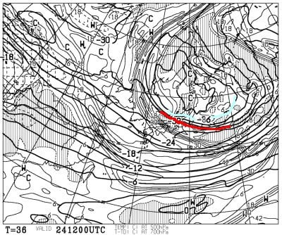

さらに25日の木曜日の夜9時の地上天気図を

見ても．

見事な等圧線が縦じまの冬型で，

JPCZが南に流れているし…

志賀にも結構降りそうな天気図！！

木曜も水曜に引き続き降ります！！！

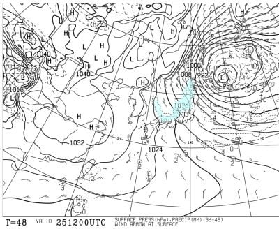

そして，26日金曜まで，冬型の天気図が

続きますね…

ただ，この日はJPCZが弱まっていて，

一見そこまで大雪にならなさそうですが．

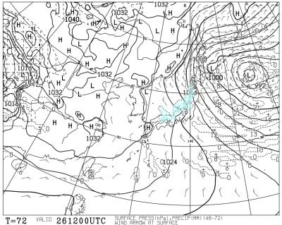

ただ…この日の湿数図を見ると．

赤く記した，網掛けになっている湿数0の

湿った空気の両気に囲まれて，

湿数の高い乾いた空気が矢印の方向に

流れていく図になってます．

この，乾いた空気＝大陸からの冷えた空気

が日本海を通ると日本海の湿気を含み，

こいつが山にぶつかると大量の雪を降らせます．

これまでの経験上，湿数図がこの形に

なると，志賀高原などの山沿いは大雪に

なるパターン…

これは，金曜も降る！雪が降る！！

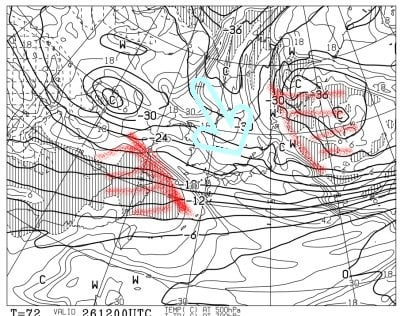

ってな感じで．

24日から26日まで，志賀高原はひたすら

雪が降り続きそうです…！！！！

24日（水）：朝から冷え冷え．朝は30㎝

　くらい積雪？

　一日ひたすら降る．積もる．寒い．

　根性のないスキーヤーはふるい落とされる

25日（木）：一晩中雪が降り続けて，朝は30㎝以上

　積もってるか？

　風がかなり強いので，北向きの奥志賀は

　リフト・ゴンドラがヤバそう．

　この日は北向きじゃないリフトも風で

　運休する可能性が…

　この日も寒く一日ひたすら吹雪．

　昼間だけでも20～30㎝積もる．

26日（金）：雪．一日雪．朝の積雪量はまだ

　わからない．麓は降ってないけど

　志賀高原に登るとドサドサ降ってる

　パターンになりそう．

　一日強まったり弱まったりしながら，

　ひたすら雪が降る．

　この日も朝は北風が強めで，もしかすると

　ゴンドラが運休・減速運転になるかも．

　たぶんリフトはいける．

　午後は風が弱まるかな…

ってな感じで．

これから週末にかけて，

3日間，かなりの雪になりそう…！！

今週末は冷え冷えのトップシーズン雪で

スキーができそうです！！！

明日，床で寝なければ，週末の天気予想

やりますね～！！

## 💬 コメント一覧

### 💬 コメント by (かず)
**タイトル**: Unknown
**投稿日**: 2024-01-24 13:17:38

ありがとうございます

### 💬 コメント by (しんちゃん)
**タイトル**: 週末に期待
**投稿日**: 2024-01-24 19:12:40

今週末、参戦予定です。

トップシーズン雪に期待します

### 💬 コメント by (地元民)
**タイトル**: Unknown
**投稿日**: 2024-01-24 20:50:57

野沢温泉、飯山は大雪だけど、中野は数cmのみ。

志賀高原、どうなんだろうか?　

夜、夜間瀬スキ━場は郷からゲレンデが見えてる⇒雪雲の外。

### 💬 コメント by (Unknown)
**タイトル**: Unknown
**投稿日**: 2024-01-25 04:18:12

＞かずさま

どういたしまして！

＞しんちゃんさま

今週末はいい感じですよ…！

また志賀高原でお会いしましょう！

＞地元民さま

うーん．もう少し積もると思ったんですが…

夜は降っているみたいなので，明日もっと積もるといいんですが…

