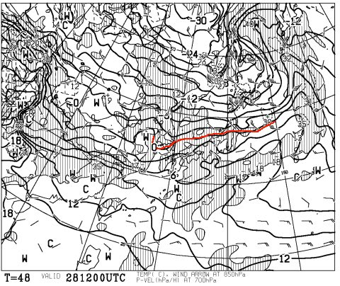

# 恒例！今週末の志賀高原の天気は…かすかに春の気配が…

📅 投稿日時: 2014-02-27 02:21:56

🏷️ カテゴリ: [スキー天気予想](c6554f5c3c106093b511a8daae23757e8.md)

えー．

今週末から3月ということで．

…天気図に．

なんだか，春の気配が近づいてきましたね…

金曜日28日，夜9時の予想地上天気図ですが…

こーゆー感じで．

青い線の寒冷前線の後ろに，矢印のような感じで寒気が

吹き込む天気図になってるんですけど．

この時の850hpa気温図が，こーゆー感じで．

…寒気が吹き込んでいるのに，0度線がぎりぎり志賀高原…

いや，志賀よりわずかに北ですかね…

…

これは，ちょっと暖かすぎ（涙）．

冬なら，寒気が北から吹き込む状態では．

0度線は日本の南まで下がるんですけどね～．

うーん．

春が近づいているのか…

これは，金曜日．

標高が低いスキー場だと，みぞれ～雨になるところが，かなり

出てきますね…

志賀は標高が高いから雪でしょうけど．

まぁ，かなり重い雪になりそうですが．

で．

こーゆー感じで．

26日以降，3月2日の日曜まで．

例年より気温が高い日が続くようなので…

だもんで．

土曜の850hpa気温もこんな感じで…

0度線は，ぎりぎり志賀高原．

ここしばらくの冷え冷え状態に比べると．

暖かい一日になりそうです．

この日，天気はすっきり晴れてはくれなさそうで．

降れば，かなり重い雪．

そして．

下の図の点線で囲まれている部分が，降水が予想される領域ですが．

うーん．

2日の予想図，降水域が日本を覆っているので．

日曜は，降りそうだな～．

で．日曜も…

こんな感じで，0度線はぎりぎり志賀高原なので．

降るのは，重めの雪だな～．

ウエアが濡れるような雪になりそう．

今のところ，雨にはならなさそうだけど．

ちょっと予想がずれると．

…雨になる可能性も…

ってことで．

まとめると．

土曜：朝から雲が多く，時折雪がちらつく．

　気温は高め．昼間は0度前後．ヘタするとプラスに．

　日が射さないので，雪質が壊滅的にドロドロになることはなさそう．

日曜：雲が多く，朝から雪がちらつき，終日雪が舞う感じ．降るのは，かなり重い雪．

　　昼間は，ウェアやゴーグルに着いた雪が溶け，濡れてしまうかな…．

　　ゲレンデの雪はちょっと重くなりそう．午後に向かってゲレンデは荒れていく…

って感じでしょうか．

うーむ．

先週のような冷え冷え晴天の恵まれたコンディションではなく．

3月だな～，って感じがする週末ですね～．

来週半ばからは，また冷えるんですけどね～．
