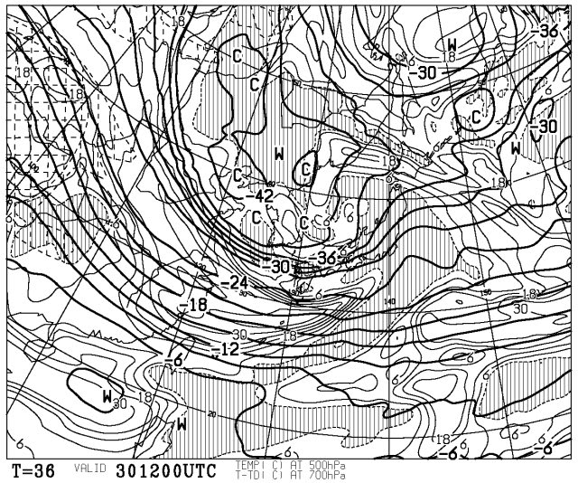
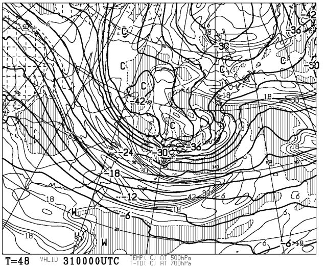
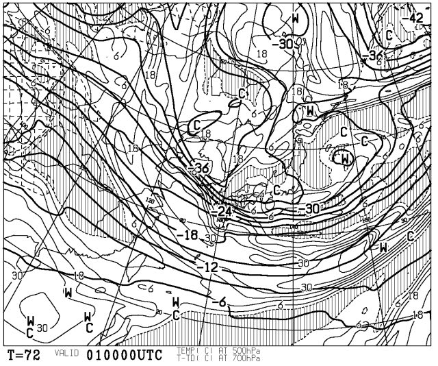
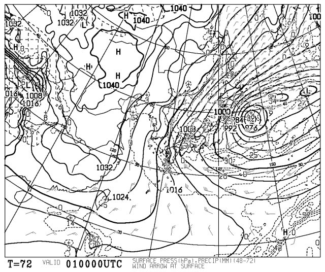
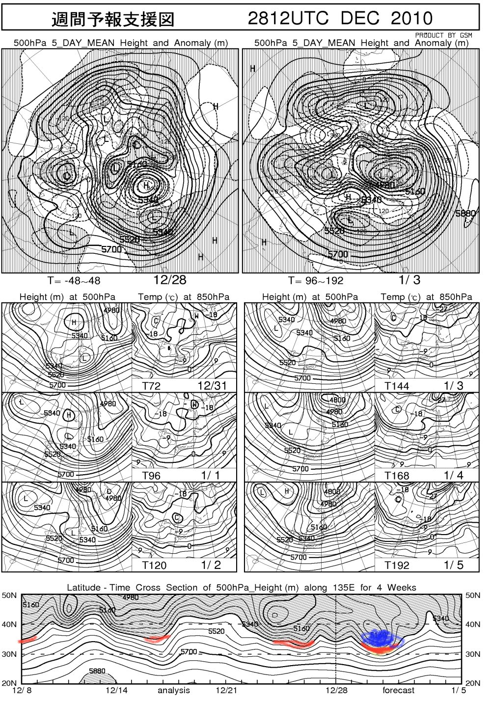

# ３１，１日は豪雪

📅 投稿日時: 2010-12-29 21:49:14

🏷️ カテゴリ: [スキー天気予想](c6554f5c3c106093b511a8daae23757e8.md)

今日からスキー場は結構雪が積もってるようですが．

30日から，これまでに増して強力な寒気が下りてきます．

なんと．500hpa図で-36度って線が，北九州から東北にかかって

伸びてます．

-30度がかなりの雪になりそうな目安ですが…

-36度となると，吹雪＆豪雪の目安です．

…これは，降ります．強烈に．

31日になっても，-36度の寒気は居座り続けます．

っつーか，すっぽり日本を覆いますね．

31日も，かなりの雪になりそうです．

そして元日の1日…

-36度は後退しますが，-30度はすっぽり日本を覆ってますね．

この日の地上天気図は…

強力な冬型です．

うーーん．

荒れてリフトが止まらなきゃいいんだけど…

で，等圧線が完全な縦じまでなく，日本海側で

ちょっと東北～南西にかけて，傾いた等圧線に

なってます．

これは，信州方面まで雪雲が流れ込むパターンですね．

ここには載せてませんが，FZCX50では，1月1日のスプレッドが

0.33とかなり低い値なので，この天気予報の確度は高いです．

日本海側にとどまらず，内陸までかなり積もります．

ここ1週間のFXXN519を見てみましょう…

一番上，500hpa 5day mean heightですが．

日本はすっぽり網掛け部分に入ってます…

すなわち，高度の負偏差領域．

日本はすっぽり寒気に覆われている領域といえます．

んで，一番下．

Time cross section of 500hPa height

ですが…

この網掛けエリア，高度5400の線が，35Nの線より下に

下りてくると大体雪が積もる目安です．

赤く線をした，12月8日，12月16日前後，12月24日前後と，

かなり冷え込んだのは覚えているかと．

大体，この冷え込む時期と，網掛けの境界が35Nより下に

下りて来ている部分は一致してます．

で，今後．

12月30～1日にかけて．

35Nどころか，30N位まで降りてきてます．

これは激烈に冷えて雪が積もりますね～

年末年始はパウダー三昧の日々かな？？

＃太陽は拝めないけど
