# 2021/2/11(木・祝)の志賀高原スキー場特派員情報…天気予想外した(涙)，そして15日以降の天気はどうなるのか？

📅 投稿日時: 2021-02-12 02:43:16

えー．

本日もいつもの志賀高原特派員情報から

お送りするわけですが…

まず．

今朝の積雪を，いつものおこみん比較で

見てみましょう！

…今朝の積雪．

20cm以上，30cmくらいあったようです…

…あれ？誰かの予想では，積雪5cmだったんですが…

そして．

朝の気温は-10℃と，ここは予想に

近かったですが．

朝からものすごい激烈雪降りで…

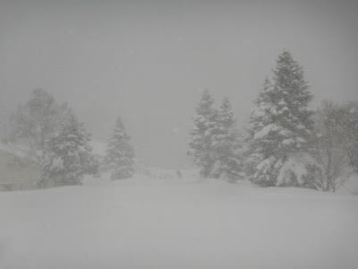

圧雪コースも重めの雪が10cm以上

積もっていたようで．

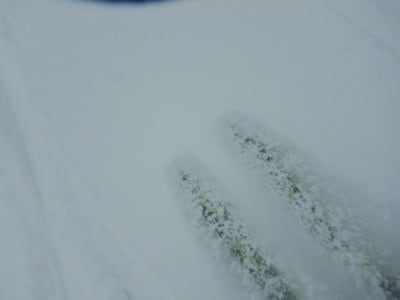

　圧雪バーンはいい感じの冷え冷え圧雪に，

　ごくわずか薄っすら積雪が乗った，

　快楽バーン！

というところ，見事に大外れだったようです(涙）

焼額ゴンドラは午前中，ちょっと列が

あったみたいですが．

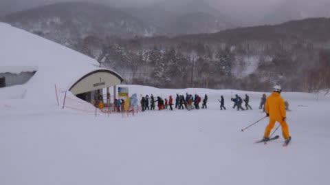

でも，ゲレンデはそんなに混んでおらず．

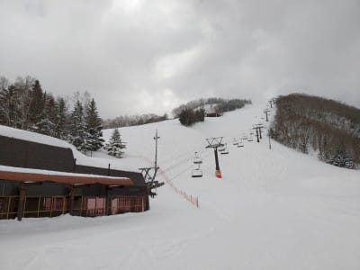

サンバレーはほぼ無人だったようですね…

経営大丈夫か，ちょっと心配…

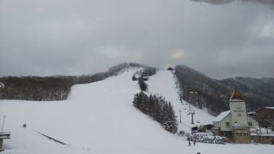

そして．

雪は昼を過ぎても激しい勢いで

降り続け．

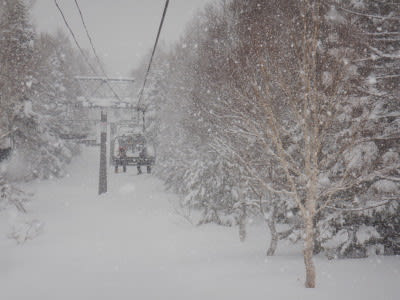

恵まれたコンディションというより．

根性の無いスキーヤーふるい落とし機能

が働く状況だったらしく．

某氏より，

「コーヒー5杯飲んで待ってるけど，

雪が止まないんですけど…」

と，誰かさんの

　昼に向かって天気は回復して行き，

　午後は晴れて，太陽のもといい感じの冷え冷え

　バーンが滑れそう！

という予想が外れたことを暗に（明に？）知らせてくれる，

ありがたい報告がありました…

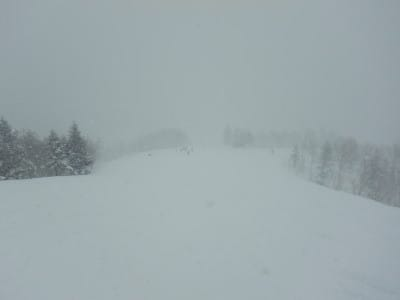

が．

私が晴れるといったら晴れるのだ！

昼過ぎには日が射して…

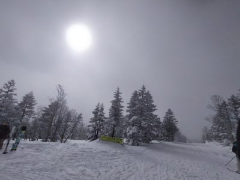

12時半くらいには晴れたようです！

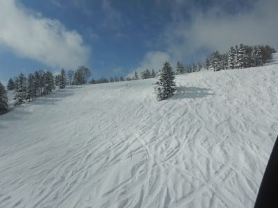

そうです．

私が晴れると言ったら，晴れるんです！

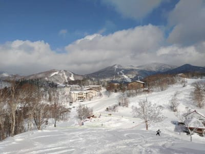

…と，思っていたのもつかの間．

晴れたのは一瞬で，

午後にはまた雪が降り始め…

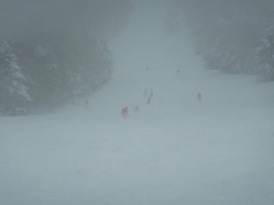

昼間の最高気温も-6℃程度と，

かなり一日冷え冷えだったけど．

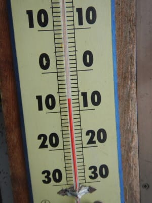

朝から積もった雪がちょっとモサモサした

荒れ気味バーンになってしまった，

ちょっと惜しい感じの一日だったようです…

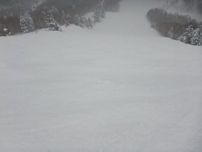

まあ，でも．

今日は冷え冷えでまだいいのだ．

明日も，まぁ昼間にわずかにプラス気温に

突入する程度だけど．

13日，14日の週末は，

気温がぐっと上がって3月のゲレンデ状況に

なってしまうのだ…

と，昨日の記事に書きましたが．

でも，13，14日は気温が上がっても，

液体が降ることはありません！！

ご安心ください…

ただ．

今日の最新の予想を見ると．

15日の月曜は…アウトです（涙）

昨日と同様に，0℃線は志賀より北と

いうのは変わりませんが…

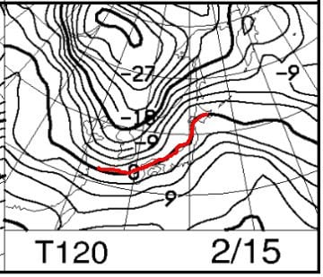

昨日より，激烈に低気圧が発達する

予想に変わりました(涙）

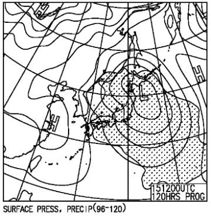

そして，降水頻度予想も，

50%を超える領域が志賀にかかっているので…

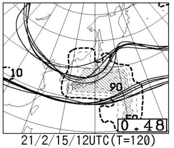

皆さん．

諦めてください．

今の天気図のままなら，

15日(月)は，大荒れ強風南風で雨が

たたきつける，スキーヤーにとっても

雪にとっても最悪の一日

になりそうです…

うーん．

雨がそれほどひどくなければいいんだけど…

で．

そのあとの天気図を見ると…

おおお！？？

16日以降，18日までは，赤い0℃線が

志賀高原の南に下がるだけでなく…

-9℃線が志賀にかかるという，

平年のこの時期よりずっと冷える

冷え冷え気温になります！！

(温まったり冷えたり，極端なんですけど…）

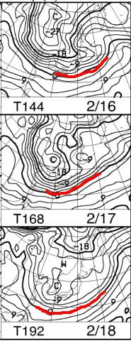

地上天気図を見ると．

16日はきれいな縦縞の等圧線じゃないので，

そんなに雪が降らなさそうで，

15日の高温で融けた雪が固まった

ガチガチバーンになりそうだけど．

17，18日は…結構積もるかも？？

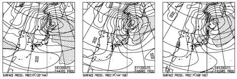

ってなことなので．

15日はかなりヤバそうな感じですが．

17，18日の激冷え積雪でゲレンデコンディションは

回復しそうな感じ…！

…まぁ，まだ16日以降の天気図は予想ばらつきが

大きい状況なので．

予想精度が上がり次第，また詳細予想やります…

しかし．

16日以降の冷えっぷりを見ると．

15日の高温悪天候が，惜しい…

## 💬 コメント一覧

### 💬 コメント by (ikkun)
**タイトル**: Unknown
**投稿日**: 2021-02-12 03:43:46

ちいと早いおはよう様です (^-^ゞ昨日は準指導員試験現場にて受ける仲間５人組で指導員のお出ましも頂きましたよ……しかし霧霧霧😱💦三turnで見えないみたいなあ(・・;)私しと言えば多分一番不安です❗普段と変えない様に軽く🍻して今起きて筆記試験ラストです❗若い訳ではないので(一番爺です)頑張ります❗

### 💬 コメント by (かず)
**タイトル**: Unknown
**投稿日**: 2021-02-12 09:46:56

今週もパスしてます…意外と昨日積りましたね……

若Sさん  オリンピックコースって今もパウダー時 圧雪ですか？

### 💬 コメント by (レインボー73)
**タイトル**: Unknown
**投稿日**: 2021-02-12 18:14:57

金曜日の志賀高原情報

続けて夜ふかししたので眠いです。やはり規則正しくですね。今日で40連荘（れんちゃん　麻雀用語）！

朝の上林ー3℃ 蓮池ー４℃ 坊平橋上下で２台息絶えている。あれれ、珍しくニゴンに長い列が。

今日は　サロモンS-MAX12 160cm Ｒ13

パノラマ、カラマツと、食い込みシマシマバーン。オリンピックもいつもと同じ。最近はオリンピックも朝の圧雪になったので、雪が降ってもあまり狙い目ではないかと。

１コンも混んでるので、すぐに奥志賀へ。奥ゴンも混んでる。そしてエキスパートへ。

ぎょぎょ！人がうじゃうじゃいる。閑散とした環境に慣れっこになっているため、瞬時に意欲ゼロで脱出。だけど、少し安心した自分がいました。

ダイヤの非圧雪も食べられて楽しくない。

寺子屋はやっぱり快適。景色もいいし。

帰りは天狗。カーフ以外ではターンをしないと決めて突入するも、思ったよりスピードが出ない。ヤケビに戻ると閑散としている。混んだから逃げた人が多いのかと。

そんなんで早退してしまいました。今日は書くパワーがなくてつまんないですね。ごめんなさい。

### 💬 コメント by (Skier_S)
**タイトル**: 今日はそんなに混んだんですか？
**投稿日**: 2021-02-12 23:33:52

＞ikkunさま

あら．準指受験ですか！お疲れ様です．

頑張ってきてください！

…って，このコメント見る時には結果が分かっていると思いますが…

いい結果であることを願ってます．

＞かずさま

今週もパスですか．

新雪は無いからいい判断かも．

17日~18日が次のパウダー予想です！

＞レインボー73さま

今日はテンション低めのレポートですね．

奥志賀エキスパもそんなに混んでいたとは！

まぁ，人がいるのは経営的にはいいことですが…

しかし，まさか平日にそんなに混んでいるとは！？？

明日はすごいことになるのかも…

